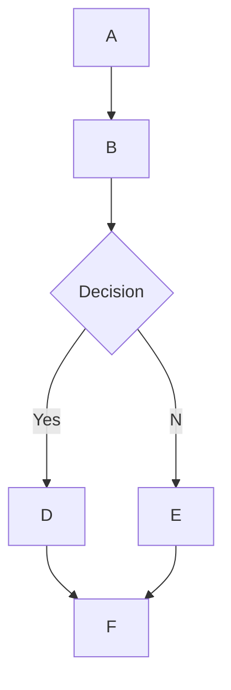

# 🌊 Open WebUI 中的 MermaidJS 渲染支持

## 概述

Open WebUI 支持直接在聊天界面内渲染视觉效果优美的 MermaidJS 图表、流程图、饼图等内容。MermaidJS 是用于可视化复杂信息和想法的强大工具，而当它与大型语言模型（LLM）的能力结合时，可以为生成和探索新点子提供强有力的支持。

## 在 Open WebUI 中使用 MermaidJS

要生成 MermaidJS 图表，只需在聊天中向 LLM 发出请求，要求通过 MermaidJS 创建一个图表或图表。例如，您可以要求 LLM：

* "使用 Mermaid 创建一个简单决策流程的流程图，并解释流程图的工作方式。"
* "采用 Mermaid 可视化一个决策树，来判断是否适合外出散步。"

注意，为了 LLM 的响应能正确渲染，代码必须以 `mermaid` 一词开始，并跟随 MermaidJS 代码。您可以参考 [MermaidJS 文档](https://mermaid.js.org/intro/) 来确保语法正确，并提供结构化的提示以指导 LLM 生成更好的 MermaidJS 语法。

## 在聊天中直接可视化 MermaidJS 代码

当您请求 MermaidJS 的可视化时，大型语言模型（LLM）会生成必要的代码。只要代码使用了有效的 MermaidJS 语法，Open WebUI 会自动在聊天界面中直接渲染可视化内容。

如果模型生成了 MermaidJS 语法，但可视化未成功渲染，这通常是由于代码存在语法错误。不用担心——当响应完全生成后，您会被通知出现的错误。如果发生这种情况，可以参考 [MermaidJS 文档](https://mermaid.js.org/intro/) 找出问题并相应修改提示。

## 与可视化内容的交互

当您的可视化内容显示后，您可以：

* 缩放以更仔细地查看内容。
* 点击显示区域右上角的复制按钮复制生成可视化的原始 MermaidJS 代码。

### 示例



这将生成一个如下的流程图：

```markdown
 startAncestor [ start ]
A[A] --> B[B]
B --> C[Decision]
C -->| Yes | D[D]
C -->| No  | E[E]
D --> F[F]
E --> F[F]
```

尝试不同类型的图表和图形，有助于您更好地理解如何在 Open WebUI 内有效利用 MermaidJS。对于更小的模型，可以参考 [MermaidJS 文档](https://mermaid.js.org/intro/) 为 LLM 提供指导，或者让 LLM 将文档总结成全面的注释或系统提示。通过遵循这些指南并探索 MermaidJS 的功能，您可以在 Open WebUI 中充分发挥这一强大工具的潜力。
