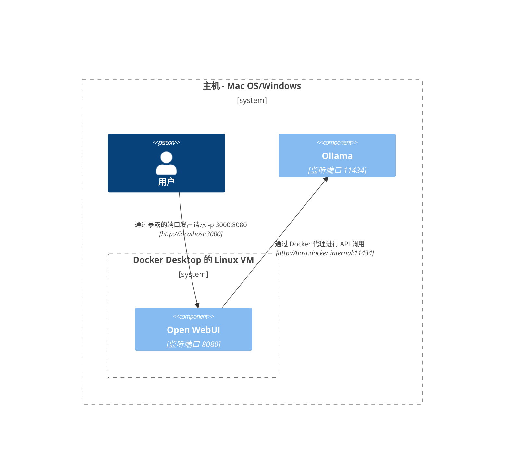
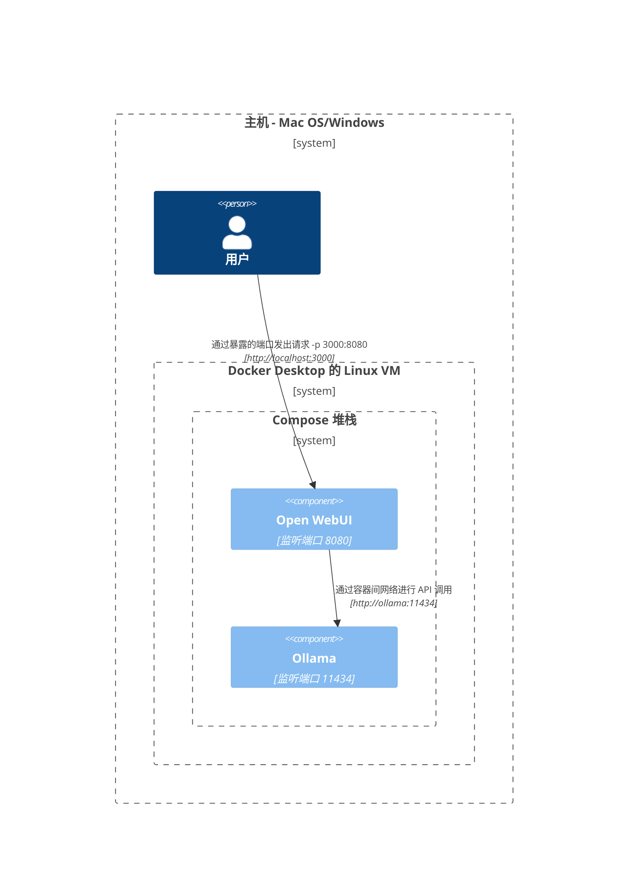
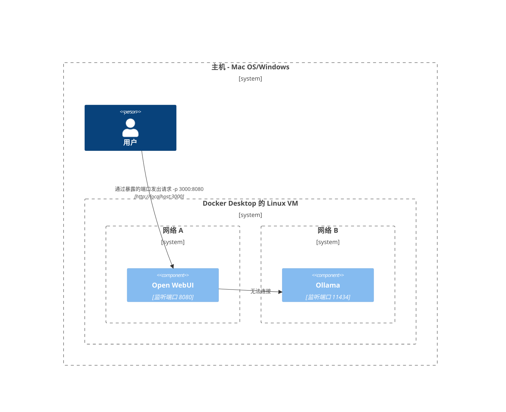
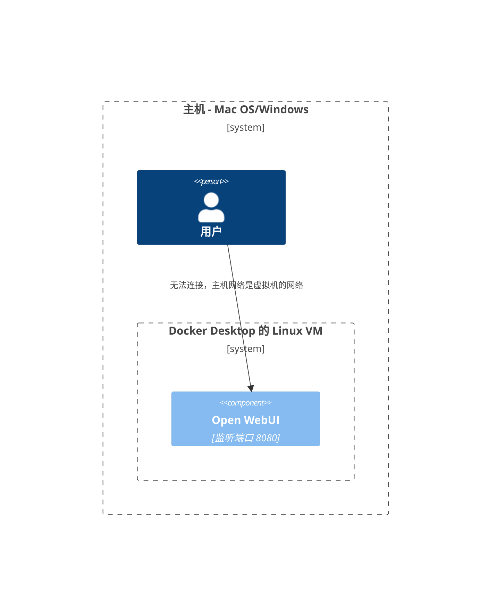
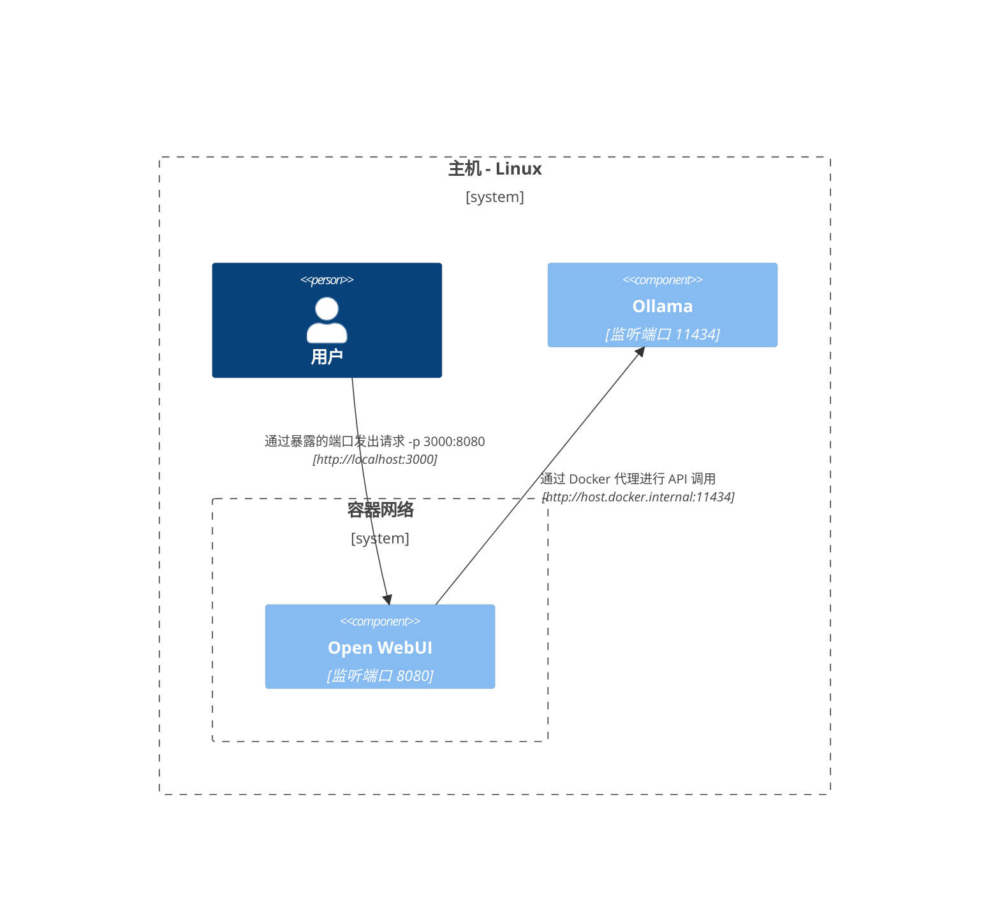
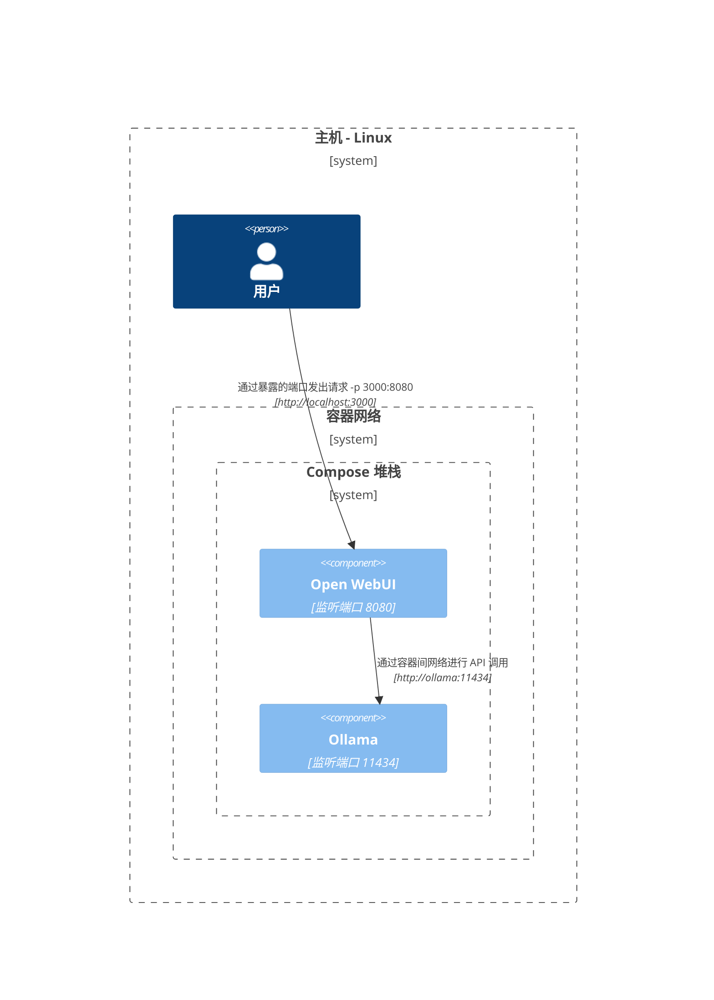

在这里，我们提供清晰且结构化的图表，帮助您理解网络中各种组件在不同设置中的交互方式。本文档旨在帮助 macOS/Windows 和 Linux 用户。每种场景都使用 Mermaid 图表进行展示，以说明不同系统配置和部署策略下的交互设置方式。

## Mac OS/Windows 配置选项 🖥️

### 主机上的 Ollama，容器中的 Open WebUI

在此场景中，`Ollama` 在主机上直接运行，而 `Open WebUI` 在 Docker 容器内运行。



### Ollama 和 Open WebUI 在 Compose 堆栈中

`Ollama` 和 `Open WebUI` 配置在同一个 Docker Compose 堆栈中，简化了网络通信。



### Ollama 和 Open WebUI，独立网络

在此场景中，`Ollama` 和 `Open WebUI` 分别部署在独立的 Docker 网络中，可能导致连接问题。



### Open WebUI 使用主机网络

在此配置中，`Open WebUI` 使用主机网络，这会影响其在某些环境中的连接能力。




## Linux 配置选项 🐧

### 主机上的 Ollama，容器中的 Open WebUI（Linux）

此图专用于 Linux 平台，其中 `Ollama` 在主机上运行，`Open WebUI` 部署在 Docker 容器中。



### Ollama 和 Open WebUI 在 Compose 堆栈中（Linux）

一种设置，其中 `Ollama` 和 `Open WebUI` 位于同一 Docker Compose 堆栈内，适用于 Linux 的简化网络设置。



### Ollama 和 Open WebUI，独立网络（Linux）

一种场景，`Ollama` 和 `Open WebUI` 在 Linux 环境中分别位于不同的 Docker 网络中，这可能导致连接问题。

```mermaid
C4Context
边界(b0, "托管机器 - Linux") {
   人物(user, "用户")
   边界(b2, "容器网络A") {
      组件(openwebui, "Open WebUI", "侦听端口8080")
   }
   边界(b3, "容器网络B") {
      组件(ollama, "Ollama", "侦听端口11434")
   }
}
关系(openwebui, ollama, "无法连接")
关系(user, openwebui, "通过暴露的端口发送请求 -p 3000:8080", "http://localhost:3000")
更新关系样式(user, openwebui, $offsetX="-100", $offsetY="-50")
```

### 主机网络中的 Open WebUI，主机上的 Ollama (Linux)

一种优化布局，其中 `Open WebUI` 和 `Ollama` 使用主机网络，在 Linux 系统上实现无缝交互。

```mermaid
C4Context
边界(b0, "托管机器 - Linux") {
   人物(user, "用户")
   组件(openwebui, "Open WebUI", "侦听端口8080")
   组件(ollama, "Ollama", "侦听端口11434")
}
关系(openwebui, ollama, "通过localhost发送API调用", "http://localhost:11434")
关系(user, openwebui, "通过侦听端口发送请求", "http://localhost:8080")
更新关系样式(user, openwebui, $offsetX="-100", $offsetY="-50")
```

每种设置都对应不同的部署策略和网络配置，帮助您选择最适合需求的布局。
