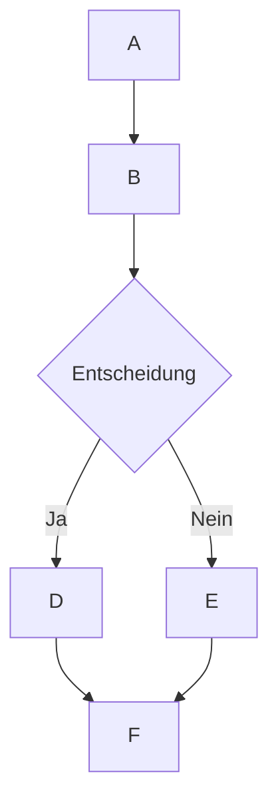

# 🌊 Unterstützung der MermaidJS-Darstellung in Open WebUI

## Überblick

Open WebUI unterstützt das Rendern von ansprechenden MermaidJS-Diagrammen, Flussdiagrammen, Kuchendiagrammen und mehr direkt innerhalb der Chat-Oberfläche. MermaidJS ist ein leistungsstarkes Tool zum Visualisieren komplexer Informationen und Ideen, und in Kombination mit den Fähigkeiten eines großen Sprachmodells (LLM) kann es ein mächtiges Werkzeug zur Ideenfindung und -erweiterung sein.

## Verwendung von MermaidJS in Open WebUI

Um ein MermaidJS-Diagramm zu erstellen, bitten Sie einfach ein LLM innerhalb eines Chats, ein Diagramm oder eine Grafik mit MermaidJS zu erstellen. Beispielsweise könnten Sie das LLM bitten:

* "Erstelle ein Flussdiagramm für einen einfachen Entscheidungsprozess für mich mit Mermaid. Erkläre, wie das Flussdiagramm funktioniert."
* "Verwende Mermaid, um einen Entscheidungsbaum zu visualisieren, der bestimmt, ob es geeignet ist, draußen spazieren zu gehen."

Beachten Sie, dass die Antwort des LLM für eine korrekte Darstellung mit dem Wort `mermaid` beginnen muss, gefolgt vom MermaidJS-Code. Sie können die [MermaidJS-Dokumentation](https://mermaid.js.org/intro/) konsultieren, um sicherzustellen, dass die Syntax korrekt ist und strukturierte Anweisungen für das LLM bereitstellen, um bessere MermaidJS-Syntax zu generieren.

## Visualisieren von MermaidJS-Code direkt im Chat

Wenn Sie eine MermaidJS-Visualisierung anfordern, erzeugt das große Sprachmodell (LLM) den erforderlichen Code. Open WebUI rendert die Visualisierung automatisch direkt innerhalb der Chat-Oberfläche, sofern der Code gültige MermaidJS-Syntax verwendet.

Wenn das Modell MermaidJS-Syntax erzeugt, die Visualisierung jedoch nicht dargestellt wird, deutet dies normalerweise auf einen Syntaxfehler im Code hin. Keine Sorge – Sie werden über alle Fehler informiert, sobald die Antwort vollständig generiert wurde. Falls dies passiert, versuchen Sie, die [MermaidJS-Dokumentation](https://mermaid.js.org/intro/) zu konsultieren, um das Problem zu identifizieren und die Eingabe entsprechend zu überarbeiten.

## Interaktion mit Ihrer Visualisierung

Sobald Ihre Visualisierung angezeigt wird, können Sie:

* Hinein- und herauszoomen, um sie genauer zu betrachten.
* Den ursprünglichen MermaidJS-Code, der zur Erstellung der Visualisierung verwendet wurde, durch Klicken auf die Kopierschaltfläche in der oberen rechten Ecke des Anzeigebereichs kopieren.

### Beispiel



Dies wird ein Flussdiagramm wie das folgende erzeugen:

```markdown
 startAncestor [ start ]
A[A] --> B[B]
B --> C[Entscheidung]
C -->| Ja | D[D]
C -->| Nein | E[E]
D --> F[F]
E --> F[F]
```

Das Experimentieren mit verschiedenen Diagramm- und Grafiktypen kann Ihnen helfen, ein tieferes Verständnis dafür zu entwickeln, wie Sie MermaidJS effektiv in Open WebUI einsetzen können. Für kleinere Modelle können Sie die [MermaidJS-Dokumentation](https://mermaid.js.org/intro/) konsultieren, um Anweisungen für das LLM bereitzustellen oder es auffordern, die Dokumentation in umfassende Notizen oder eine Systemanweisung zusammenzufassen. Indem Sie diese Richtlinien befolgen und die Funktionen von MermaidJS erkunden, können Sie das volle Potenzial dieses leistungsstarken Tools in Open WebUI ausschöpfen.
