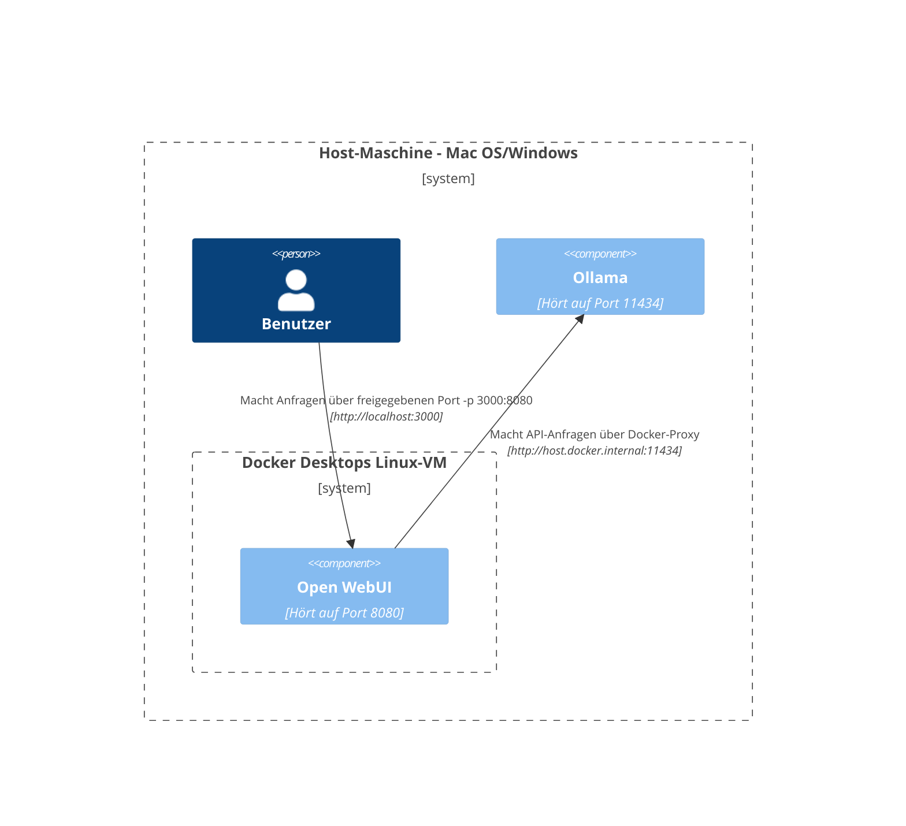
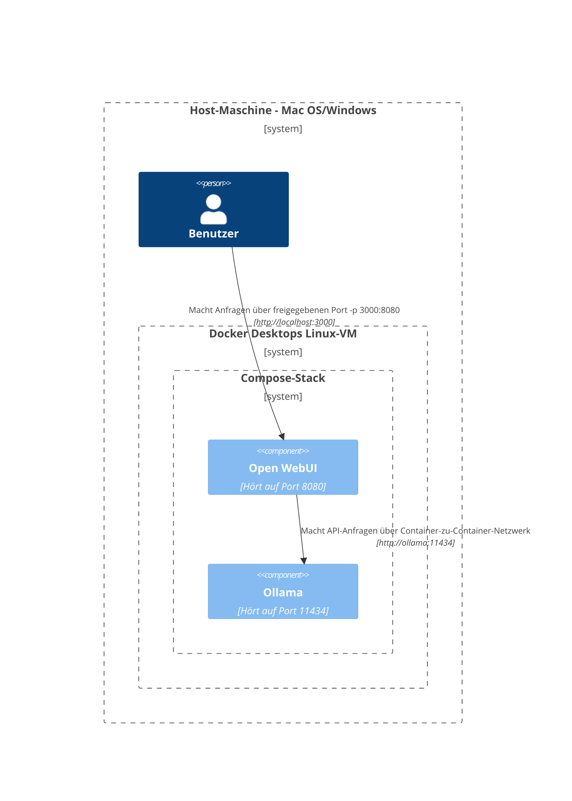
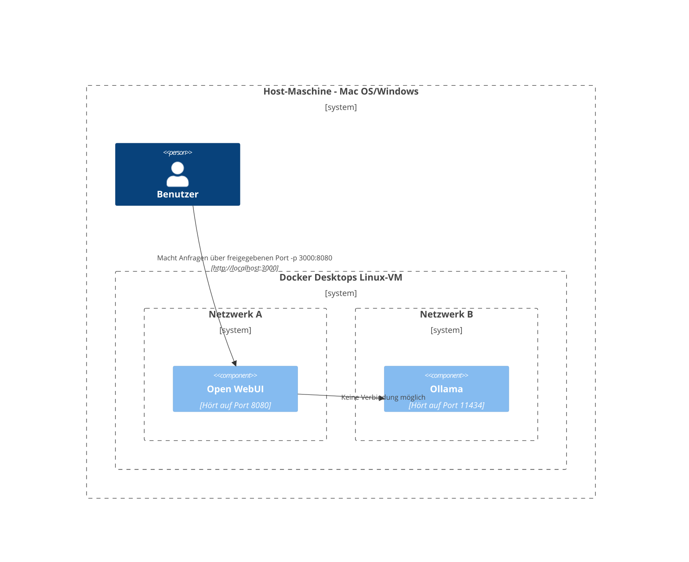
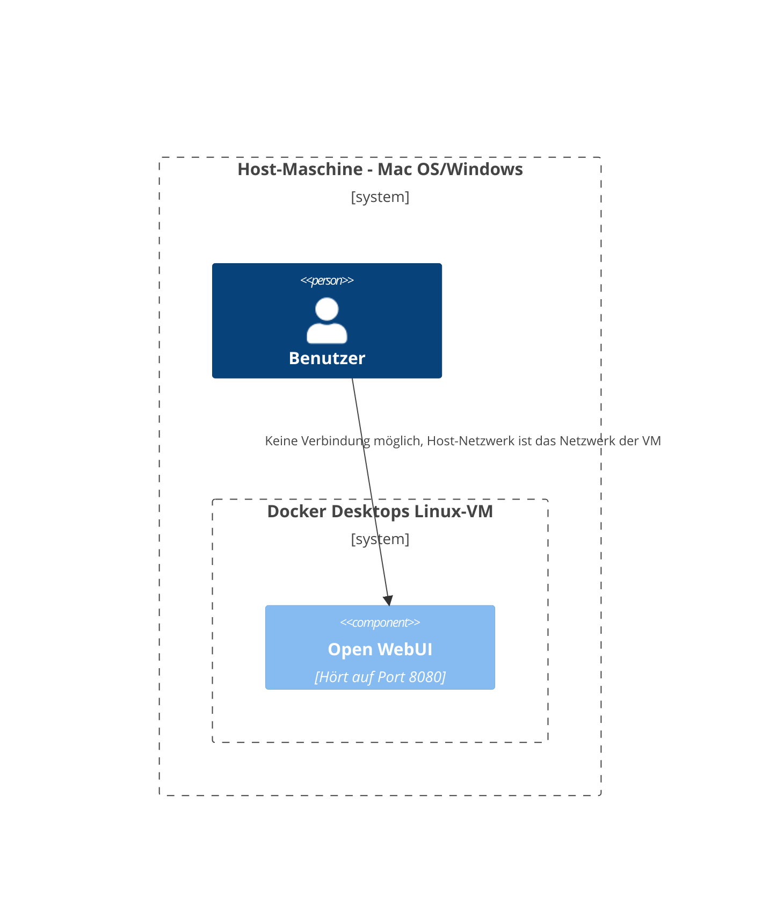
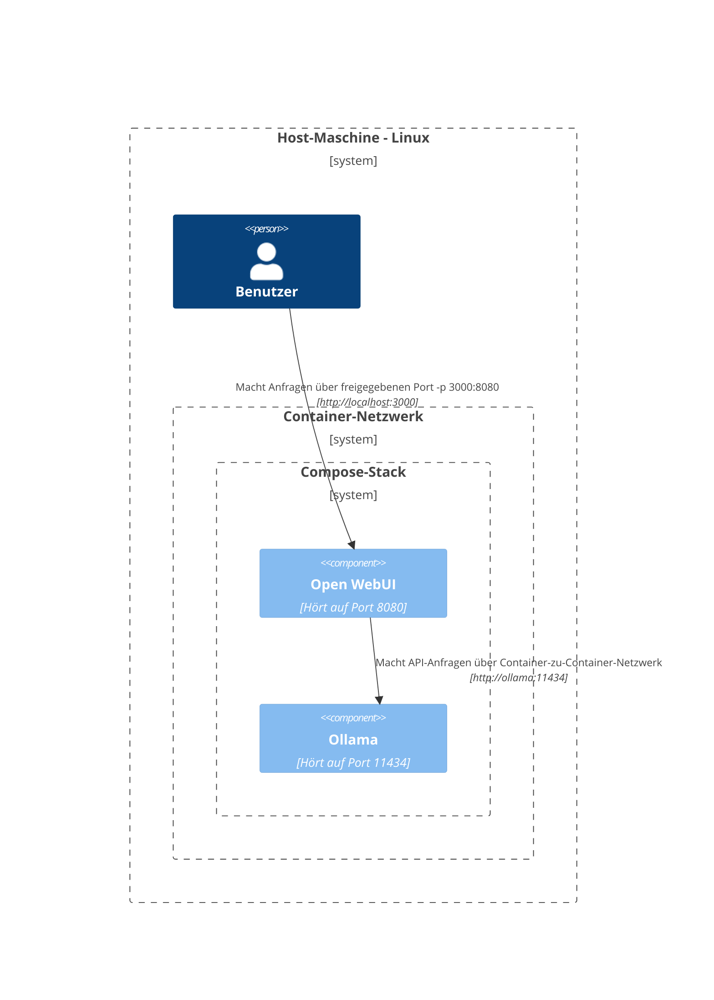
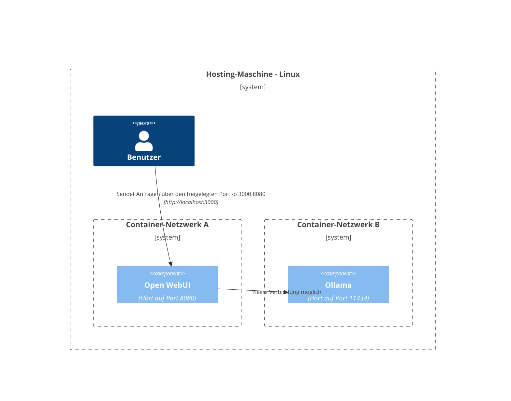
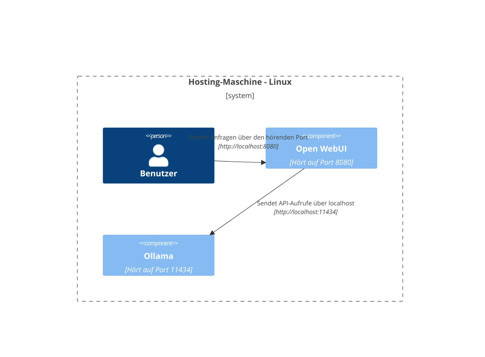

Hier bieten wir klare und strukturierte Diagramme an, die Ihnen helfen sollen zu verstehen, wie verschiedene Komponenten innerhalb unterschiedlicher Netzwerkkonfigurationen interagieren. Diese Dokumentation ist sowohl für macOS/Windows- als auch Linux-Nutzer gedacht. Jedes Szenario wird mit Mermaid-Diagrammen illustriert, um die Interaktionen je nach Systemkonfiguration und Bereitstellungsstrategie darzustellen.

## Mac OS/Windows Setup-Optionen 🖥️

### Ollama auf Host, Open WebUI im Container

In diesem Szenario läuft `Ollama` direkt auf dem Host-Rechner, während `Open WebUI` in einem Docker-Container betrieben wird.

### Ollama und Open WebUI im Compose-Stack

Sowohl `Ollama` als auch `Open WebUI` sind im selben Docker Compose-Stack konfiguriert, was die Netzwerkkommunikation vereinfacht.

### Ollama und Open WebUI in separaten Netzwerken

Hier werden `Ollama` und `Open WebUI` in separaten Docker-Netzwerken bereitgestellt, was potenziell zu Verbindungsproblemen führen kann.

### Open WebUI im Host-Netzwerk

In dieser Konfiguration nutzt `Open WebUI` das Host-Netzwerk, was die Verbindungsfähigkeit in bestimmten Umgebungen beeinflussen kann.

## Linux-Setup-Optionen 🐧

### Ollama auf Host, Open WebUI im Container (Linux)

Dieses Diagramm bezieht sich speziell auf die Linux-Plattform, wobei `Ollama` auf dem Host läuft und `Open WebUI` in einem Docker-Container bereitgestellt wird.

### Ollama und Open WebUI im Compose-Stack (Linux)

Eine Konfiguration, bei der sowohl `Ollama` als auch `Open WebUI` innerhalb des gleichen Docker Compose-Stacks auf Linux gehostet sind, wodurch die Netzwerkkonfiguration vereinfacht wird.

### Ollama und Open WebUI in separaten Netzwerken (Linux)

Ein Szenario, bei dem `Ollama` und `Open WebUI` in unterschiedlichen Docker-Netzwerken innerhalb einer Linux-Umgebung bereitgestellt werden, wodurch möglicherweise die Konnektivität beeinträchtigt wird.

### Open WebUI im Host-Netzwerk, Ollama auf Host (Linux)

Ein optimales Layout, bei dem sowohl `Open WebUI` als auch `Ollama` das Netzwerk des Hosts nutzen, wodurch eine nahtlose Interaktion auf Linux-Systemen ermöglicht wird.

Jedes Setup adressiert unterschiedliche Bereitstellungsstrategien und Netzwerkkonfigurationen, um Ihnen bei der Auswahl des optimalen Layouts für Ihre Anforderungen zu helfen.
