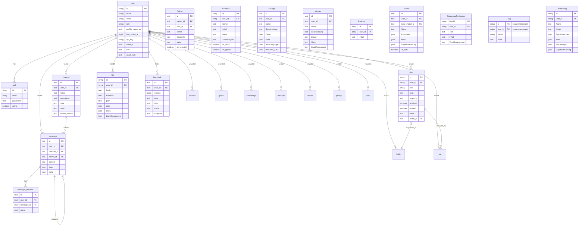

:::warning
Dieses Tutorial ist ein Community-Beitrag und wird nicht vom Open WebUI-Team unterstützt. Es dient lediglich als Demonstration, wie Sie Open WebUI für Ihren spezifischen Anwendungsfall anpassen können. Möchten Sie einen Beitrag leisten? Schauen Sie sich das Tutorial zur Beitragserstellung an.
:::

> [!WARNING]  
> Diese Dokumentation wurde basierend auf der aktuellen Version (0.5.11) erstellt und wird ständig aktualisiert.

# Open-WebUI Interne SQLite-Datenbank

Für Open-WebUI dient die SQLite-Datenbank als Rückgrat für Benutzerverwaltung, Chatverlauf, Dateispeicherung und verschiedene andere Kernfunktionen. Das Verständnis dieser Struktur ist entscheidend für alle, die zum Projekt beitragen oder es effektiv warten möchten.

## Interner Speicherort der SQLite-Datenbank

Sie finden die SQLite-Datenbank unter `root` -> `data` -> `webui.db`

```
📁 Root (/)
├── 📁 data
│   ├── 📁 cache
│   ├── 📁 uploads
│   ├── 📁 vector_db
│   └── 📄 webui.db
├── 📄 dev.sh
├── 📁 open_webui
├── 📄 requirements.txt
├── 📄 start.sh
└── 📄 start_windows.bat
```

## Datenbank lokal kopieren

Wenn Sie die Open-WebUI SQLite-Datenbank, die im Container ausgeführt wird, auf Ihren lokalen Computer kopieren möchten, können Sie folgendes verwenden:

```bash
docker cp open-webui:/app/backend/data/webui.db ./webui.db
```

Alternativ können Sie auf die Datenbank innerhalb des Containers zugreifen:

```bash
docker exec -it open-webui /bin/sh
```

## Tabellenübersicht

Hier ist eine vollständige Liste der Tabellen in der SQLite-Datenbank von Open-WebUI. Die Tabellen sind alphabetisch aufgelistet und zur besseren Übersicht nummeriert.

| **Nr.** | **Tabellenname** | **Beschreibung**                                              |
| ------- | ---------------- | ------------------------------------------------------------ |
| 01      | auth             | Speichert Benutzer-Authentifizierungsdaten und Login-Informationen |
| 02      | channel          | Verwaltert Chat-Kanäle und deren Konfigurationen             |
| 03      | channel_member   | Verfolgt Mitgliedschaften und Berechtigungen innerhalb von Kanälen |
| 04      | chat             | Speichert Chatsitzungen und deren Metadaten                  |
| 05      | chatidtag        | Verknüpft Chats mit den zugehörigen Tags                     |
| 06      | config           | Pflegt systemweite Konfigurationseinstellungen               |
| 07      | document         | Speichert Dokumente und ihre Metadaten für Wissensmanagement |
| 08      | feedback         | Erfasst Benutzerfeedback und Bewertungen                     |
| 09      | file             | Verwaltert hochgeladene Dateien und Metadaten                |
| 10      | folder           | Organisiert Dateien und Inhalte in hierarchischen Strukturen |
| 11      | function         | Speichert benutzerdefinierte Funktionen und deren Konfigurationen |
| 12      | group            | Verwaltert Benutzergruppen und deren Berechtigungen          |
| 13      | knowledge        | Speichert Einträge in der Wissensbasis und zugehörige Informationen |
| 14      | memory           | Speichert Chatverlauf und Kontextspeicher                   |
| 15      | message          | Speichert individuelle Chat-Nachrichten und deren Inhalte    |
| 16      | message_reaction | Zeichnet Benutzerreaktionen (Emojis/Antworten) auf Nachrichten auf |
| 17      | migrate_history  | Verfolgt Datenbankschemaversionen und Migrationsprotokolle   |
| 18      | model            | Verwaltert AI-Modellkonfigurationen und Einstellungen         |
| 19      | prompt           | Speichert Vorlagen und Konfigurationen für AI-Eingabeaufforderungen |
| 20      | tag              | Verwaltert Tags/Labels zur Inhaltskategorisierung            |
| 21      | tool             | Speichert Konfigurationen für Systemwerkzeuge und Integrationen |
| 22      | user             | Pflegt Benutzerprofile und Kontoinformationen               |

Hinweis: Es gibt zwei zusätzliche Tabellen in der SQLite-Datenbank von Open-WebUI, die nicht zur Kernfunktionalität von Open-WebUI gehören und ausgeschlossen wurden:

- Alembic Versions-Tabelle
- Migrationsverlauf-Tabelle

Nachdem wir alle Tabellen haben, lassen Sie uns die Struktur jeder Tabelle verstehen.

## Auth-Tabelle

| **Spaltenname** | **Datentyp**  | **Einschränkungen** | **Beschreibung**                  |
| --------------- | ------------- | ------------------- | --------------------------------- |
| id              | String        | PRIMARY KEY         | Eindeutiger Bezeichner           |
| email           | String        | -                   | E-Mail des Benutzers             |
| password        | Text          | -                   | Gehashtes Passwort               |
| active          | Boolean       | -                   | Kontostatus                      |

Wissenswertes über die Auth-Tabelle:

- Verwendet UUID als Primärschlüssel
- Eins-zu-Eins-Beziehung mit der `users`-Tabelle (geteilte ID)

## Channel-Tabelle

| **Spaltenname** | **Datentyp**  | **Einschränkungen** | **Beschreibung**                  |
| --------------- | ------------- | ------------------- | --------------------------------- |
| id              | Text          | PRIMARY KEY     | Eindeutige Kennung (UUID)                         |
| user_id         | Text          | -               | Besitzer/Ersteller des Kanals                    |
| type            | Text          | nullable        | Kanaltyp                                        |
| name            | Text          | -               | Kanalname                                      |
| description     | Text          | nullable        | Kanalbeschreibung                              |
| data            | JSON          | nullable        | Flexibler Datenspeicher                        |
| meta            | JSON          | nullable        | Kanal-Metadaten                                |
| access_control  | JSON          | nullable        | Berechtigungseinstellungen                     |
| created_at      | BigInteger    | -               | Erstellungszeitstempel (Nanosekunden)         |
| updated_at      | BigInteger    | -               | Letzter Aktualisierungszeitstempel (Nanosekunden) |

Wissenswertes über die Auth-Tabelle:

- Verwendet UUID als Primärschlüssel
- Kanalnamen sind nicht case-sensitiv (werden in Kleinbuchstaben gespeichert)

## Kanal-Mitglied-Tabelle

| **Spaltenname** | **Datentyp**  | **Einschränkungen** | **Beschreibung**                              |
| --------------- | ------------- | -------------------- | -------------------------------------------- |
| id              | TEXT          | NOT NULL             | Eindeutige Kennung für die Kanalmitgliedschaft |
| channel_id      | TEXT          | NOT NULL             | Referenz zum Kanal                           |
| user_id         | TEXT          | NOT NULL             | Referenz zum Benutzer                        |
| created_at      | BIGINT        | -                    | Zeitstempel der Mitgliedschaftserstellung    |

## Chat-Tabelle

| **Spaltenname** | **Datentyp**  | **Einschränkungen** | **Beschreibung**              |
| --------------- | ------------- | ------------------- | ---------------------------- |
| id              | String        | PRIMARY KEY         | Eindeutige Kennung (UUID)   |
| user_id         | String        | -                   | Eigentümer des Chats        |
| title           | Text          | -                   | Chat-Titel                  |
| chat            | JSON          | -                   | Chat-Inhalt und -Verlauf    |
| created_at      | BigInteger    | -                   | Erstellungszeitstempel      |
| updated_at      | BigInteger    | -                   | Letzter Aktualisierungszeitstempel |
| share_id        | Text          | UNIQUE, nullable    | Freigabe-Kennung            |
| archived        | Boolean       | default=False       | Archivierungsstatus         |
| pinned          | Boolean       | default=False, nullable | Pin-Status                 |
| meta            | JSON          | server_default="{}" | Metadaten inklusive Tags    |
| folder_id       | Text          | nullable            | Übergeordnete Ordner-ID     |

## Chat-ID-Tag-Tabelle

| **Spaltenname** | **Datentyp**  | **Einschränkungen** | **Beschreibung**         |
| --------------- | ------------- | ------------------- | ----------------------- |
| id              | VARCHAR(255)  | NOT NULL            | Eindeutige Kennung      |
| tag_name        | VARCHAR(255)  | NOT NULL            | Name des Tags           |
| chat_id         | VARCHAR(255)  | NOT NULL            | Referenz zum Chat       |
| user_id         | VARCHAR(255)  | NOT NULL            | Referenz zum Benutzer   |
| timestamp       | INTEGER       | NOT NULL            | Zeitstempel der Erstellung |

## Konfiguration

| **Spaltenname** | **Datentyp**  | **Einschränkungen** | **Standardwert**       | **Beschreibung**        |
| --------------- | ------------- | -------------------- | --------------------   | ---------------------  |
| id              | INTEGER       | NOT NULL             | -                      | Primärschlüssel-Kennung |
| data            | JSON          | NOT NULL             | -                      | Konfigurationsdaten    |
| version         | INTEGER       | NOT NULL             | -                      | Konfigurationsversionsnummer |
| created_at      | DATETIME      | NOT NULL             | CURRENT_TIMESTAMP      | Erstellungszeitstempel |
| updated_at      | DATETIME      | -                    | CURRENT_TIMESTAMP      | Letzter Aktualisierungszeitstempel |

## Feedback-Tabelle

| **Spaltenname** | **Datentyp**  | **Einschränkungen** | **Beschreibung**                 |
| --------------- | ------------- | -------------------- | ------------------------------- |
| id              | Text          | PRIMARY KEY          | Eindeutige Kennung (UUID)        |
| user_id         | Text          | -                    | Benutzer, der Feedback gegeben hat |
| version         | BigInteger    | default=0            | Feedback-Versionsnummer         |
| type            | Text          | -                    | Typ des Feedback                |
| data            | JSON          | nullable             | Feedback-Daten inklusive Bewertungen |
| meta            | JSON          | nullable             | Metadaten (Arena, chat_id, etc) |
| snapshot        | JSON          | nullable             | Zugehörige Chat-Snapshot        |
| created_at      | BigInteger    | -               | Erstellungszeitstempel          |
| updated_at      | BigInteger    | -               | Letzter Aktualisierungszeitstempel           |

# Datei-Tabelle

| **Spaltenname** | **Datentyp**  | **Beschränkungen** | **Beschreibung**       |
| --------------- | ------------- | --------------- | --------------------- |
| id              | String        | PRIMARY KEY     | Eindeutiger Bezeichner     |
| user_id         | String        | -               | Besitzer der Datei     |
| hash            | Text          | nullable        | Datei-Hash/Prüfsumme    |
| filename        | Text          | -               | Name der Datei      |
| path            | Text          | nullable        | Dateisystempfad      |
| data            | JSON          | nullable        | Datei-bezogene Daten     |
| meta            | JSON          | nullable        | Dateimetadaten         |
| access_control  | JSON          | nullable        | Berechtigungseinstellungen   |
| created_at      | BigInteger    | -               | Erstellungszeitstempel    |
| updated_at      | BigInteger    | -               | Letzter Aktualisierungszeitstempel |

Die erwartete Struktur des `meta`-Felds:

```python
{
    "name": string,          # Optionaler Anzeigename
    "content_type": string,  # MIME-Typ
    "size": integer,         # Dateigröße in Bytes
    # Zusätzliche Metadaten, unterstützt über ConfigDict(extra="allow")
}
```

## Ordner-Tabelle

| **Spaltenname** | **Datentyp**  | **Beschränkungen** | **Beschreibung**                |
| --------------- | ------------- | --------------- | ------------------------------ |
| id              | Text          | PRIMARY KEY     | Eindeutiger Bezeichner (UUID)       |
| parent_id       | Text          | nullable        | ID des übergeordneten Ordners für Hierarchie |
| user_id         | Text          | -               | Besitzer des Ordners            |
| name            | Text          | -               | Ordnername                    |
| items           | JSON          | nullable        | Ordnerinhalte                |
| meta            | JSON          | nullable        | Ordner-Metadaten                |
| is_expanded     | Boolean       | default=False   | UI-Erweiterungszustand             |
| created_at      | BigInteger    | -               | Erstellungszeitstempel             |
| updated_at      | BigInteger    | -               | Letzter Aktualisierungszeitstempel          |

Wissenswertes zur Ordner-Tabelle:

- Ordner können geschachtelt werden (Referenz auf parent_id)
- Wurzelordner haben null als parent_id
- Ordnernamen müssen innerhalb desselben übergeordneten Ordners eindeutig sein

## Funktions-Tabelle

| **Spaltenname** | **Datentyp**  | **Beschränkungen** | **Beschreibung**           |
| --------------- | ------------- | --------------- | ------------------------- |
| id              | String        | PRIMARY KEY     | Eindeutiger Bezeichner         |
| user_id         | String        | -               | Besitzer der Funktion     |
| name            | Text          | -               | Funktionsname             |
| type            | Text          | -               | Funktionstyp             |
| content         | Text          | -               | Funktionsinhalt/-code     |
| meta            | JSON          | -               | Funktionenmetadata         |
| valves          | JSON          | -               | Funktionseinstellungen |
| is_active       | Boolean       | -               | Aktivitätsstatus der Funktion    |
| is_global       | Boolean       | -               | Verfügbarkeitsflag auf globaler Ebene  |
| created_at      | BigInteger    | -               | Erstellungszeitstempel        |
| updated_at      | BigInteger    | -               | Letzter Aktualisierungszeitstempel     |

Wissenswertes zur Funktions-Tabelle:

- `type` kann nur sein: ["filter", "action"]

## Gruppen-Tabelle

| **Spaltenname** | **Datentyp**  | **Beschränkungen**     | **Beschreibung**          |
| --------------- | ------------- | ------------------- | ------------------------ |
| id              | Text          | PRIMARY KEY, UNIQUE | Eindeutiger Bezeichner (UUID) |
| user_id         | Text          | -                   | Gruppenbesitzer/-ersteller      |
| name            | Text          | -                   | Gruppenname               |
| description     | Text          | -                   | Gruppenbeschreibung        |
| data            | JSON          | nullable            | Zusätzliche Gruppendaten    |
| meta            | JSON          | nullable            | Gruppenmetadaten           |
| permissions     | JSON          | nullable            | Berechtigungskonfiguration |
| user_ids        | JSON          | nullable            | Liste der Benutzer-IDs der Mitglieder  |
| created_at      | BigInteger    | -                   | Erstellungszeitstempel       |
| updated_at      | BigInteger    | -                   | Letzter Aktualisierungszeitstempel    |

## Wissens-Tabelle

| **Spaltenname** | **Datentyp**  | **Beschränkungen**     | **Beschreibung**            |
| --------------- | ------------- | ------------------- | -------------------------- |
| id              | Text          | PRIMARY KEY, UNIQUE | Eindeutiger Bezeichner (UUID)       |
| user_id         | Text          | -                   | Besitzer der Wissensdatenbank       |
| name            | Text          | -                   | Name der Wissensdatenbank           |
| description     | Text          | -                   | Beschreibung der Wissensdatenbank   |
| data            | JSON          | nullable            | Inhalt der Wissensdatenbank         |
| meta            | JSON          | nullable            | Zusätzliche Metadaten               |
| access_control  | JSON          | nullable            | Zugriffskontrollregeln              |
| created_at      | BigInteger    | -                   | Erstellungszeitstempel              |
| updated_at      | BigInteger    | -                   | Zeitstempel der letzten Aktualisierung |

Die erwartete Struktur des Feldes `access_control`:

```python
{
  "read": {
    "group_ids": ["group_id1", "group_id2"],
    "user_ids": ["user_id1", "user_id2"]
  },
  "write": {
    "group_ids": ["group_id1", "group_id2"],
    "user_ids": ["user_id1", "user_id2"]
  }
}
```

## Speicher-Tabelle

| **Spaltenname** | **Datentyp**  | **Einschränkungen** | **Beschreibung**                 |
| --------------- | ------------- | ------------------- | -------------------------------- |
| id              | String        | PRIMARY KEY         | Eindeutiger Bezeichner (UUID)    |
| user_id         | String        | -                   | Besitzer des Speichers           |
| content         | Text          | -                   | Speicherinhalt                   |
| created_at      | BigInteger    | -                   | Erstellungszeitstempel           |
| updated_at      | BigInteger    | -                   | Zeitstempel der letzten Aktualisierung |

## Nachrichten-Tabelle

| **Spaltenname** | **Datentyp**  | **Einschränkungen** | **Beschreibung**                             |
| --------------- | ------------- | ------------------- | --------------------------------------------- |
| id              | Text          | PRIMARY KEY         | Eindeutiger Bezeichner (UUID)                |
| user_id         | Text          | -                   | Verfasser der Nachricht                      |
| channel_id      | Text          | nullable            | Zugehöriger Kanal                            |
| parent_id       | Text          | nullable            | Übergeordnete Nachricht für Threads          |
| content         | Text          | -                   | Nachrichtentext                              |
| data            | JSON          | nullable            | Zusätzliche Nachrichtendaten                 |
| meta            | JSON          | nullable            | Metadaten der Nachricht                      |
| created_at      | BigInteger    | -                   | Erstellungszeitstempel (Nanosekunden)        |
| updated_at      | BigInteger    | -                   | Zeitstempel der letzten Aktualisierung (Nanosekunden) |

## Reaktionen auf Nachrichten Tabelle

| **Spaltenname** | **Datentyp**  | **Einschränkungen** | **Beschreibung**                 |
| --------------- | ------------- | ------------------- | -------------------------------- |
| id              | Text          | PRIMARY KEY         | Eindeutiger Bezeichner (UUID)   |
| user_id         | Text          | -                   | Benutzer, der reagiert hat      |
| message_id      | Text          | -                   | Zugehörige Nachricht            |
| name            | Text          | -                   | Name/Emoji der Reaktion         |
| created_at      | BigInteger    | -                   | Zeitstempel der Reaktion        |

## Modell-Tabelle

| **Spaltenname** | **Datentyp**  | **Einschränkungen** | **Beschreibung**                 |
| --------------- | ------------- | ------------------- | -------------------------------- |
| id              | Text          | PRIMARY KEY         | Modellbezeichner                 |
| user_id         | Text          | -                   | Besitzer des Modells             |
| base_model_id   | Text          | nullable            | Referenz auf übergeordnetes Modell |
| name            | Text          | -                   | Anzeigename                      |
| params          | JSON          | -                   | Modellparameter                  |
| meta            | JSON          | -                   | Modellmetadaten                  |
| access_control  | JSON          | nullable            | Zugriffsberechtigungen           |
| is_active       | Boolean       | default=True        | Aktivierungsstatus               |
| created_at      | BigInteger    | -                   | Erstellungszeitstempel           |
| updated_at      | BigInteger    | -                   | Zeitstempel der letzten Aktualisierung |

## Aufforderungs-Tabelle

| **Spaltenname** | **Datentyp**  | **Einschränkungen** | **Beschreibung**                   |
| --------------- | ------------- | ------------------- | ---------------------------------- |
| command         | String        | PRIMARY KEY         | Eindeutige Befehlskennung          |
| user_id         | String        | -                   | Besitzer der Aufforderung          |
| title           | Text          | -                   | Titel der Aufforderung             |
| content         | Text          | -                   | Inhalt/Vorlage der Aufforderung    |
| timestamp       | BigInteger    | -                   | Zeitstempel der letzten Aktualisierung |
| access_control  | JSON          | nullable            | Zugriffsberechtigungen             |

## Tag-Tabelle

| **Spaltenname** | **Datentyp** | **Einschränkungen** | **Beschreibung**          |
| --------------- | ------------- | ------------------- | ------------------------- |
| id              | String        | PK (zusammengesetzt) | Normalisierte Tag-Kennung |
| name            | String        | -                   | Anzeigename              |
| user_id         | String        | PK (zusammengesetzt) | Tag-Besitzer             |
| meta            | JSON          | nullable            | Tag-Metadaten            |

Wissenswertes über die Tag-Tabelle:

- Primärschlüssel ist zusammengesetzt (id, user_id)

## Werkzeug-Tabelle

| **Spaltenname** | **Datentyp** | **Einschränkungen** | **Beschreibung**       |
| --------------- | ------------- | ------------------- | ---------------------- |
| id              | String        | PRIMÄRSCHLÜSSEL    | Eindeutige Kennung     |
| user_id         | String        | -                   | Werkzeugbesitzer       |
| name            | Text          | -                   | Werkzeugname           |
| content         | Text          | -                   | Werkzeuginhalt/Code    |
| specs           | JSON          | -                   | Werkzeugspezifikationen |
| meta            | JSON          | -                   | Werkzeug-Metadaten     |
| valves          | JSON          | -                   | Werkzeugsteuerungseinstellungen |
| access_control  | JSON          | nullable            | Zugriffsberechtigungen |
| created_at      | BigInteger    | -                   | Erstellungszeitstempel |
| updated_at      | BigInteger    | -                   | Letzter Aktualisierungszeitstempel |

## Benutzer-Tabelle

| **Spaltenname**   | **Datentyp** | **Einschränkungen**  | **Beschreibung**         |
| ----------------- | ------------- | ------------------- | ----------------------- |
| id                | String        | PRIMÄRSCHLÜSSEL     | Eindeutige Kennung       |
| name              | String        | -                   | Name des Benutzers       |
| email             | String        | -                   | E-Mail des Benutzers     |
| role              | String        | -                   | Rolle des Benutzers      |
| profile_image_url | Text          | -                   | Pfad zum Profilbild      |
| last_active_at    | BigInteger    | -                   | Letzter Aktivitätszeitstempel |
| updated_at        | BigInteger    | -                   | Letzter Aktualisierungszeitstempel |
| created_at        | BigInteger    | -                   | Erstellungszeitstempel   |
| api_key           | String        | EINZIGARTIG, nullable | API-Authentifizierungsschlüssel |
| settings          | JSON          | nullable            | Benutzerpräferenzen      |
| info              | JSON          | nullable            | Zusätzliche Benutzerinformationen |
| oauth_sub         | Text          | EINZIGARTIG         | OAuth-Subjekt-Kennung    |

# Entity-Relationship-Diagramm

Um die Beziehung zwischen den Tabellen zu visualisieren, siehe das untenstehende Entity-Relationship-Diagramm (ERD), das mit Mermaid generiert wurde.


