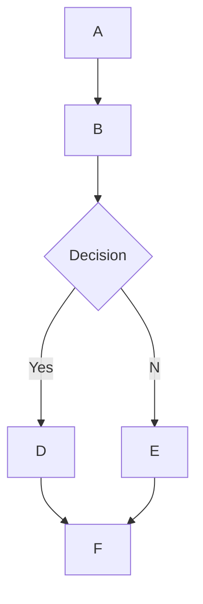

# 🌊 Soporte de Renderizado de MermaidJS en Open WebUI

## Visión General

Open WebUI admite el renderizado de diagramas MermaidJS visualmente atractivos, diagramas de flujo, gráficos de pastel y más, directamente dentro de la interfaz de chat. MermaidJS es una herramienta poderosa para visualizar información e ideas complejas, y cuando se combina con las capacidades de un modelo de lenguaje grande (LLM), puede ser una herramienta potente para generar y explorar nuevas ideas.

## Usando MermaidJS en Open WebUI

Para generar un diagrama MermaidJS, simplemente solicita a un LLM dentro de cualquier chat que cree un diagrama o gráfico usando MermaidJS. Por ejemplo, puedes pedirle al LLM:

* "Crea un diagrama de flujo para un proceso de toma de decisiones simple usando Mermaid. Explica cómo funciona el diagrama de flujo."
* "Usa Mermaid para visualizar un árbol de decisiones para determinar si es adecuado salir a caminar."

Ten en cuenta que, para que la respuesta del LLM se renderice correctamente, debe comenzar con la palabra `mermaid` seguida del código MermaidJS. Puedes consultar la [documentación de MermaidJS](https://mermaid.js.org/intro/) para asegurarte de que la sintaxis sea correcta y proporcionar indicaciones estructuradas al LLM para guiarlo hacia la generación de mejor sintaxis MermaidJS.

## Visualizando Código MermaidJS Directamente en el Chat

Cuando solicitas una visualización MermaidJS, el modelo de lenguaje grande (LLM) generará el código necesario. Open WebUI renderizará automáticamente la visualización directamente en la interfaz de chat, siempre que el código use una sintaxis válida de MermaidJS.

Si el modelo genera una sintaxis MermaidJS pero la visualización no se renderiza, generalmente indica un error de sintaxis en el código. No te preocupes: se te notificará de cualquier error una vez que se haya generado completamente la respuesta. Si esto ocurre, intenta consultar la [documentación de MermaidJS](https://mermaid.js.org/intro/) para identificar el problema y revisar la indicación correspondiente.

## Interactuando con Tu Visualización

Una vez que se muestra tu visualización, puedes:

* Acercarte y alejarte para examinarla más de cerca.
* Copiar el código original de MermaidJS utilizado para generar la visualización haciendo clic en el botón de copiar en la esquina superior derecha del área de visualización.

### Ejemplo



Esto generará un diagrama de flujo como el siguiente:

```markdown
 startAncestor [ start ]
A[A] --> B[B]
B --> C[Decision]
C -->| Yes | D[D]
C -->| No  | E[E]
D --> F[F]
E --> F[F]
```

Experimentar con diferentes tipos de diagramas y gráficos puede ayudarte a desarrollar una comprensión más matizada de cómo aprovechar eficazmente MermaidJS dentro de Open WebUI. Para modelos más pequeños, considera consultar la [documentación de MermaidJS](https://mermaid.js.org/intro/) para proporcionar orientación al LLM o pedirle que resuma la documentación en notas completas o una indicación de sistema. Siguiendo estas pautas y explorando las capacidades de MermaidJS, podrás desbloquear el máximo potencial de esta poderosa herramienta en Open WebUI.
