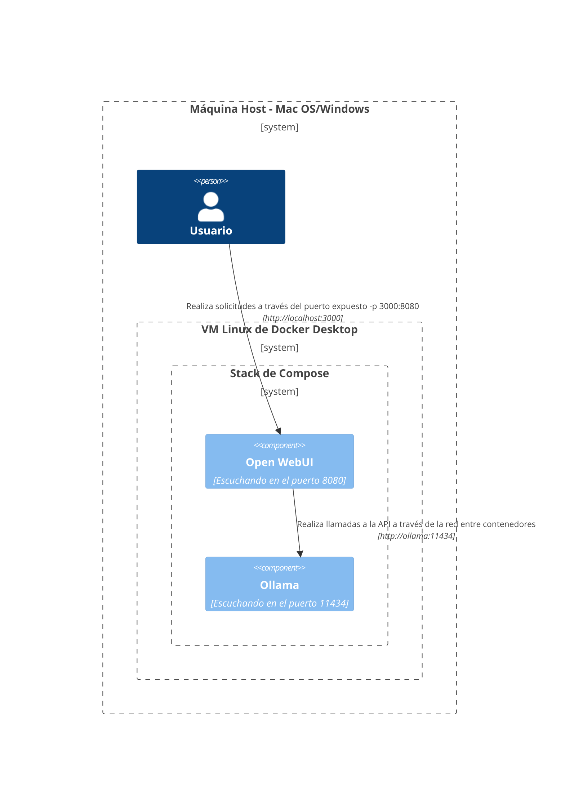
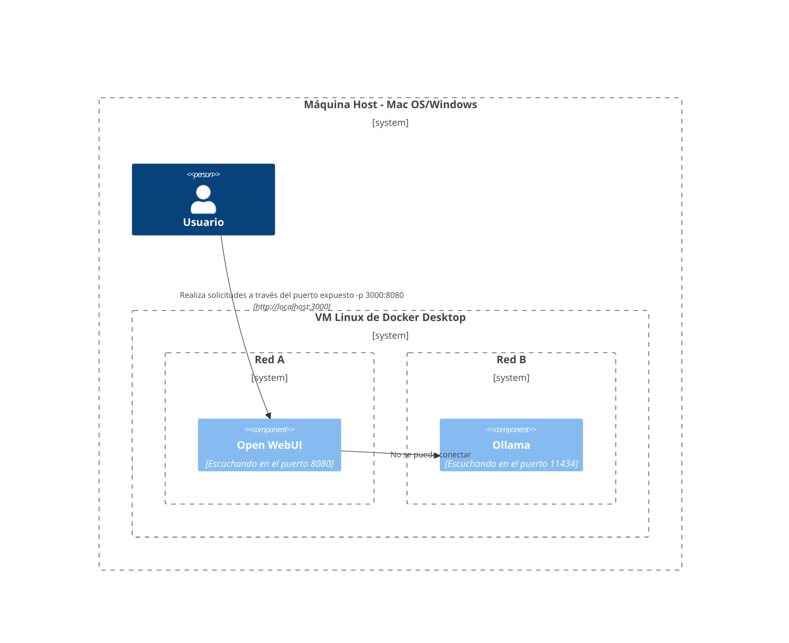
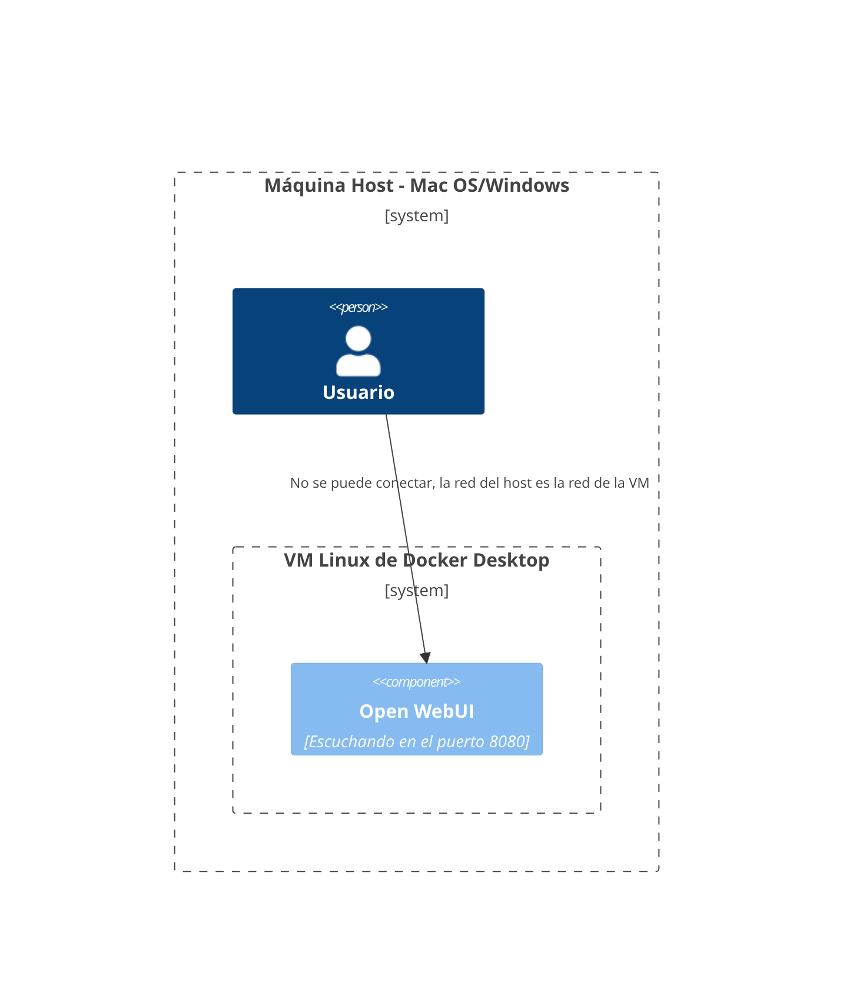
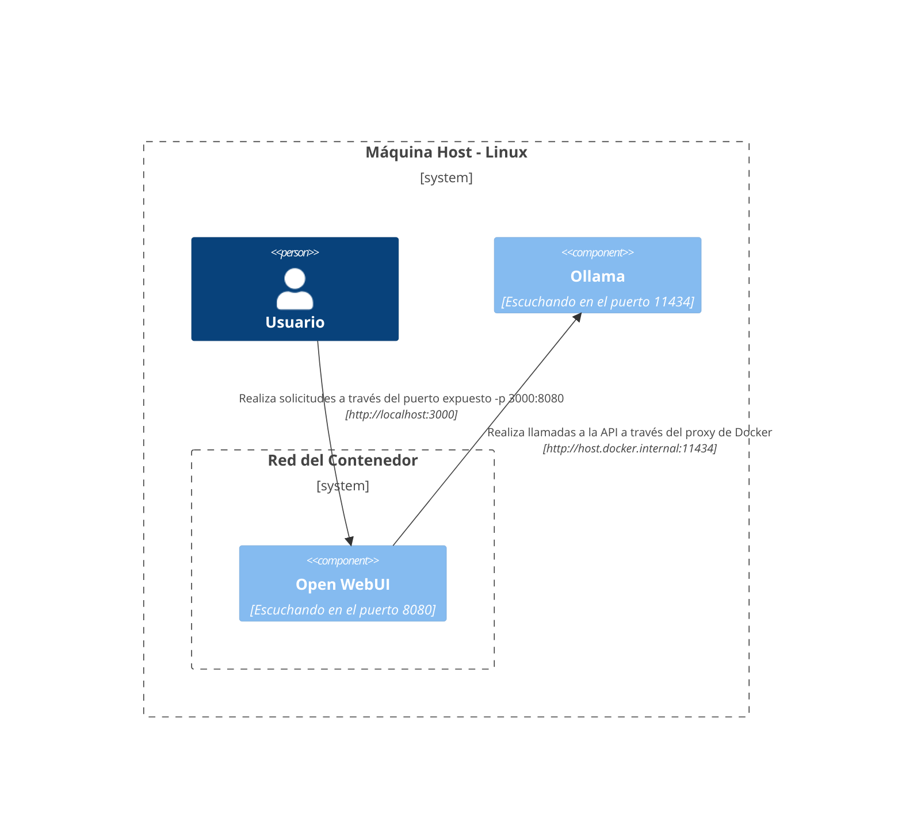
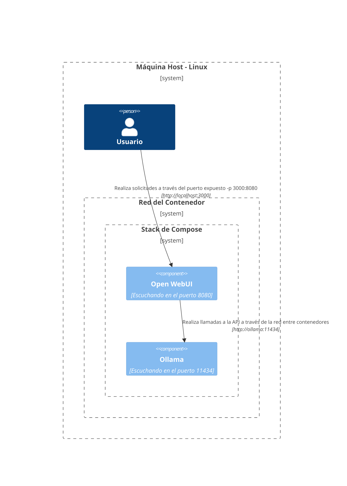

Aquí, proporcionamos diagramas claros y estructurados para ayudarte a entender cómo interactúan los distintos componentes de la red en diferentes configuraciones. Esta documentación está diseñada para asistir a usuarios de macOS/Windows y Linux. Cada escenario se ilustra utilizando diagramas Mermaid para mostrar cómo se configuran las interacciones según las diferentes configuraciones del sistema y estrategias de implementación.

## Opciones de Configuración para Mac OS/Windows 🖥️

### Ollama en el Host, Abrir WebUI en el Contenedor

En este escenario, `Ollama` se ejecuta directamente en la máquina host mientras que `Open WebUI` opera dentro de un contenedor Docker.


### Ollama y Open WebUI en la Stack de Compose

Tanto `Ollama` como `Open WebUI` están configurados dentro de la misma stack de Docker Compose, simplificando las comunicaciones de red.



### Ollama y Open WebUI en Redes Separadas

Aquí, `Ollama` y `Open WebUI` se despliegan en redes Docker separadas, lo que podría causar problemas de conectividad.



### Open WebUI en la Red del Host

En esta configuración, `Open WebUI` utiliza la red del host, lo que afecta su capacidad para conectarse en ciertos entornos.




## Opciones de Configuración para Linux 🐧

### Ollama en el Host, Open WebUI en el Contenedor (Linux)

Este diagrama es específico para la plataforma Linux, con `Ollama` ejecutándose en el host y `Open WebUI` desplegado dentro de un contenedor Docker.



### Ollama y Open WebUI en la Stack de Compose (Linux)

Una configuración donde tanto `Ollama` como `Open WebUI` residen dentro de la misma stack de Docker Compose, permitiendo una comunicación fácil en Linux.



### Ollama y Open WebUI, Redes Separadas (Linux)

Un escenario en el que `Ollama` y `Open WebUI` están en diferentes redes Docker bajo un entorno Linux, lo que podría dificultar la conectividad.

```mermaid
C4Context
Boundary(b0, "Máquina de alojamiento - Linux") {
   Persona(user, "Usuario")
   Boundary(b2, "Red de Contenedor A") {
      Componente(openwebui, "Open WebUI", "Escuchando en el puerto 8080")
   }
   Boundary(b3, "Red de Contenedor B") {
      Componente(ollama, "Ollama", "Escuchando en el puerto 11434")
   }
}
Rel(openwebui, ollama, "No se puede conectar")
Rel(user, openwebui, "Realiza solicitudes a través del puerto expuesto -p 3000:8080", "http://localhost:3000")
UpdateRelStyle(user, openwebui, $offsetX="-100", $offsetY="-50")
```

### Open WebUI en Red de Host, Ollama en Host (Linux)

Una disposición óptima donde tanto `Open WebUI` como `Ollama` utilizan la red del host, facilitando una interacción fluida en sistemas Linux.

```mermaid
C4Context
Boundary(b0, "Máquina de alojamiento - Linux") {
   Persona(user, "Usuario")
   Componente(openwebui, "Open WebUI", "Escuchando en el puerto 8080")
   Componente(ollama, "Ollama", "Escuchando en el puerto 11434")
}
Rel(openwebui, ollama, "Realiza llamadas API a través de localhost", "http://localhost:11434")
Rel(user, openwebui, "Realiza solicitudes a través del puerto en escucha", "http://localhost:8080")
UpdateRelStyle(user, openwebui, $offsetX="-100", $offsetY="-50")
```

Cada configuración aborda diferentes estrategias de despliegue y configuraciones de red para ayudarle a elegir la mejor disposición para sus necesidades.
