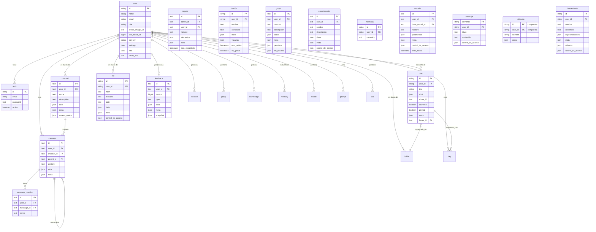

:::warning
Este tutorial es una contribución de la comunidad y no está respaldado por el equipo de Open WebUI. Solo sirve como una demostración sobre cómo personalizar Open WebUI para tu caso de uso específico. ¿Quieres contribuir? Consulta el tutorial de contribuciones.
:::

> [!WARNING]  
> Esta documentación fue creada basada en la versión actual (0.5.11) y se actualiza constantemente.

# Base de datos interna SQLite en Open-WebUI

Para Open-WebUI, la base de datos SQLite actúa como el soporte para la gestión de usuarios, historial de chat, almacenamiento de archivos y varias otras funcionalidades principales. Entender esta estructura es esencial para cualquiera que desee contribuir o mantener el proyecto de manera efectiva.

## Ubicación interna de SQLite

Puedes encontrar la base de datos SQLite en `root` -> `data` -> `webui.db`

```
📁 Root (/)
├── 📁 data
│   ├── 📁 cache
│   ├── 📁 uploads
│   ├── 📁 vector_db
│   └── 📄 webui.db
├── 📄 dev.sh
├── 📁 open_webui
├── 📄 requirements.txt
├── 📄 start.sh
└── 📄 start_windows.bat
```

## Copiar la base de datos localmente

Si deseas copiar la base de datos SQLite de Open-WebUI que está ejecutándose en el contenedor a tu máquina local, puedes usar:

```bash
docker cp open-webui:/app/backend/data/webui.db ./webui.db
```

Alternativamente, puedes acceder a la base de datos dentro del contenedor utilizando:

```bash
docker exec -it open-webui /bin/sh
```

## Visión general de las tablas

Aquí hay una lista completa de las tablas en la base de datos SQLite de Open-WebUI. Las tablas están listadas alfabéticamente y numeradas para mayor comodidad.

| **No.** | **Nombre de la Tabla**   | **Descripción**                                              |
| ------- | ------------------------ | ------------------------------------------------------------ |
| 01      | auth                     | Almacena credenciales de autenticación de usuarios e información de inicio de sesión |
| 02      | channel                  | Administra canales de chat y sus configuraciones             |
| 03      | channel_member           | Lleva un registro de la membresía de usuarios y permisos dentro de canales |
| 04      | chat                     | Almacena las sesiones de chat y sus metadatos                |
| 05      | chatidtag                | Mapea relaciones entre chats y sus etiquetas asociadas       |
| 06      | config                   | Mantiene configuraciones del sistema a nivel global          |
| 07      | document                 | Almacena documentos y sus metadatos para la gestión del conocimiento |
| 08      | feedback                 | Captura retroalimentación y calificaciones de usuarios       |
| 09      | file                     | Administra los archivos subidos y sus metadatos              |
| 10      | folder                   | Organiza archivos y contenido en estructuras jerárquicas     |
| 11      | function                 | Almacena funciones personalizadas y sus configuraciones      |
| 12      | group                    | Administra grupos de usuarios y sus permisos                 |
| 13      | knowledge                | Almacena entradas de la base de conocimientos e información relacionada |
| 14      | memory                   | Mantiene el historial de chat y la memoria de contexto       |
| 15      | message                  | Almacena mensajes individuales y su contenido                |
| 16      | message_reaction         | Registra las reacciones de los usuarios (emojis/respuestas) a los mensajes |
| 17      | migrate_history          | Rastrea la versión del esquema de base de datos y los registros de migración |
| 18      | model                    | Administra configuraciones y ajustes de modelos de IA        |
| 19      | prompt                   | Almacena plantillas y configuraciones para prompts de IA     |
| 20      | tag                      | Administra etiquetas y categoriza contenido                  |
| 21      | tool                     | Almacena configuraciones de herramientas e integraciones del sistema |
| 22      | user                     | Mantiene perfiles de usuarios e información de cuentas       |

Nota: hay dos tablas adicionales en la base de datos SQLite de Open-WebUI que no están relacionadas con la funcionalidad principal de Open-WebUI y que han sido excluidas:

- Tabla de Version Alembic
- Tabla de Historial de Migración

Ahora que tenemos todas las tablas, entendamos la estructura de cada una de ellas.

## Tabla Auth

| **Nombre de la Columna** | **Tipo de Dato** | **Restricciones** | **Descripción**                           |
| ------------------------ | ---------------- | ----------------- | ----------------------------------------- |
| id                      | String           | PRIMARY KEY       | Identificador único                       |
| email                   | String           | -                 | Email del usuario                         |
| password                | Text             | -                 | Contraseña cifrada                        |
| active                  | Boolean          | -                 | Estado de la cuenta                       |

Aspectos a saber sobre la tabla auth:

- Usa UUID como clave primaria
- Relación Uno a Uno con la tabla `users` (id compartida)

## Tabla Channel

| **Nombre de la Columna** | **Tipo de Dato** | **Restricciones** | **Descripción**                                          |
| ------------------------ | ---------------- | ----------------- | --------------------------------------------------------- |
| id              | Texto         | CLAVE PRIMARIA  | Identificador único (UUID)                  |
| user_id         | Texto         | -               | Propietario/creador del canal               |
| type            | Texto         | nullable        | Tipo de canal                               |
| name            | Texto         | -               | Nombre del canal                            |
| description     | Texto         | nullable        | Descripción del canal                       |
| data            | JSON          | nullable        | Almacenamiento de datos flexible            |
| meta            | JSON          | nullable        | Metadatos del canal                         |
| access_control  | JSON          | nullable        | Configuración de permisos                   |
| created_at      | BigInteger    | -               | Marca de tiempo de creación (nanosegundos) |
| updated_at      | BigInteger    | -               | Marca de tiempo de última actualización (nanosegundos) |

Cosas que saber sobre la tabla auth:

- Usa UUID como clave primaria
- Nombres de canales insensibles a mayúsculas (almacenados en minúsculas)

## Tabla de Miembro del Canal

| **Nombre de columna** | **Tipo de dato** | **Restricciones** | **Descripción**                               |
| --------------------- | -----------------| ------------------|----------------------------------------------- |
| id                   | TEXTO            | NOT NULL          | Identificador único de la membresía del canal |
| channel_id           | TEXTO            | NOT NULL          | Referencia al canal                           |
| user_id              | TEXTO            | NOT NULL          | Referencia al usuario                         |
| created_at           | BIGINT           | -                 | Marca de tiempo de creación de la membresía  |

## Tabla de Chat

| **Nombre de columna** | **Tipo de dato** | **Restricciones**         | **Descripción**           |
| --------------------- | ---------------- | -------------------------- | ------------------------- |
| id                   | String           | CLAVE PRIMARIA            | Identificador único (UUID)|
| user_id              | String           | -                        | Propietario del chat       |
| title                | Texto            | -                        | Título del chat            |
| chat                 | JSON             | -                        | Contenido e historial del chat |
| created_at           | BigInteger       | -                        | Marca de tiempo de creación |
| updated_at           | BigInteger       | -                        | Marca de tiempo de última actualización |
| share_id             | Texto            | ÚNICO, nullable          | Identificador para compartir |
| archived             | Boolean          | predeterminado=False     | Estado de archivo          |
| pinned               | Boolean          | predeterminado=False, nullable | Estado de fijación    |
| meta                 | JSON             | server_default="{}"      | Metadatos incluyendo etiquetas |
| folder_id            | Texto            | nullable                | ID del folder padre            |

## Tabla de Etiquetas de Chat

| **Nombre de columna** | **Tipo de dato** | **Restricciones** | **Descripción**    |
| --------------------- | ---------------- | ------------------ | ------------------ |
| id                   | VARCHAR(255)     | NOT NULL           | Identificador único |
| tag_name             | VARCHAR(255)     | NOT NULL           | Nombre de la etiqueta |
| chat_id              | VARCHAR(255)     | NOT NULL           | Referencia al chat    |
| user_id              | VARCHAR(255)     | NOT NULL           | Referencia al usuario |
| timestamp            | INTEGER          | NOT NULL           | Marca de tiempo de creación |

## Configuración

| **Nombre de columna** | **Tipo de dato** | **Restricciones** | **Predeterminado** | **Descripción**       |
| --------------------- | ---------------- | ----------------- | ------------------ | --------------------- |
| id                   | INTEGER          | NOT NULL          | -                  | Identificador clave primaria |
| data                 | JSON             | NOT NULL          | -                  | Datos de configuración     |
| version              | INTEGER          | NOT NULL          | -                  | Número de versión de configuración |
| created_at           | DATETIME         | NOT NULL          | CURRENT_TIMESTAMP  | Marca de tiempo de creación |
| updated_at           | DATETIME         | -                 | CURRENT_TIMESTAMP  | Marca de tiempo de última actualización |

## Tabla de Retroalimentación

| **Nombre de columna** | **Tipo de dato** | **Restricciones** | **Descripción**                 |
| --------------------- | ---------------- | ----------------- | ------------------------------- |
| id                   | Texto            | CLAVE PRIMARIA    | Identificador único (UUID)      |
| user_id              | Texto            | -                 | Usuario que proporcionó retroalimentación |
| version              | BigInteger       | predeterminado=0  | Número de versión de la retroalimentación |
| type                 | Texto            | -                 | Tipo de retroalimentación       |
| data                 | JSON             | nullable          | Datos de retroalimentación incluyendo calificaciones |
| meta                 | JSON             | nullable          | Metadatos (arena, chat_id, etc.) |
| snapshot             | JSON             | nullable          | Instantánea de chat asociada    |
| created_at      | BigInteger    | -               | Marca de tiempo de creación              |
| updated_at      | BigInteger    | -               | Marca de tiempo de última actualización           |

# Tabla de Archivos

| **Nombre de Columna** | **Tipo de Datos** | **Restricciones** | **Descripción**       |
| --------------------- | ----------------- | ----------------- | --------------------- |
| id                    | String           | PRIMARY KEY       | Identificador único   |
| user_id               | String           | -                 | Propietario del archivo |
| hash                  | Text             | nullable          | Hash/checksum del archivo |
| filename              | Text             | -                 | Nombre del archivo    |
| path                  | Text             | nullable          | Ruta del sistema de archivos |
| data                  | JSON             | nullable          | Datos relacionados con el archivo |
| meta                  | JSON             | nullable          | Metadatos del archivo |
| access_control        | JSON             | nullable          | Configuración de permisos |
| created_at            | BigInteger       | -                 | Marca de tiempo de creación |
| updated_at            | BigInteger       | -                 | Marca de tiempo de última actualización |

La estructura esperada del campo `meta`:

```python
{
    "name": string,          # Nombre opcional para mostrar
    "content_type": string,  # Tipo MIME
    "size": integer,         # Tamaño del archivo en bytes
    # Metadatos adicionales compatibles a través de ConfigDict(extra="allow")
}
```

## Tabla de Carpetas

| **Nombre de Columna** | **Tipo de Datos** | **Restricciones** | **Descripción**                |
| --------------------- | ----------------- | ----------------- | ------------------------------ |
| id                    | Text             | PRIMARY KEY       | Identificador único (UUID)    |
| parent_id             | Text             | nullable          | ID de carpeta padre para jerarquía |
| user_id               | Text             | -                 | Propietario de la carpeta     |
| name                  | Text             | -                 | Nombre de la carpeta          |
| items                 | JSON             | nullable          | Contenido de la carpeta       |
| meta                  | JSON             | nullable          | Metadatos de la carpeta       |
| is_expanded           | Boolean          | default=False     | Estado de expansión en la interfaz gráfica |
| created_at            | BigInteger       | -                 | Marca de tiempo de creación   |
| updated_at            | BigInteger       | -                 | Marca de tiempo de última actualización |

Aspectos importantes sobre la tabla de carpetas:

- Las carpetas pueden estar anidadas (referencia a parent_id)
- Las carpetas raíz tienen parent_id nulo
- Los nombres de las carpetas deben ser únicos dentro del mismo padre

## Tabla de Funciones

| **Nombre de Columna** | **Tipo de Datos** | **Restricciones** | **Descripción**           |
| --------------------- | ----------------- | ----------------- | ------------------------- |
| id                    | String           | PRIMARY KEY       | Identificador único       |
| user_id               | String           | -                 | Propietario de la función |
| name                  | Text             | -                 | Nombre de la función      |
| type                  | Text             | -                 | Tipo de función           |
| content               | Text             | -                 | Código/contenido de la función |
| meta                  | JSON             | -                 | Metadatos de la función   |
| valves                | JSON             | -                 | Configuración de control de la función |
| is_active             | Boolean          | -                 | Estado activo de la función |
| is_global             | Boolean          | -                 | Indicador de disponibilidad global |
| created_at            | BigInteger       | -                 | Marca de tiempo de creación |
| updated_at            | BigInteger       | -                 | Marca de tiempo de última actualización |

Aspectos importantes sobre la tabla de funciones:

- `type` solo puede ser: ["filter", "action"]

## Tabla de Grupos

| **Nombre de Columna** | **Tipo de Datos** | **Restricciones**     | **Descripción**          |
| --------------------- | ----------------- | --------------------- | ------------------------ |
| id                    | Text             | PRIMARY KEY, UNIQUE  | Identificador único (UUID) |
| user_id               | Text             | -                    | Propietario/creador del grupo |
| name                  | Text             | -                    | Nombre del grupo         |
| description           | Text             | -                    | Descripción del grupo    |
| data                  | JSON             | nullable             | Datos adicionales del grupo |
| meta                  | JSON             | nullable             | Metadatos del grupo      |
| permissions           | JSON             | nullable             | Configuración de permisos |
| user_ids              | JSON             | nullable             | Lista de IDs de usuario miembros |
| created_at            | BigInteger       | -                    | Marca de tiempo de creación |
| updated_at            | BigInteger       | -                    | Marca de tiempo de última actualización |

## Tabla de Conocimientos

| **Nombre de Columna** | **Tipo de Datos** | **Restricciones**     | **Descripción**            |
| --------------------- | ----------------- | --------------------- | -------------------------- |
| id              | Text          | PRIMARY KEY, UNIQUE | Identificador único (UUID)        |
| user_id         | Text          | -                   | Propietario de la base de conocimientos |
| name            | Text          | -                   | Nombre de la base de conocimientos    |
| description     | Text          | -                   | Descripción de la base de conocimientos |
| data            | JSON          | nullable            | Contenido de la base de conocimientos |
| meta            | JSON          | nullable            | Metadatos adicionales             |
| access_control  | JSON          | nullable            | Reglas de control de acceso        |
| created_at      | BigInteger    | -                   | Marca de tiempo de creación        |
| updated_at      | BigInteger    | -                   | Marca de tiempo de la última actualización |

La estructura esperada de los campos `access_control`:

```python
{
  "read": {
    "group_ids": ["group_id1", "group_id2"],
    "user_ids": ["user_id1", "user_id2"]
  },
  "write": {
    "group_ids": ["group_id1", "group_id2"],
    "user_ids": ["user_id1", "user_id2"]
  }
}
```

## Tabla de Memoria

| **Nombre de la columna** | **Tipo de datos** | **Restricciones** | **Descripción**           |
| ------------------------ | ----------------- | ----------------- | ------------------------- |
| id                      | String            | PRIMARY KEY       | Identificador único (UUID) |
| user_id                 | String            | -                 | Propietario de la memoria  |
| content                 | Text              | -                 | Contenido de la memoria    |
| created_at              | BigInteger        | -                 | Marca de tiempo de creación |
| updated_at              | BigInteger        | -                 | Marca de tiempo de la última actualización |

## Tabla de Mensajes

| **Nombre de la columna** | **Tipo de datos** | **Restricciones** | **Descripción**                      |
| ------------------------ | ----------------- | ----------------- | ------------------------------------ |
| id                      | Text              | PRIMARY KEY       | Identificador único (UUID)            |
| user_id                 | Text              | -                 | Autor del mensaje                     |
| channel_id              | Text              | nullable          | Canal asociado                        |
| parent_id               | Text              | nullable          | Mensaje padre para hilos              |
| content                 | Text              | -                 | Contenido del mensaje                 |
| data                    | JSON              | nullable          | Datos adicionales del mensaje         |
| meta                    | JSON              | nullable          | Metadatos del mensaje                 |
| created_at              | BigInteger        | -                 | Marca de tiempo de creación (nanosegundos) |
| updated_at              | BigInteger        | -                 | Marca de tiempo de la última actualización (nanosegundos) |

## Tabla de Reacciones a Mensajes

| **Nombre de la columna** | **Tipo de datos** | **Restricciones** | **Descripción**           |
| ------------------------ | ----------------- | ----------------- | ------------------------- |
| id                      | Text              | PRIMARY KEY       | Identificador único (UUID) |
| user_id                 | Text              | -                 | Usuario que reaccionó      |
| message_id              | Text              | -                 | Mensaje asociado           |
| name                    | Text              | -                 | Nombre/reacción emoji      |
| created_at              | BigInteger        | -                 | Marca de tiempo de la reacción |

## Tabla de Modelos

| **Nombre de la columna** | **Tipo de datos** | **Restricciones** | **Descripción**          |
| ------------------------ | ----------------- | ----------------- | ------------------------ |
| id                      | Text              | PRIMARY KEY       | Identificador del modelo  |
| user_id                 | Text              | -                 | Propietario del modelo    |
| base_model_id           | Text              | nullable          | Referencia al modelo padre |
| name                    | Text              | -                 | Nombre para mostrar       |
| params                  | JSON              | -                 | Parámetros del modelo     |
| meta                    | JSON              | -                 | Metadatos del modelo      |
| access_control          | JSON              | nullable          | Permisos de acceso        |
| is_active               | Boolean           | default=True      | Estatus activo            |
| created_at              | BigInteger        | -                 | Marca de tiempo de creación |
| updated_at              | BigInteger        | -                 | Marca de tiempo de la última actualización |

## Tabla de Prompts

| **Nombre de la columna** | **Tipo de datos** | **Restricciones** | **Descripción**              |
| ------------------------ | ----------------- | ----------------- | ---------------------------- |
| command                 | String            | PRIMARY KEY       | Identificador único del comando |
| user_id                 | String            | -                 | Propietario del prompt        |
| title                   | Text              | -                 | Título del prompt             |
| content                 | Text              | -                 | Contenido/plantilla del prompt |
| timestamp               | BigInteger        | -                 | Marca de tiempo de la última actualización |
| access_control          | JSON              | nullable          | Permisos de acceso            |

## Tabla de Etiquetas

| **Nombre de columna** | **Tipo de dato** | **Restricciones** | **Descripción**            |
| -------------------- | ---------------- | ----------------- | -------------------------- |
| id                   | Cadena           | PK (compuesto)    | Identificador normalizado de etiqueta |
| name                 | Cadena           | -                 | Nombre para mostrar        |
| user_id              | Cadena           | PK (compuesto)    | Propietario de la etiqueta |
| meta                 | JSON             | nullable          | Metadatos de la etiqueta   |

Cosas a saber sobre la tabla de etiquetas:

- La clave principal es compuesta (id, user_id)

## Tabla de herramientas

| **Nombre de columna** | **Tipo de dato** | **Restricciones** | **Descripción**        |
| -------------------- | ---------------- | ----------------- | ----------------------- |
| id                   | Cadena           | CLAVE PRIMARIA    | Identificador único     |
| user_id              | Cadena           | -                 | Propietario de la herramienta |
| name                 | Texto            | -                 | Nombre de la herramienta |
| content              | Texto            | -                 | Contenido/código de la herramienta |
| specs                | JSON             | -                 | Especificaciones de la herramienta |
| meta                 | JSON             | -                 | Metadatos de la herramienta |
| valves               | JSON             | -                 | Configuraciones de control de la herramienta |
| access_control       | JSON             | nullable          | Permisos de acceso       |
| created_at           | Entero grande    | -                 | Marca de tiempo de creación |
| updated_at           | Entero grande    | -                 | Marca de tiempo de la última actualización |

## Tabla de usuarios

| **Nombre de columna**  | **Tipo de dato** | **Restricciones**   | **Descripción**           |
| --------------------- | ---------------- | ------------------ | ------------------------- |
| id                    | Cadena           | CLAVE PRIMARIA     | Identificador único       |
| name                  | Cadena           | -                  | Nombre del usuario        |
| email                 | Cadena           | -                  | Correo electrónico del usuario |
| role                  | Cadena           | -                  | Rol del usuario           |
| profile_image_url     | Texto            | -                  | Ruta de la imagen de perfil |
| last_active_at        | Entero grande    | -                  | Marca de tiempo de la última actividad |
| updated_at            | Entero grande    | -                  | Marca de tiempo de la última actualización |
| created_at            | Entero grande    | -                  | Marca de tiempo de creación |
| api_key               | Cadena           | ÚNICO, nullable    | Clave de autenticación API |
| settings              | JSON             | nullable          | Preferencias del usuario  |
| info                  | JSON             | nullable          | Información adicional del usuario |
| oauth_sub             | Texto            | ÚNICO             | Identificador de sujeto de OAuth |

# Diagrama de Entidad-Relación

Para ayudar a visualizar la relación entre las tablas, consulta el siguiente Diagrama de Entidad-Relación (ERD) generado con Mermaid.


