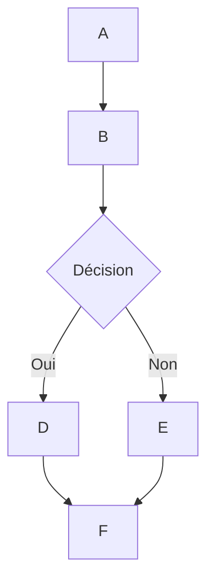

# 🌊 Support du rendu MermaidJS dans Open WebUI

## Aperçu

Open WebUI supporte le rendu de diagrammes MermaidJS attrayants, de diagrammes de flux, de graphiques en secteurs et plus encore, directement dans l'interface de chat. MermaidJS est un outil puissant pour visualiser des informations et idées complexes, et lorsqu'il est associé aux capacités d'un grand modèle de langage (LLM), il devient un outil puissant pour générer et explorer de nouvelles idées.

## Utilisation de MermaidJS dans Open WebUI

Pour générer un diagramme MermaidJS, demandez simplement à un LLM dans n'importe quel chat de créer un diagramme ou un graphique en utilisant MermaidJS. Par exemple, vous pouvez demander au LLM :

* "Créez un diagramme de flux pour un processus de prise de décision simple en utilisant Mermaid. Expliquez comment fonctionne le diagramme de flux."
* "Utilisez Mermaid pour visualiser un arbre de décision pour déterminer s'il est approprié de sortir marcher."

Notez que pour que la réponse du LLM soit rendue correctement, elle doit commencer par le mot `mermaid` suivi du code MermaidJS. Vous pouvez consulter la [documentation de MermaidJS](https://mermaid.js.org/intro/) pour vous assurer que la syntaxe est correcte et fournir des instructions structurées au LLM pour l'aider à générer une meilleure syntaxe MermaidJS.

## Visualisation du code MermaidJS directement dans le chat

Lorsque vous demandez une visualisation MermaidJS, le grand modèle de langage (LLM) générera le code nécessaire. Open WebUI rendra automatiquement la visualisation directement dans l'interface de chat, tant que le code utilise une syntaxe MermaidJS valide.

Si le modèle génère une syntaxe MermaidJS, mais que la visualisation ne se rend pas, cela indique généralement une erreur de syntaxe dans le code. Ne vous inquiétez pas – vous serez informé de toutes erreurs une fois la réponse entièrement générée. Si cela se produit, essayez de consulter la [documentation de MermaidJS](https://mermaid.js.org/intro/) pour identifier le problème et revoir les instructions en conséquence.

## Interagir avec votre visualisation

Une fois votre visualisation affichée, vous pouvez :

* Zoomer pour l'examiner de plus près.
* Copier le code MermaidJS original utilisé pour générer la visualisation en cliquant sur le bouton de copie dans le coin supérieur droit de la zone d'affichage.

### Exemple



Cela générera un diagramme de flux ressemblant à celui-ci :

```markdown
 startAncestor [ start ]
A[A] --> B[B]
B --> C[Décision]
C -->| Oui | D[D]
C -->| Non  | E[E]
D --> F[F]
E --> F[F]
```

Expérimenter différents types de diagrammes et graphiques peut vous aider à développer une compréhension plus approfondie de l'utilisation efficace de MermaidJS dans Open WebUI. Pour les modèles plus simples, envisagez de consulter la [documentation de MermaidJS](https://mermaid.js.org/intro/) pour fournir des orientations au LLM, ou demandez-lui de résumer la documentation en notes complètes ou en instructions système. En suivant ces directives et en explorant les capacités de MermaidJS, vous pouvez exploiter pleinement le potentiel de cet outil puissant dans Open WebUI.
