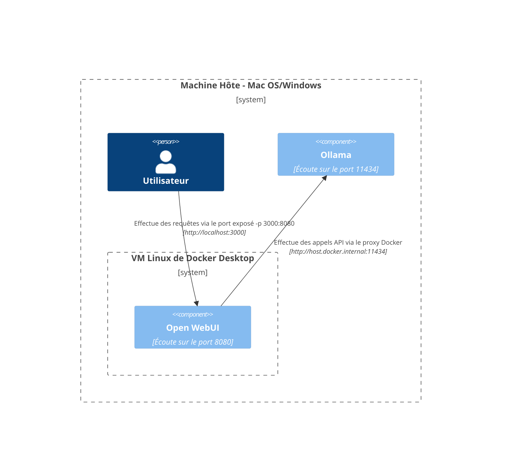
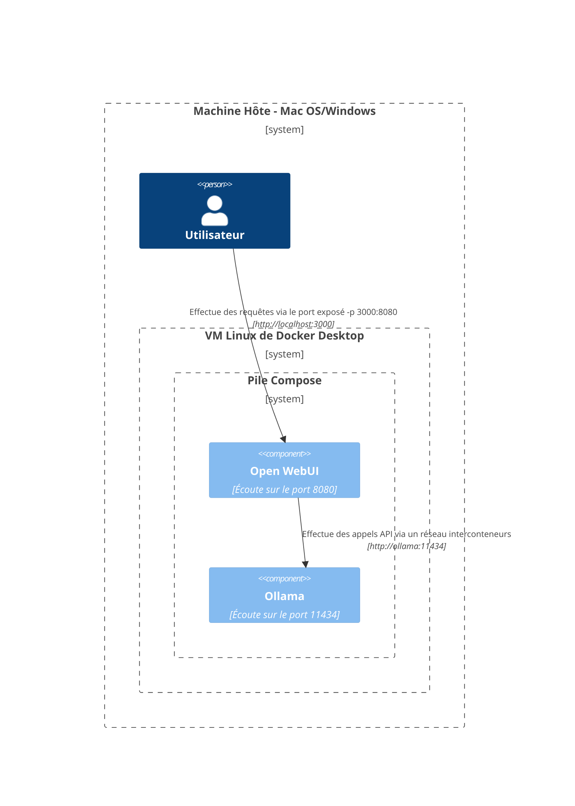
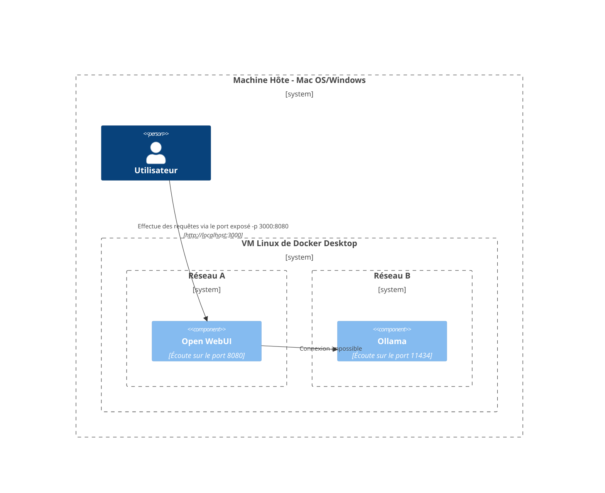
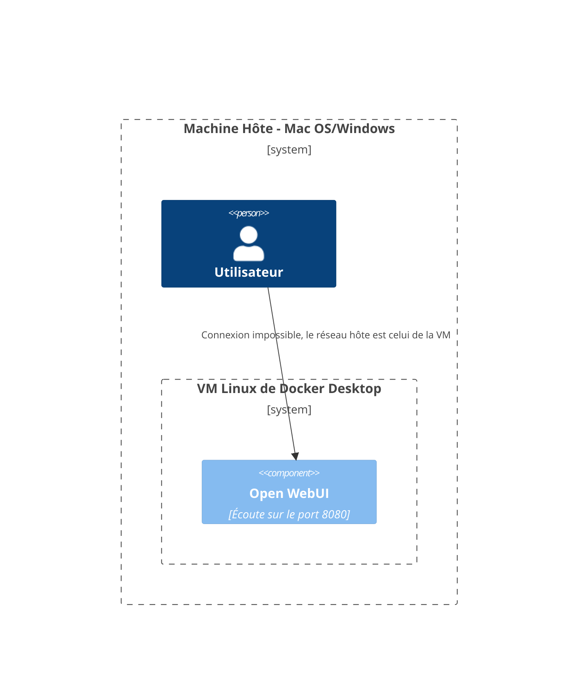
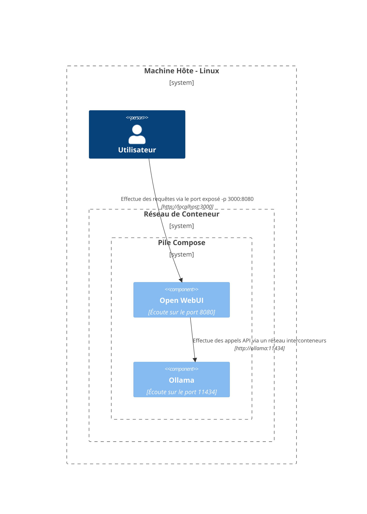
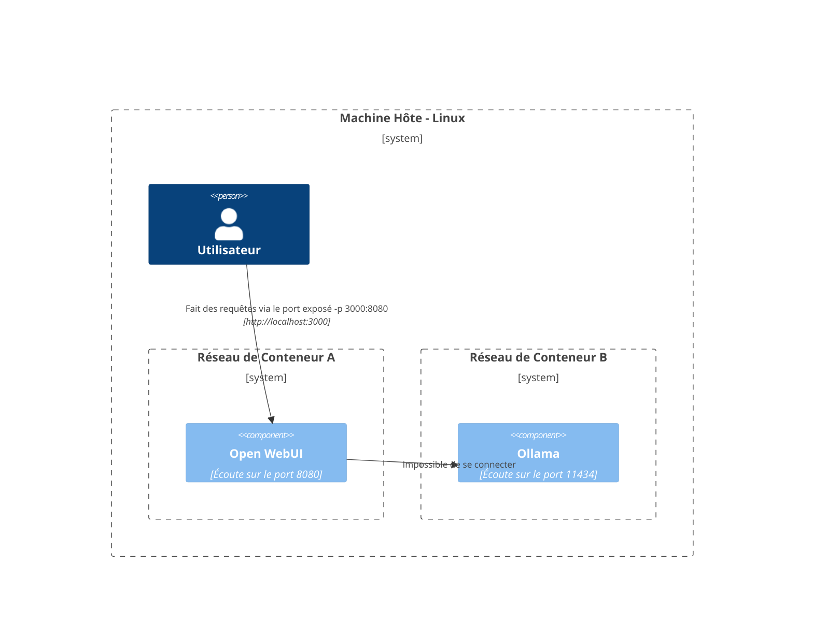
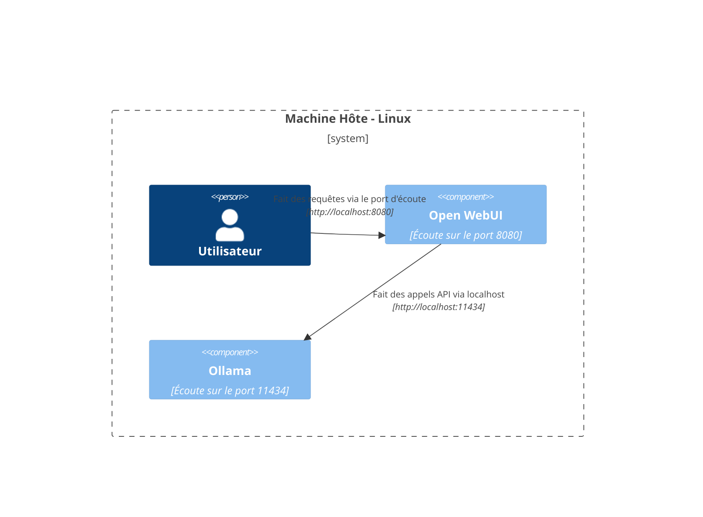

Ici, nous fournissons des diagrammes clairs et structurés pour vous aider à comprendre comment les différents composants du réseau interagissent dans divers environnements. Cette documentation est conçue pour aider les utilisateurs de macOS/Windows et de Linux. Chaque scénario est illustré à l'aide de diagrammes Mermaid pour montrer comment les interactions sont configurées en fonction des différentes configurations système et stratégies de déploiement.

## Options de configuration Mac OS/Windows 🖥️

### Ollama sur l'hôte, Open WebUI dans le conteneur

Dans ce scénario, `Ollama` s'exécute directement sur la machine hôte tandis que `Open WebUI` fonctionne dans un conteneur Docker.

### Ollama et Open WebUI dans une pile Compose

Les deux `Ollama` et `Open WebUI` sont configurés dans la même pile Docker Compose, simplifiant les communications réseau.

### Ollama et Open WebUI, Réseaux distincts

Ici, `Ollama` et `Open WebUI` sont déployés dans des réseaux Docker distincts, ce qui peut entraîner des problèmes de connectivité.

### Open WebUI dans le réseau hôte

Dans cette configuration, `Open WebUI` utilise le réseau hôte, ce qui peut limiter ses capacités de connexion dans certains environnements.

## Options de configuration Linux 🐧

### Ollama sur l'hôte, Open WebUI dans le conteneur (Linux)

Ce diagramme est spécifique à la plateforme Linux, avec `Ollama` s'exécutant sur l'hôte et `Open WebUI` déployé dans un conteneur Docker.

### Ollama et Open WebUI dans une pile Compose (Linux)

Une configuration où `Ollama` et `Open WebUI` résident dans la même pile Docker Compose, facilitant le réseau sur Linux.

### Ollama et Open WebUI, Réseaux distincts (Linux)

Un scénario où `Ollama` et `Open WebUI` sont dans des réseaux Docker différents dans un environnement Linux, ce qui pourrait nuire à la connectivité.

### Open WebUI dans le Réseau Hôte, Ollama sur l'Hôte (Linux)

Un agencement optimal où à la fois `Open WebUI` et `Ollama` utilisent le réseau de l’hôte, facilitant une interaction sans faille sur les systèmes Linux.

Chaque configuration répond à différentes stratégies de déploiement et configurations réseau pour vous aider à choisir le meilleur agencement selon vos besoins.
