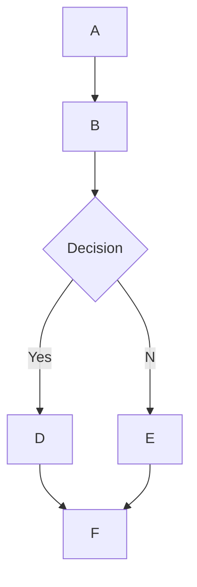

# 🌊 Open WebUIにおけるMermaidJSのレンダリングサポート

## 概要

Open WebUIは、チャットインターフェイス内で視覚的に魅力的なMermaidJSのダイアグラム、フローチャート、円グラフなどを直接レンダリングする機能をサポートしています。MermaidJSは複雑な情報やアイデアを視覚化するための強力なツールであり、大規模言語モデル（LLM）の能力と組み合わせることで、新しいアイデアを生成し探求するための強力なツールとなります。

## Open WebUIでのMermaidJSの使用方法

MermaidJSのダイアグラムを生成するには、任意のチャット内でLLMにMermaidJSを使用してダイアグラムやチャートを作成するように依頼するだけです。例えば、以下のようにLLMに依頼できます:

* "Mermaidを使用して簡単な意思決定プロセスのフローチャートを作成し、その働きを説明してください。"
* "Mermaidを使用して、外を散歩するのが適切かどうかを判断する意思決定木を視覚化してください。"

LLMの応答が正しくレンダリングされるためには、その応答が単語`mermaid`で始まり、その後にMermaidJSコードが続く必要があります。正しい構文を確保するために[MermaidJSのドキュメント](https://mermaid.js.org/intro/)を参考にして、LLMに対してより良いMermaidJS構文を生成させるための構造化されたプロンプトを提供することを推奨します。

## チャット内でMermaidJSコードを直接視覚化

MermaidJSの視覚化を要求すると、大規模言語モデル（LLM）が必要なコードを生成します。コードが有効なMermaidJS構文を使用している場合、Open WebUIはその視覚化をチャットインターフェイス内で自動的にレンダリングします。

モデルがMermaidJS構文を生成したものの視覚化がレンダリングされない場合、それは通常コードの構文エラーを示しています。心配しないでください — 応答が完全に生成されるとエラーが通知されます。この場合は、[MermaidJSのドキュメント](https://mermaid.js.org/intro/)を参照して問題を特定し、プロンプトを修正してください。

## 視覚化とのインタラクション

視覚化が表示されると、以下の操作を行うことができます:

* より詳細に検討するためにズームインおよびズームアウトする。
* 表示エリアの右上隅にあるコピーボタンをクリックして、視覚化の生成に使用された元のMermaidJSコードをコピーする。

### 例



これにより、以下のようなフローチャートが生成されます:

```markdown
 startAncestor [ start ]
A[A] --> B[B]
B --> C[Decision]
C -->| Yes | D[D]
C -->| No  | E[E]
D --> F[F]
E --> F[F]
```

さまざまな種類のダイアグラムやチャートを試してみることで、Open WebUI内でMermaidJSを効果的に活用する方法についてのより深い理解を得ることができます。小型モデルでは、[MermaidJSのドキュメント](https://mermaid.js.org/intro/)を参照してLLMにガイドを提供したり、それを包括的なノートやシステムプロンプトに要約させることを検討してください。これらのガイドラインに従い、MermaidJSの能力を探求することで、Open WebUIでこの強力なツールの潜在能力を最大限に引き出すことができます。
