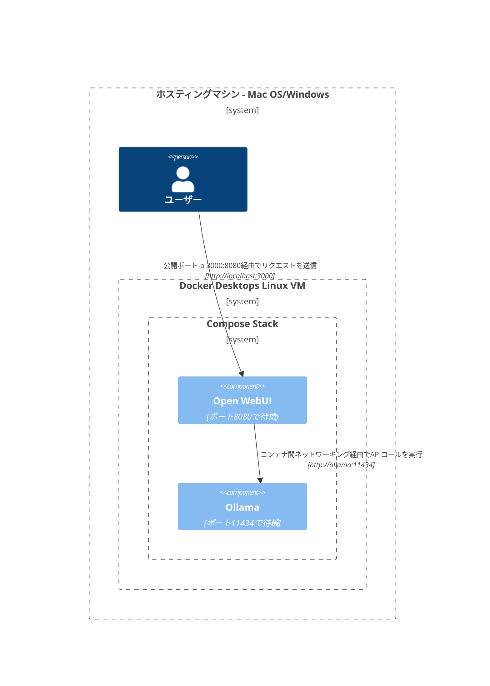
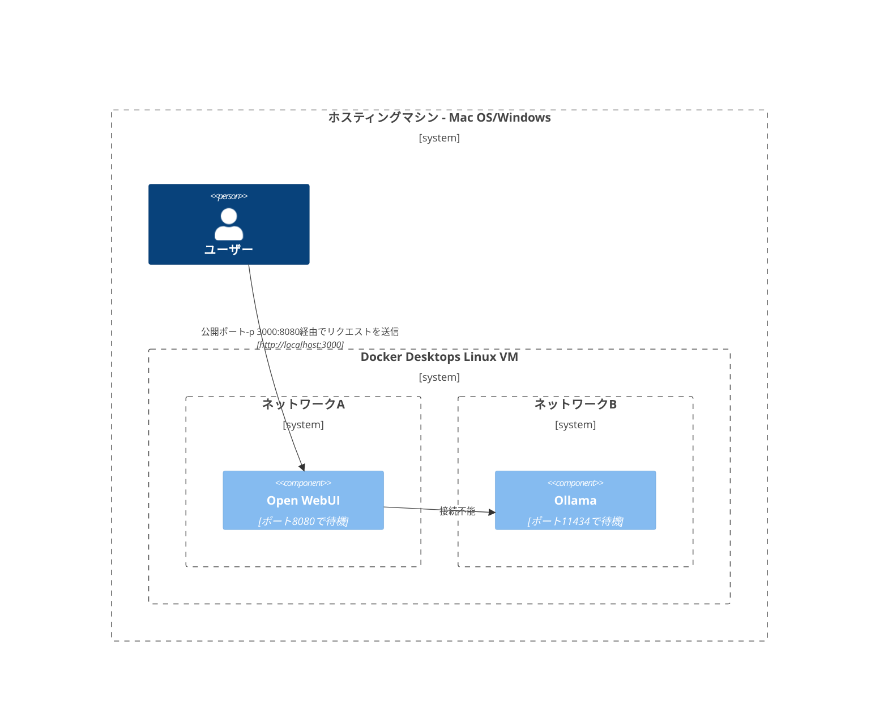
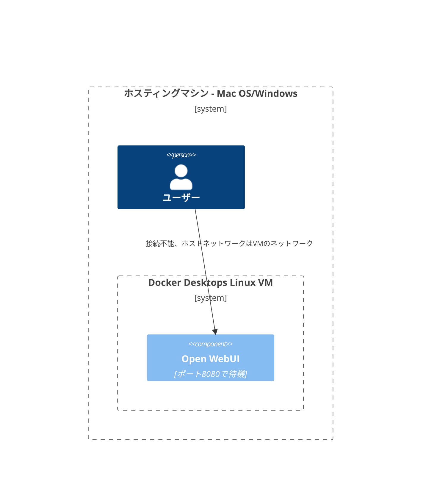
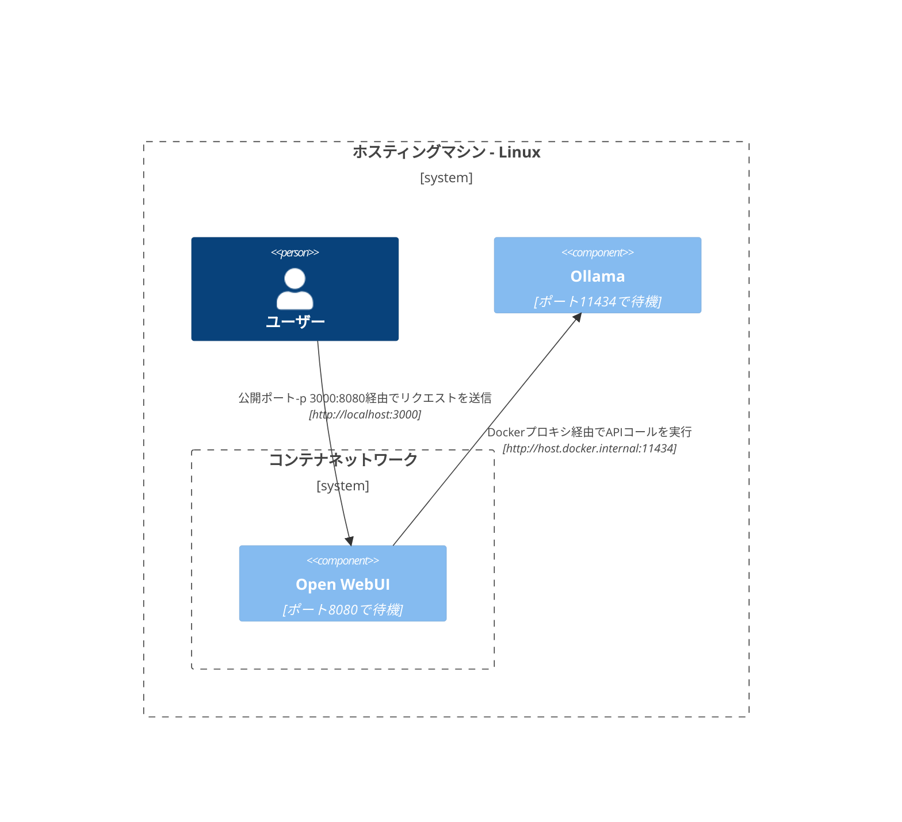
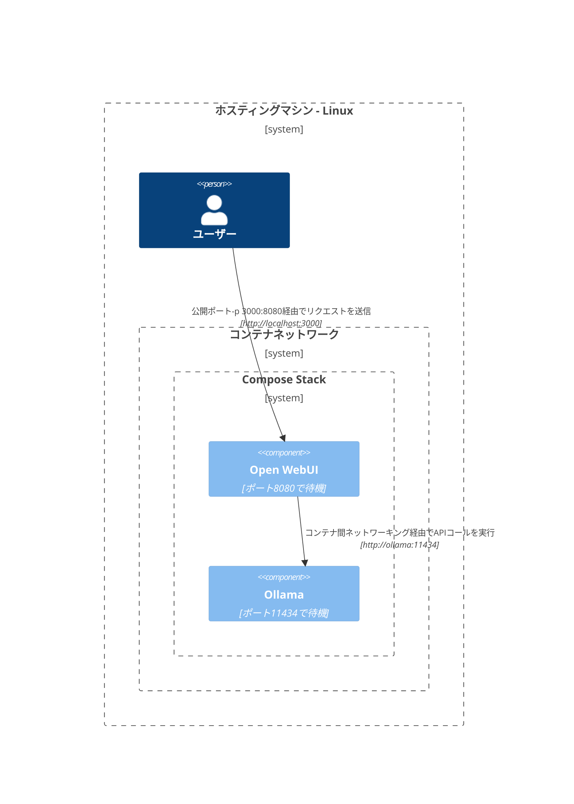
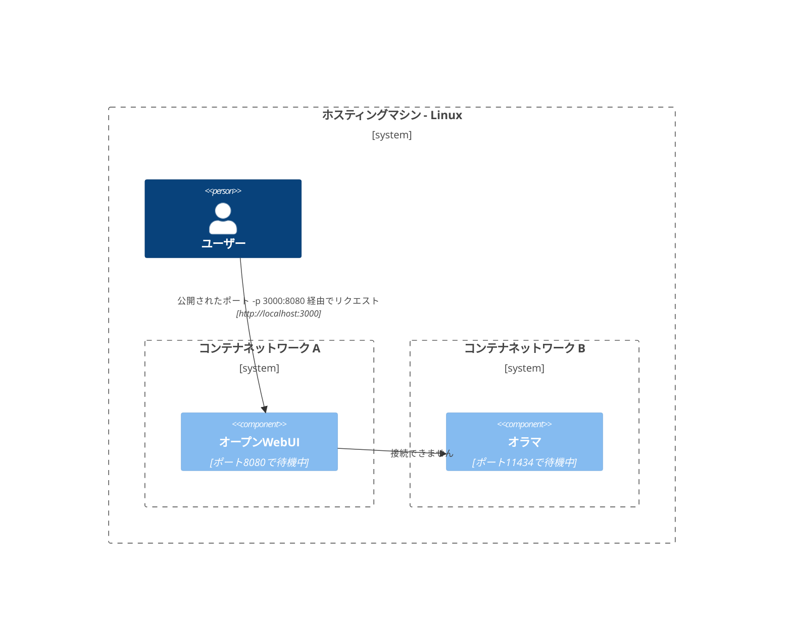
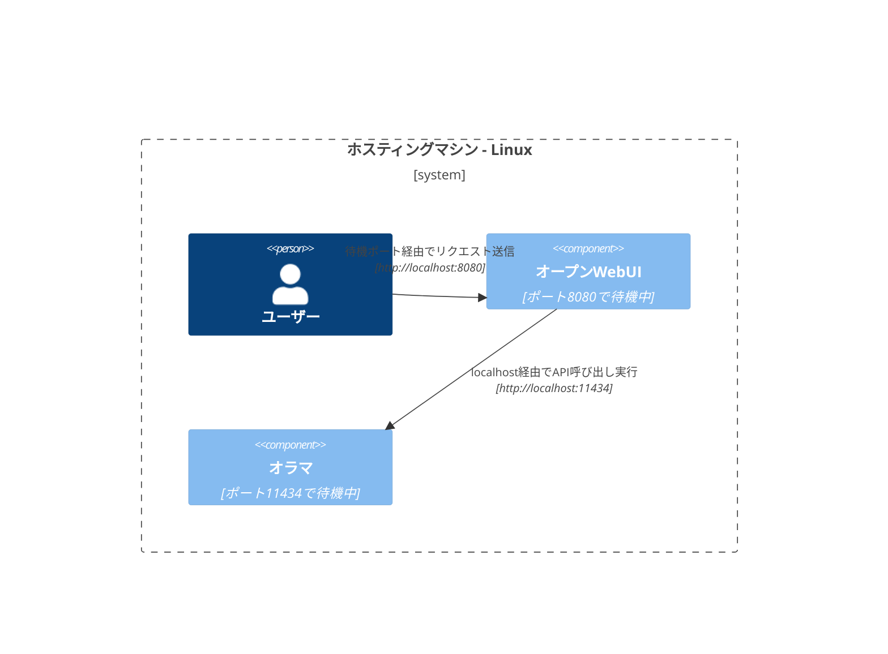

ここでは、ネットワークのさまざまな構成内でコンポーネントがどのように相互作用するかを理解するための、明確で体系的な図を提供します。このドキュメントは、macOS/WindowsとLinuxの両方のユーザーを対象に設計されています。各シナリオは、Mermaidダイアグラムを使用して、システム構成や展開戦略によって設定された相互作用を示しています。

## Mac OS/Windowsのセットアップオプション 🖥️

### ホスト上のOllama、コンテナ内のOpen WebUI

このシナリオでは、`Ollama`がホストマシン上で直接実行され、`Open WebUI`がDockerコンテナ内で操作されます。

### Compose Stack内でのOllamaとOpen WebUI

`Ollama`と`Open WebUI`の両方が同じDocker Composeスタック内に構成され、ネットワーク通信が簡素化されます。

### 別々のネットワークでのOllamaとOpen WebUI

この場合、`Ollama`と`Open WebUI`が別々のDockerネットワークに展開され、それにより接続の問題が生じる可能性があります。

### ホストネットワーク内のOpen WebUI

この構成では、`Open WebUI`がホストネットワークを利用し、特定の環境で接続に影響が生じます。

## Linuxのセットアップオプション 🐧

### ホスト上のOllama、コンテナ内のOpen WebUI (Linux)

この図はLinuxプラットフォーム専用で、`Ollama`がホスト上で動作し、`Open WebUI`がDockerコンテナ内にデプロイされています。

### Compose Stack内でのOllamaとOpen WebUI (Linux)

Linux環境で`Ollama`と`Open WebUI`が同じDocker Composeスタック内に配置され、簡単なネットワーキングを可能にします。

### 別々のネットワークでのOllamaとOpen WebUI (Linux)

Linux環境で`Ollama`と`Open WebUI`が異なるDockerネットワークに配置され、接続の障害を引き起こす可能性があります。

### ホストネットワークのオープンWebUI、ホスト上のオラマ (Linux)

Linuxシステムでの円滑な対話を可能にする、`Open WebUI` と `Ollama` がホストネットワークを共有する最適な構成。

各セットアップは異なるデプロイメント戦略とネットワーク構成に対応し、要件に応じた最適な配置を選択できるように設計されています。
