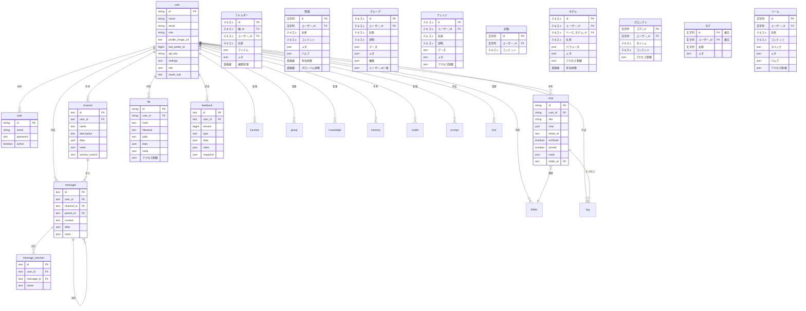

:::warning
このチュートリアルはコミュニティの寄稿であり、Open WebUIチームによってサポートされていません。これは特定の利用ケースに合わせてOpen WebUIをカスタマイズする方法を示すためのものです。寄稿をご希望ですか？寄稿のチュートリアルをご覧ください。
:::

> [!WARNING]  
> このドキュメントは現在のバージョン（0.5.11）に基づいて作成されており、継続的に更新されています。

# Open-WebUI内部SQLiteデータベース

Open-WebUIでは、SQLiteデータベースはユーザー管理、チャット履歴、ファイルストレージ、その他の主要な機能の基盤となっています。この構造を理解することは、プロジェクトに寄稿または維持を効果的に行うために不可欠です。

## 内部SQLiteの場所

SQLiteデータベースは`root` -> `data` -> `webui.db`にあります。

```
📁 Root (/)
├── 📁 data
│   ├── 📁 cache
│   ├── 📁 uploads
│   ├── 📁 vector_db
│   └── 📄 webui.db
├── 📄 dev.sh
├── 📁 open_webui
├── 📄 requirements.txt
├── 📄 start.sh
└── 📄 start_windows.bat
```

## データベースをローカルにコピー

コンテナ内で動作しているOpen-WebUI SQLiteデータベースをローカルマシンにコピーしたい場合は、以下を使用できます:

```bash
docker cp open-webui:/app/backend/data/webui.db ./webui.db
```

あるいは、次のコマンドを使用してコンテナ内のデータベースにアクセスすることもできます:

```bash
docker exec -it open-webui /bin/sh
```

## テーブル概要

以下はOpen-WebUIのSQLiteデータベース内のテーブル一覧です。テーブルはアルファベット順に列挙され、便利なように番号が振られています。

| **番号** | **テーブル名**      | **説明**                                                                |
| ------- | ------------------ | ------------------------------------------------------------------------ |
| 01      | auth               | ユーザー認証情報およびログイン情報を格納                                 |
| 02      | channel            | チャットチャンネルおよびその設定を管理                                   |
| 03      | channel_member     | チャンネル内のユーザーのメンバーシップおよび権限を追跡                   |
| 04      | chat               | チャットセッションおよびそのメタデータを格納                             |
| 05      | chatidtag          | チャットと関連タグの間の関係をマッピング                                 |
| 06      | config             | システム全体の設定を保持                                                 |
| 07      | document           | 文書および知識管理のためのメタデータを保存                               |
| 08      | feedback           | ユーザーのフィードバックおよび評価をキャプチャ                           |
| 09      | file               | アップロードされたファイルとそのメタデータを管理                         |
| 10      | folder             | ファイルおよびコンテンツを階層構造で整理                                 |
| 11      | function           | カスタム関数とその設定を保存                                             |
| 12      | group              | ユーザーグループおよびその権限を管理                                     |
| 13      | knowledge          | 知識ベースのエントリーおよび関連情報を格納                               |
| 14      | memory             | チャット履歴およびコンテキストメモリを保持                               |
| 15      | message            | 個々のチャットメッセージおよびその内容を保存                             |
| 16      | message_reaction   | メッセージに対するユーザーのリアクション（絵文字/応答）を記録             |
| 17      | migrate_history    | データベーススキーマバージョンおよび移行履歴を追跡                       |
| 18      | model              | AIモデルの設定および構成を管理                                           |
| 19      | prompt             | AIプロンプト用のテンプレートおよび設定を保存                             |
| 20      | tag                | コンテンツ分類用のタグ/ラベルを管理                                     |
| 21      | tool               | システムツールおよび統合のための設定を保存                               |
| 22      | user               | ユーザープロファイルおよびアカウント情報を保持                           |

注意: Open-WebUIのSQLiteデータベースには、Open-WebUIの主要機能に関連しない追加の2つのテーブルがありますが、これらは除外されています:

- Alembicバージョンテーブル
- 移行履歴テーブル

すべてのテーブルを理解したところで、各テーブルの構造を確認します。

## Authテーブル

| **カラム名**   | **データ型** | **制約**        | **説明**                     |
| ------------- | ------------ | --------------- | --------------------------- |
| id            | String       | PRIMARY KEY     | 一意の識別子                |
| email         | String       | -               | ユーザーのメールアドレス    |
| password      | Text         | -               | ハッシュ化されたパスワード  |
| active        | Boolean      | -               | アカウントの状態            |

Authテーブルについて知っておくべきこと:

- PRIMARY KEYにUUIDを使用
- `users`テーブルと一対一の関係（共有されるid）

## Channelテーブル

| **カラム名**   | **データ型** | **制約**        | **説明**                     |
| ------------- | ------------ | --------------- | --------------------------- |
| id              | テキスト       | 主キー           | 一意の識別子（UUID）               |
| user_id         | テキスト       | -               | チャンネルの所有者/作成者           |
| type            | テキスト       | null許可          | チャンネルの種類                    |
| name            | テキスト       | -               | チャンネル名                        |
| description     | テキスト       | null許可          | チャンネルの説明                    |
| data            | JSON          | null許可          | 柔軟なデータストレージ              |
| meta            | JSON          | null許可          | チャンネルのメタデータ              |
| access_control  | JSON          | null許可          | 権限設定                            |
| created_at      | BigInteger    | -               | 作成タイムスタンプ（ナノ秒）         |
| updated_at      | BigInteger    | -               | 最終更新タイムスタンプ（ナノ秒）     |

認証テーブルについての注意事項：

- 主キーとしてUUIDを使用
- 大文字小文字を区別しないチャンネル名（小文字で保存）

## チャンネルメンバーテーブル

| **列名**        | **データ型**   | **制約条件**      | **説明**                                |
| --------------- | ------------- | --------------- | --------------------------------------- |
| id              | テキスト       | NOT NULL        | チャンネルメンバーシップの一意の識別子 |
| channel_id      | テキスト       | NOT NULL        | チャンネルの参照                       |
| user_id         | テキスト       | NOT NULL        | ユーザーの参照                         |
| created_at      | BIGINT        | -               | メンバーシップが作成されたタイムスタンプ |

## チャットテーブル

| **列名**        | **データ型**   | **制約条件**      | **説明**                 |
| --------------- | ------------- | ---------------- | ------------------------ |
| id              | 文字列         | 主キー           | 一意の識別子（UUID）      |
| user_id         | 文字列         | -               | チャットの所有者         |
| title           | テキスト       | -               | チャットのタイトル       |
| chat            | JSON          | -               | チャットの内容と履歴      |
| created_at      | BigInteger    | -               | 作成タイムスタンプ       |
| updated_at      | BigInteger    | -               | 最終更新タイムスタンプ    |
| share_id        | テキスト       | 一意, null許可    | 共有用の識別子            |
| archived        | Boolean       | default=False   | アーカイブ状態            |
| pinned          | Boolean       | default=False, null許可 | ピン状態            |
| meta            | JSON          | server_default="{}" | タグを含むメタデータ |
| folder_id       | テキスト       | null許可          | 親フォルダID             |

## チャットIDタグテーブル

| **列名**        | **データ型**   | **制約条件**      | **説明**       |
| --------------- | ------------- | --------------- | ---------------- |
| id              | VARCHAR(255)  | NOT NULL        | 一意の識別子    |
| tag_name        | VARCHAR(255)  | NOT NULL        | タグ名           |
| chat_id         | VARCHAR(255)  | NOT NULL        | チャットの参照   |
| user_id         | VARCHAR(255)  | NOT NULL        | ユーザーの参照   |
| timestamp       | INTEGER       | NOT NULL        | 作成タイムスタンプ |

## コンフィグ

| **列名**        | **データ型**   | **制約条件**      | **デフォルト**     | **説明**                |
| --------------- | ------------- | --------------- | ----------------- | ----------------------- |
| id              | INTEGER       | NOT NULL        | -                 | 主キー識別子            |
| data            | JSON          | NOT NULL        | -                 | 設定データ              |
| version         | INTEGER       | NOT NULL        | -                 | コンフィグのバージョン番号 |
| created_at      | DATETIME      | NOT NULL        | CURRENT_TIMESTAMP | 作成タイムスタンプ       |
| updated_at      | DATETIME      | -               | CURRENT_TIMESTAMP | 最終更新タイムスタンプ    |

## フィードバックテーブル

| **列名**        | **データ型**   | **制約条件**      | **説明**                               |
| --------------- | ------------- | --------------- | ------------------------------------- |
| id              | テキスト       | 主キー           | 一意の識別子（UUID）                   |
| user_id         | テキスト       | -               | フィードバックを提供したユーザー       |
| version         | BigInteger    | default=0       | フィードバックのバージョン番号         |
| type            | テキスト       | -               | フィードバックの種類                   |
| data            | JSON          | null許可          | 評価を含むフィードバックデータ         |
| meta            | JSON          | null許可          | メタデータ（アリーナ、チャットIDなど） |
| snapshot        | JSON          | null許可          | 関連するチャットのスナップショット     |
| created_at      | BigInteger    | -               | 作成タイムスタンプ                |
| updated_at      | BigInteger    | -               | 最終更新タイムスタンプ            |

# ファイルテーブル

| **列名**         | **データ型**    | **制約**           | **説明**                |
| --------------- | ------------- | --------------- | --------------------- |
| id              | String        | PRIMARY KEY     | 一意識別子                  |
| user_id         | String        | -               | ファイル所有者               |
| hash            | Text          | nullable        | ファイルハッシュ／チェックサム  |
| filename        | Text          | -               | ファイル名                  |
| path            | Text          | nullable        | ファイルシステムパス         |
| data            | JSON          | nullable        | ファイル関連データ            |
| meta            | JSON          | nullable        | ファイルメタデータ            |
| access_control  | JSON          | nullable        | 権限設定                   |
| created_at      | BigInteger    | -               | 作成タイムスタンプ            |
| updated_at      | BigInteger    | -               | 最終更新タイムスタンプ        |

`meta`フィールドの期待される構造：

```python
{
    "name": string,          # オプション表示名
    "content_type": string,  # MIMEタイプ
    "size": integer,         # ファイルサイズ（バイト）
    # ConfigDict(extra="allow")を介して追加のメタデータをサポート
}
```

## フォルダテーブル

| **列名**         | **データ型**    | **制約**           | **説明**                       |
| --------------- | ------------- | --------------- | ------------------------------ |
| id              | Text          | PRIMARY KEY     | 一意識別子（UUID）             |
| parent_id       | Text          | nullable        | 階層の親フォルダID            |
| user_id         | Text          | -               | フォルダ所有者                 |
| name            | Text          | -               | フォルダ名                     |
| items           | JSON          | nullable        | フォルダ内容                   |
| meta            | JSON          | nullable        | フォルダメタデータ             |
| is_expanded     | Boolean       | default=False   | UI展開状態                     |
| created_at      | BigInteger    | -               | 作成タイムスタンプ             |
| updated_at      | BigInteger    | -               | 最終更新タイムスタンプ         |

フォルダテーブルについて知っておくべきこと：

- フォルダはネスト可能（parent_id参照）
- ルートフォルダはparent_idがnull
- 同じ親フォルダ内でフォルダ名は一意である必要がある

## 関数テーブル

| **列名**         | **データ型**    | **制約**           | **説明**                  |
| --------------- | ------------- | --------------- | ------------------------- |
| id              | String        | PRIMARY KEY     | 一意識別子                   |
| user_id         | String        | -               | 関数所有者                   |
| name            | Text          | -               | 関数名                      |
| type            | Text          | -               | 関数タイプ                    |
| content         | Text          | -               | 関数内容／コード              |
| meta            | JSON          | -               | 関数メタデータ               |
| valves          | JSON          | -               | 関数制御設定                 |
| is_active       | Boolean       | -               | 関数のアクティブ状態          |
| is_global       | Boolean       | -               | グローバル利用可能フラグ      |
| created_at      | BigInteger    | -               | 作成タイムスタンプ            |
| updated_at      | BigInteger    | -               | 最終更新タイムスタンプ         |

関数テーブルについて知っておくべきこと：

- `type`は次のいずれかのみ：["filter", "action"]

## グループテーブル

| **列名**         | **データ型**    | **制約**              | **説明**                  |
| --------------- | ------------- | ------------------- | ------------------------ |
| id              | Text          | PRIMARY KEY, UNIQUE | 一意識別子（UUID）         |
| user_id         | Text          | -                   | グループ所有者／作成者       |
| name            | Text          | -                   | グループ名                  |
| description     | Text          | -                   | グループ説明                |
| data            | JSON          | nullable            | グループに関する追加データ    |
| meta            | JSON          | nullable            | グループメタデータ           |
| permissions     | JSON          | nullable            | 権限構成                   |
| user_ids        | JSON          | nullable            | メンバーのユーザーIDリスト    |
| created_at      | BigInteger    | -                   | 作成タイムスタンプ           |
| updated_at      | BigInteger    | -                   | 最終更新タイムスタンプ       |

## ナレッジテーブル

| **列名**         | **データ型**    | **制約**              | **説明**                   |
| --------------- | ------------- | ------------------- | -------------------------- |
| id              | Text          | PRIMARY KEY, UNIQUE | ユニーク識別子 (UUID)            |
| user_id         | Text          | -                   | ナレッジベースの所有者             |
| name            | Text          | -                   | ナレッジベース名                  |
| description     | Text          | -                   | ナレッジベースの説明              |
| data            | JSON          | nullable            | ナレッジベースの内容              |
| meta            | JSON          | nullable            | 追加メタデータ                    |
| access_control  | JSON          | nullable            | アクセス制御ルール                |
| created_at      | BigInteger    | -                   | 作成タイムスタンプ                |
| updated_at      | BigInteger    | -                   | 最終更新タイムスタンプ            |

`access_control` フィールドの想定構造:

```python
{
  "read": {
    "group_ids": ["group_id1", "group_id2"],
    "user_ids": ["user_id1", "user_id2"]
  },
  "write": {
    "group_ids": ["group_id1", "group_id2"],
    "user_ids": ["user_id1", "user_id2"]
  }
}
```

## メモリテーブル

| **列名**        | **データ型**  | **制約**        | **説明**                    |
| --------------- | ------------- | --------------- | ------------------------    |
| id              | String        | PRIMARY KEY     | ユニーク識別子 (UUID)         |
| user_id         | String        | -               | メモリの所有者              |
| content         | Text          | -               | メモリのコンテンツ          |
| created_at      | BigInteger    | -               | 作成タイムスタンプ          |
| updated_at      | BigInteger    | -               | 最終更新タイムスタンプ      |

## メッセージテーブル

| **列名**        | **データ型**  | **制約**        | **説明**                    |
| --------------- | ------------- | --------------- | ------------------------    |
| id              | Text          | PRIMARY KEY     | ユニーク識別子 (UUID)         |
| user_id         | Text          | -               | メッセージの作成者           |
| channel_id      | Text          | nullable        | 関連するチャネル             |
| parent_id       | Text          | nullable        | スレッドの親メッセージ       |
| content         | Text          | -               | メッセージ内容               |
| data            | JSON          | nullable        | メッセージの追加データ       |
| meta            | JSON          | nullable        | メッセージのメタデータ       |
| created_at      | BigInteger    | -               | 作成タイムスタンプ（ナノ秒） |
| updated_at      | BigInteger    | -               | 最終更新タイムスタンプ（ナノ秒）|

## メッセージリアクションテーブル

| **列名**        | **データ型**  | **制約**        | **説明**                    |
| --------------- | ------------- | --------------- | ------------------------    |
| id              | Text          | PRIMARY KEY     | ユニーク識別子 (UUID)         |
| user_id         | Text          | -               | リアクションをしたユーザー   |
| message_id      | Text          | -               | 関連するメッセージ           |
| name            | Text          | -               | リアクション名や絵文字       |
| created_at      | BigInteger    | -               | リアクションのタイムスタンプ |

## モデルテーブル

| **列名**        | **データ型**  | **制約**        | **説明**                    |
| --------------- | ------------- | --------------- | ------------------------    |
| id              | Text          | PRIMARY KEY     | モデル識別子                |
| user_id         | Text          | -               | モデルの所有者              |
| base_model_id   | Text          | nullable        | 親モデルの参照              |
| name            | Text          | -               | 表示名                      |
| params          | JSON          | -               | モデルのパラメータ          |
| meta            | JSON          | -               | モデルのメタデータ          |
| access_control  | JSON          | nullable        | アクセス権限                |
| is_active       | Boolean       | default=True    | アクティブ状態              |
| created_at      | BigInteger    | -               | 作成タイムスタンプ          |
| updated_at      | BigInteger    | -               | 最終更新タイムスタンプ      |

## プロンプトテーブル

| **列名**        | **データ型**  | **制約**        | **説明**                    |
| --------------- | ------------- | --------------- | ------------------------    |
| command         | String        | PRIMARY KEY     | ユニークなコマンド識別子     |
| user_id         | String        | -               | プロンプトの所有者          |
| title           | Text          | -               | プロンプトのタイトル         |
| content         | Text          | -               | プロンプトの内容またはテンプレート|
| timestamp       | BigInteger    | -               | 最終更新タイムスタンプ      |
| access_control  | JSON          | nullable        | アクセス権限                |

## タグテーブル

| **列名** | **データ型** | **制約** | **説明** |
| --------------- | ------------- | --------------- | ------------------------- |
| id              | String        | PK (複合キー)   | 正規化されたタグ識別子     |
| name            | String        | -               | 表示名                   |
| user_id         | String        | PK (複合キー)   | タグの所有者             |
| meta            | JSON          | NULL許容        | タグのメタデータ         |

タグテーブルについて知っておくべきこと：

- 主キーは複合キー (id, user_id)

## ツールテーブル

| **列名** | **データ型** | **制約** | **説明** |
| --------------- | ------------- | --------------- | --------------------- |
| id              | String        | 主キー           | 一意の識別子           |
| user_id         | String        | -               | ツールの所有者         |
| name            | Text          | -               | ツール名               |
| content         | Text          | -               | ツールの内容・コード   |
| specs           | JSON          | -               | ツールの仕様           |
| meta            | JSON          | -               | ツールのメタデータ     |
| valves          | JSON          | -               | ツールの制御設定       |
| access_control  | JSON          | NULL許容        | アクセス権限           |
| created_at      | BigInteger    | -               | 作成タイムスタンプ     |
| updated_at      | BigInteger    | -               | 最終更新タイムスタンプ |

## ユーザーテーブル

| **列名**           | **データ型** | **制約**         | **説明**               |
| ----------------- | ------------- | ---------------- | ------------------------ |
| id                | String        | 主キー           | 一意の識別子           |
| name              | String        | -                | ユーザー名              |
| email             | String        | -                | ユーザーのメールアドレス |
| role              | String        | -                | ユーザーの役割         |
| profile_image_url | Text          | -                | プロフィール画像のパス |
| last_active_at    | BigInteger    | -                | 最終アクティビティのタイムスタンプ |
| updated_at        | BigInteger    | -                | 最終更新タイムスタンプ |
| created_at        | BigInteger    | -                | 作成タイムスタンプ     |
| api_key           | String        | 一意、NULL許容   | API認証キー             |
| settings          | JSON          | NULL許容         | ユーザー設定           |
| info              | JSON          | NULL許容         | ユーザーのその他情報   |
| oauth_sub         | Text          | 一意            | OAuthサブジェクト識別子  |

# エンティティリレーションシップ図

以下のMermaidを使用したエンティティリレーションシップ図 (ERD) を参照すると、テーブル同士の関係が視覚化できます。


