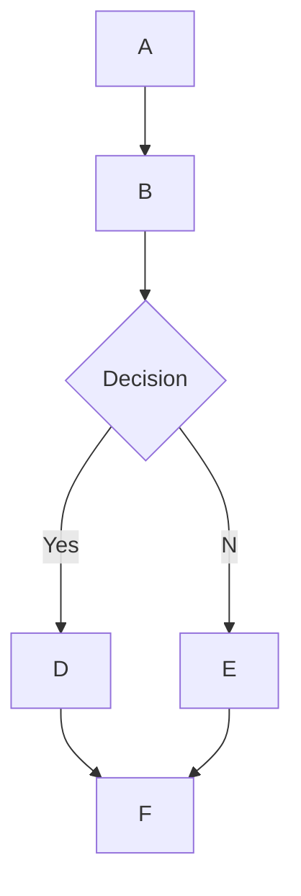

# 🌊 Open WebUI에서의 MermaidJS 렌더링 지원

## 개요

Open WebUI는 매력적인 시각적 MermaidJS 다이어그램, 흐름도, 원형 차트 등을 채팅 인터페이스 내에서 직접 렌더링하는 것을 지원합니다. MermaidJS는 복잡한 정보와 아이디어를 시각화하는 강력한 도구이며, 대형 언어 모델(LLM)의 기능과 결합될 때 새로운 아이디어를 생성하고 탐구하는 데 강력한 도구가 될 수 있습니다.

## Open WebUI에서 MermaidJS 사용

MermaidJS 다이어그램을 생성하려면, 채팅에서 LLM에게 MermaidJS를 사용하여 다이어그램이나 차트를 생성해달라고 요청하면 됩니다. 예를 들어, 다음과 같이 요청할 수 있습니다:

* "Mermaid를 사용하여 간단한 의사결정 과정에 대한 흐름도를 만들어 주세요. 흐름도가 어떻게 작동하는지 설명해 주세요."
* "Mermaid를 사용하여 밖에 나가서 산책하기 적합한지를 결정하기 위한 의사결정 트리를 시각화해 주세요."

LLM 응답이 올바르게 렌더링되려면, 응답은 `mermaid`라는 단어로 시작한 다음 MermaidJS 코드가 와야 합니다. [MermaidJS 문서](https://mermaid.js.org/intro/)를 참조하여 구문이 올바른지 확인하고, LLM에게 구조화된 프롬프트를 제공하여 더 나은 MermaidJS 구문을 생성하도록 가이드할 수 있습니다.

## 채팅에서 직접 MermaidJS 코드 시각화

MermaidJS 시각화를 요청하면, 대형 언어 모델(LLM)이 필요한 코드를 생성합니다. MermaidJS 문법이 올바르게 사용되었는 한, Open WebUI는 채팅 인터페이스 내에서 자동으로 시각화를 렌더링합니다.

모델이 MermaidJS 구문을 생성했지만 시각화가 렌더링되지 않는 경우, 일반적으로 코드에 구문 오류가 있다는 것을 의미합니다. 걱정하지 마세요 – 응답이 완전히 생성된 후 오류에 대한 알림을 받게 됩니다. 이 경우, [MermaidJS 문서](https://mermaid.js.org/intro/)를 참조하여 문제를 식별하고 프롬프트를 수정하십시오.

## 시각화와의 상호작용

시각화가 표시되면 다음 작업을 수행할 수 있습니다:

* 확대 및 축소하여 자세히 검사할 수 있습니다.
* 디스플레이 영역의 우측 상단에 있는 복사 버튼을 클릭하여 시각화를 생성하는 데 사용된 원래 MermaidJS 코드를 복사할 수 있습니다.

### 예제



다음과 같은 흐름도를 생성합니다:

```markdown
 startAncestor [ start ]
A[A] --> B[B]
B --> C[Decision]
C -->| Yes | D[D]
C -->| No  | E[E]
D --> F[F]
E --> F[F]
```

다양한 유형의 다이어그램과 차트를 실험함으로써 Open WebUI 내에서 MermaidJS를 효과적으로 활용하는 방법에 대한 더 깊은 이해를 개발할 수 있습니다. 작은 모델에서는 [MermaidJS 문서](https://mermaid.js.org/intro/)를 참조하여 LLM에 가이드를 제공하거나, 문서를 종합적인 노트나 시스템 프롬프트로 요약하도록 요청하세요. 이러한 가이드라인을 따르고 MermaidJS의 기능을 탐구함으로써 Open WebUI에서 이 강력한 도구의 전체 잠재력을 활용할 수 있습니다.
