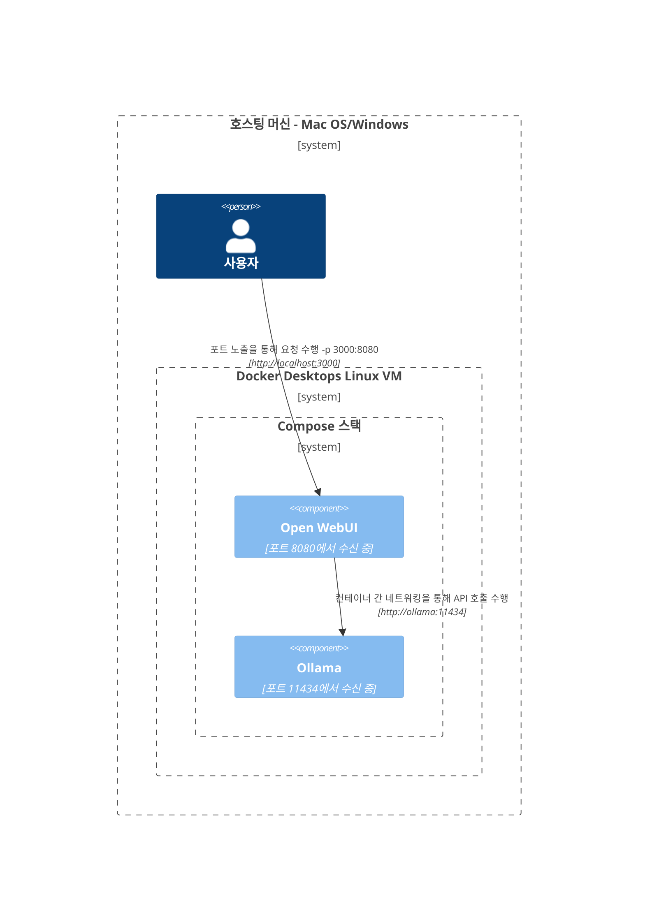
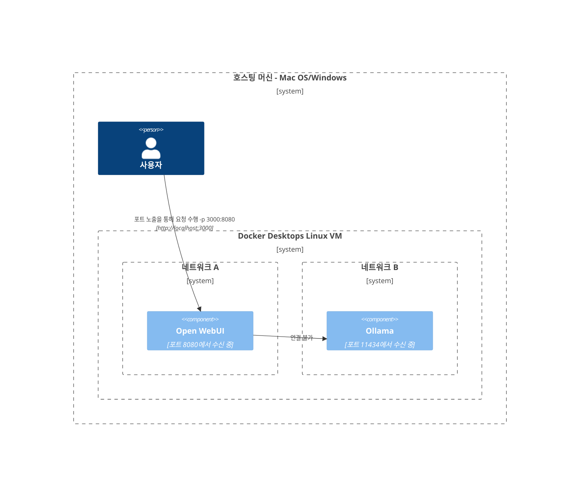
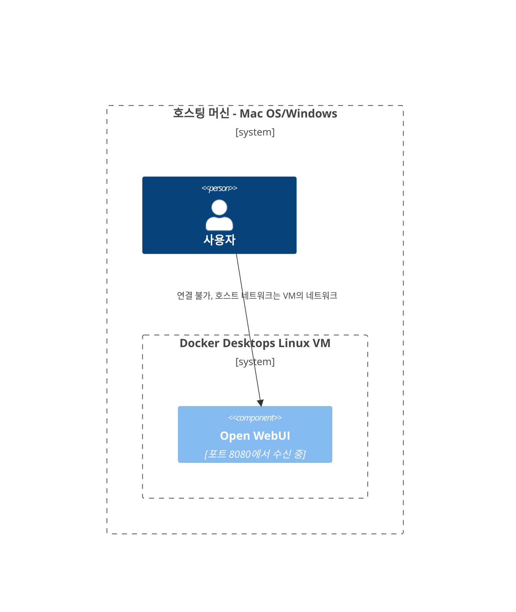
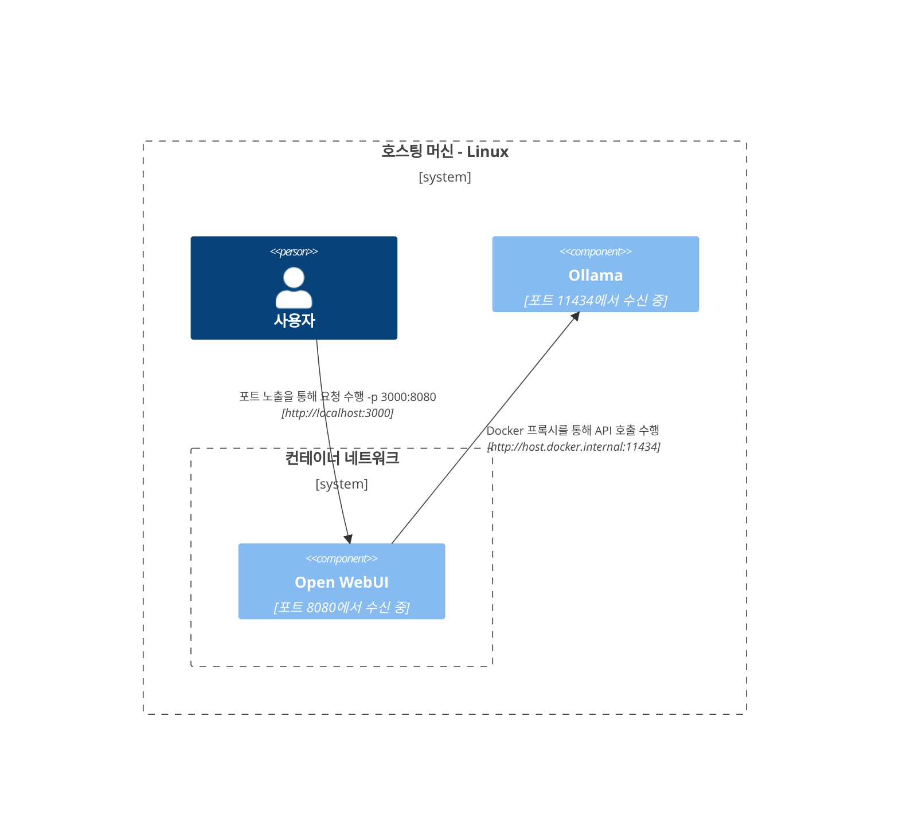
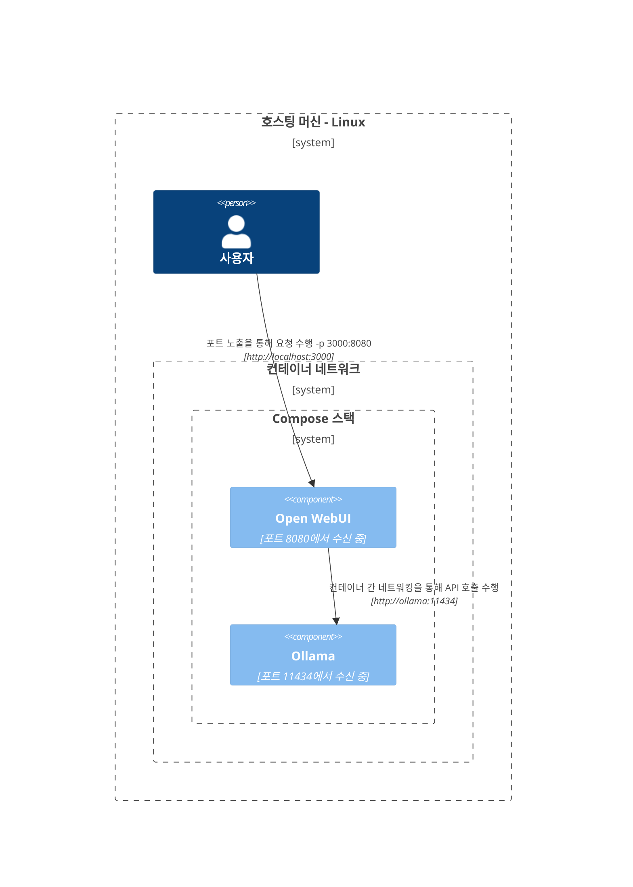

여기에서는 다양한 네트워크 설정 내에서 구성 요소들이 어떻게 상호 작용하는지 이해하기 쉽도록 명확하고 구조화된 다이어그램을 제공합니다. 이 문서는 macOS/Windows 및 Linux 사용자 모두를 지원하기 위해 설계되었습니다. 각 시나리오는 시스템 구성과 배포 전략에 따라 상호 작용이 설정되는 방식을 보여주기 위해 Mermaid 다이어그램을 사용하여 설명됩니다.

## Mac OS/Windows 설정 옵션 🖥️

### 호스트에서 Ollama 실행, 컨테이너에서 Open WebUI 열기

이 시나리오에서는 `Ollama`가 호스트 머신에서 직접 실행되고, `Open WebUI`는 Docker 컨테이너 내에서 작동합니다.


### Compose 스택에서 Ollama와 Open WebUI 실행

`Ollama`와 `Open WebUI`가 동일한 Docker Compose 스택 내에서 구성되어 네트워크 통신이 간소화됩니다.



### 분리된 네트워크에서 Ollama와 Open WebUI 실행

`Ollama`와 `Open WebUI`가 별도의 Docker 네트워크에서 배치되어 연결 문제가 발생할 가능성이 있습니다.



### 호스트 네트워크에서 Open WebUI 실행

이 설정에서는 `Open WebUI`가 호스트 네트워크를 사용하여 특정 환경에서 연결에 영향을 미칠 수 있는 네트워크를 사용합니다.




## Linux 설정 옵션 🐧

### 호스트에서 Ollama 실행, 컨테이너에서 Open WebUI 열기 (Linux)

이 다이어그램은 Linux 플랫폼에 대해 특정하며, `Ollama`가 호스트에서 실행되고 `Open WebUI`가 Docker 컨테이너 내부에 배치됩니다.



### Compose 스택에서 Ollama와 Open WebUI 실행 (Linux)

Linux에서 쉽게 네트워킹이 가능한 `Ollama`와 `Open WebUI`가 동일한 Docker Compose 스택 내에 위치하는 설정입니다.



### 분리된 네트워크에서 Ollama와 Open WebUI 실행 (Linux)

Linux 환경에서 `Ollama`와 `Open WebUI`가 다른 Docker 네트워크에 위치하여 연결에 장애가 생길 수 있는 시나리오입니다.

```mermaid
C4Context
경계(b0, "호스팅 머신 - 리눅스") {
   사람(user, "사용자")
   경계(b2, "컨테이너 네트워크 A") {
      구성요소(openwebui, "Open WebUI", "포트 8080에서 대기 중")
   }
   경계(b3, "컨테이너 네트워크 B") {
      구성요소(ollama, "Ollama", "포트 11434에서 대기 중")
   }
}
Rel(openwebui, ollama, "연결할 수 없음")
Rel(user, openwebui, "노출된 포트를 통해 요청 수행 -p 3000:8080", "http://localhost:3000")
UpdateRelStyle(user, openwebui, $offsetX="-100", $offsetY="-50")
```

### 호스트 네트워크에서 Open WebUI, 호스트에서 Ollama(리눅스)

`Open WebUI`와 `Ollama`가 호스트의 네트워크를 사용하는 최적의 레이아웃으로, 리눅스 시스템에서 원활한 상호작용을 가능하게 합니다.

```mermaid
C4컨텍스트
경계(b0, "호스팅 머신 - 리눅스") {
   사람(user, "사용자")
   구성요소(openwebui, "Open WebUI", "포트 8080에서 대기 중")
   구성요소(ollama, "Ollama", "포트 11434에서 대기 중")
}
Rel(openwebui, ollama, "localhost를 통해 API 호출 수행", "http://localhost:11434")
Rel(user, openwebui, "대기 포트를 통해 요청 수행", "http://localhost:8080")
UpdateRelStyle(user, openwebui, $offsetX="-100", $offsetY="-50")
```

각 설정은 다양한 배포 전략과 네트워킹 구성 방식을 다루며, 요구 사항에 맞는 최적의 레이아웃을 선택할 수 있도록 돕습니다.
