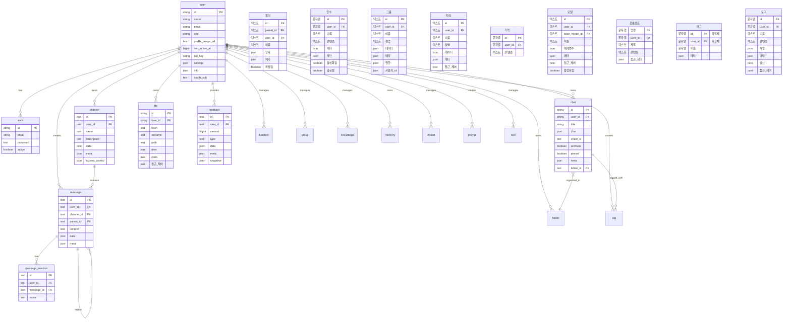

:::warning
이 튜토리얼은 커뮤니티 기여로 제공되며 Open WebUI 팀에서 지원하지 않습니다. 특정 사용 사례에 맞게 Open WebUI를 커스터마이징하는 방법을 보여주는 데만 사용됩니다. 기여하고 싶으신가요? 기여 튜토리얼을 확인하세요.
:::

> [!WARNING]  
> 이 문서는 현재 버전(0.5.11)에 기반하여 작성되었으며 지속적으로 업데이트되고 있습니다.

# Open-WebUI 내부 SQLite 데이터베이스

Open-WebUI의 SQLite 데이터베이스는 사용자 관리, 채팅 기록, 파일 저장 및 다양한 핵심 기능의 근간을 제공합니다. 이 구조를 이해하는 것은 프로젝트에 효과적으로 기여하거나 유지 관리하려는 사람들에게 필수적입니다.

## 내부 SQLite 위치

SQLite 데이터베이스는 `root` -> `data` -> `webui.db`에서 찾을 수 있습니다.

```
📁 Root (/)
├── 📁 data
│   ├── 📁 cache
│   ├── 📁 uploads
│   ├── 📁 vector_db
│   └── 📄 webui.db
├── 📄 dev.sh
├── 📁 open_webui
├── 📄 requirements.txt
├── 📄 start.sh
└── 📄 start_windows.bat
```

## 데이터베이스 로컬 복사

컨테이너에서 실행 중인 Open-WebUI SQLite 데이터베이스를 로컬 컴퓨터로 복사하려면 다음 명령어를 사용할 수 있습니다:

```bash
docker cp open-webui:/app/backend/data/webui.db ./webui.db
```

또는 컨테이너 내에서 데이터베이스에 액세스하려면 다음 명령어를 사용할 수 있습니다:

```bash
docker exec -it open-webui /bin/sh
```

## 테이블 개요

Open-WebUI의 SQLite 데이터베이스에 있는 테이블 전체 목록입니다. 테이블은 알파벳 순서로 나열되어 있으며 편의를 위해 번호가 지정되었습니다.

| **No.** | **테이블 이름**   | **설명**                                                    |
| ------- | ---------------- | ------------------------------------------------------------ |
| 01      | auth             | 사용자 인증 정보와 로그인 정보를 저장합니다                |
| 02      | channel          | 채팅 채널 및 해당 구성 관리를 제공합니다                   |
| 03      | channel_member   | 채널 내 사용자 멤버십 및 권한을 추적합니다                 |
| 04      | chat             | 채팅 세션과 해당 메타데이터를 저장합니다                   |
| 05      | chatidtag        | 채팅과 관련된 태그 간의 관계를 매핑합니다                  |
| 06      | config           | 시스템 전체 구성 설정을 유지 관리합니다                    |
| 07      | document         | 지식 관리를 위한 문서 및 해당 메타데이터를 저장합니다       |
| 08      | feedback         | 사용자 피드백 및 평가를 캡처합니다                         |
| 09      | file             | 업로드된 파일 및 해당 메타데이터를 관리합니다              |
| 10      | folder           | 파일과 콘텐츠를 계층적 구조로 조직합니다                  |
| 11      | function         | 사용자 정의 함수와 해당 구성을 저장합니다                  |
| 12      | group            | 사용자 그룹 및 해당 권한을 관리합니다                      |
| 13      | knowledge        | 지식 베이스 항목 및 관련 정보를 저장합니다                 |
| 14      | memory           | 채팅 기록 및 컨텍스트 메모리를 유지 관리합니다             |
| 15      | message          | 개별 채팅 메시지 및 해당 콘텐츠를 저장합니다               |
| 16      | message_reaction | 메시지에 대한 사용자 반응(이모티콘/응답)을 기록합니다       |
| 17      | migrate_history  | 데이터베이스 스키마 버전 및 마이그레이션 기록을 추적합니다 |
| 18      | model            | AI 모델 구성 및 설정을 관리합니다                          |
| 19      | prompt           | AI 프롬프트용 템플릿 및 구성을 저장합니다                  |
| 20      | tag              | 콘텐츠 분류를 위한 태그/레이블을 관리합니다                |
| 21      | tool             | 시스템 도구 및 통합 구성을 저장합니다                      |
| 22      | user             | 사용자 프로필 및 계정 정보를 유지 관리합니다               |

참고: Open-WebUI의 SQLite 데이터베이스에는 Open-WebUI의 핵심 기능과 관련되지 않은 두 개의 추가 테이블이 있으며, 제외되었습니다:

- Alembic 버전 테이블
- 마이그레이션 기록 테이블

이제 모든 테이블을 이해했으니, 각 테이블의 구조를 알아봅시다.

## Auth 테이블

| **열 이름**    | **데이터 유형** | **제약 조건**   | **설명**                |
| ------------- | -------------- | --------------- | ---------------------- |
| id            | String         | PRIMARY KEY     | 고유 식별자            |
| email         | String         | -               | 사용자의 이메일        |
| password      | Text           | -               | 해시된 비밀번호        |
| active        | Boolean        | -               | 계정 상태             |

Auth 테이블에 대해 알아야 할 사항들:

- 기본 키로 UUID 사용
- `users` 테이블과 일대일 관계 (공유 id)

## Channel 테이블

| **열 이름**    | **데이터 유형** | **제약 조건**   | **설명**                               |
| ------------- | -------------- | --------------- | --------------------------------------- |
| id              | Text          | PRIMARY KEY     | 고유 식별자 (UUID)                        |
| user_id         | Text          | -               | 채널의 소유자/생성자                      |
| type            | Text          | nullable        | 채널 유형                                |
| name            | Text          | -               | 채널 이름                                |
| description     | Text          | nullable        | 채널 설명                                |
| data            | JSON          | nullable        | 유연한 데이터 저장소                     |
| meta            | JSON          | nullable        | 채널 메타데이터                          |
| access_control  | JSON          | nullable        | 권한 설정                                |
| created_at      | BigInteger    | -               | 생성 타임스탬프 (나노초 단위)             |
| updated_at      | BigInteger    | -               | 마지막 업데이트 타임스탬프 (나노초 단위) |

auth 테이블에 대한 참고 사항:

- 기본 키로 UUID 사용
- 대소문자를 구분하지 않는 채널 이름 (소문자로 저장됨)

## Channel Member 테이블

| **열 이름**    | **데이터 유형** | **제약 조건**   | **설명**                                     |
| --------------- | ------------- | --------------- | -------------------------------------------- |
| id              | TEXT          | NOT NULL        | 채널 회원 고유 식별자                       |
| channel_id      | TEXT          | NOT NULL        | 채널 참조                                   |
| user_id         | TEXT          | NOT NULL        | 사용자 참조                                 |
| created_at      | BIGINT        | -               | 멤버십 생성 시점 타임스탬프                |

## Chat 테이블

| **열 이름**    | **데이터 유형** | **제약 조건**         | **설명**                  |
| --------------- | ------------- | ----------------------- | ------------------------ |
| id              | String        | PRIMARY KEY             | 고유 식별자 (UUID)        |
| user_id         | String        | -                       | 채팅 소유자               |
| title           | Text          | -                       | 채팅 제목                 |
| chat            | JSON          | -                       | 채팅 내용 및 기록         |
| created_at      | BigInteger    | -                       | 생성 타임스탬프           |
| updated_at      | BigInteger    | -                       | 마지막 업데이트 타임스탬프 |
| share_id        | Text          | UNIQUE, nullable        | 공유 식별자               |
| archived        | Boolean       | default=False           | 아카이브 상태             |
| pinned          | Boolean       | default=False, nullable | 고정 상태                 |
| meta            | JSON          | server_default="{}"     | 태그 포함 메타데이터       |
| folder_id       | Text          | nullable                | 부모 폴더 ID               |

## Chat ID Tag 테이블

| **열 이름**    | **데이터 유형** | **제약 조건**   | **설명**            |
| --------------- | ------------- | --------------- | ------------------ |
| id              | VARCHAR(255)  | NOT NULL        | 고유 식별자         |
| tag_name        | VARCHAR(255)  | NOT NULL        | 태그 이름           |
| chat_id         | VARCHAR(255)  | NOT NULL        | 채팅 참조           |
| user_id         | VARCHAR(255)  | NOT NULL        | 사용자 참조         |
| timestamp       | INTEGER       | NOT NULL        | 생성 타임스탬프     |

## Config

| **열 이름**    | **데이터 유형** | **제약 조건**   | **기본값**        | **설명**             |
| --------------- | ------------- | --------------- | ----------------- | -------------------- |
| id              | INTEGER       | NOT NULL        | -                 | 기본 키 식별자        |
| data            | JSON          | NOT NULL        | -                 | 구성 데이터           |
| version         | INTEGER       | NOT NULL        | -                 | 구성 버전 번호        |
| created_at      | DATETIME      | NOT NULL        | CURRENT_TIMESTAMP | 생성 타임스탬프       |
| updated_at      | DATETIME      | -               | CURRENT_TIMESTAMP | 마지막 업데이트 타임스탬프 |

## Feedback 테이블

| **열 이름**    | **데이터 유형** | **제약 조건**   | **설명**                     |
| --------------- | ------------- | --------------- | ---------------------------- |
| id              | Text          | PRIMARY KEY     | 고유 식별자 (UUID)            |
| user_id         | Text          | -               | 피드백을 제공한 사용자        |
| version         | BigInteger    | default=0       | 피드백 버전 번호              |
| type            | Text          | -               | 피드백 유형                   |
| data            | JSON          | nullable        | 등급을 포함한 피드백 데이터   |
| meta            | JSON          | nullable        | 메타데이터 (arena, chat_id 등) |
| snapshot        | JSON          | nullable        | 관련 채팅 스냅샷              |
| created_at      | BigInteger    | -               | 생성 날짜 및 시간              |
| updated_at      | BigInteger    | -               | 마지막 업데이트 날짜 및 시간           |

# 파일 테이블

| **열 이름**     | **데이터 유형** | **제약 조건**    | **설명**             |
| --------------- | ------------- | --------------- | -------------------- |
| id              | String        | PRIMARY KEY     | 고유 식별자           |
| user_id         | String        | -               | 파일 소유자           |
| hash            | Text          | nullable        | 파일 해시/체크섬        |
| filename        | Text          | -               | 파일 이름             |
| path            | Text          | nullable        | 파일 시스템 경로        |
| data            | JSON          | nullable        | 파일 관련 데이터        |
| meta            | JSON          | nullable        | 파일 메타데이터         |
| access_control  | JSON          | nullable        | 권한 설정             |
| created_at      | BigInteger    | -               | 생성 날짜 및 시간       |
| updated_at      | BigInteger    | -               | 마지막 업데이트 날짜 및 시간 |

`meta` 필드의 예상 구조:

```python
{
    "name": string,          # 선택적 표시 이름
    "content_type": string,  # MIME 타입
    "size": integer,         # 파일 크기 (바이트)
    # 추가적인 메타데이터는 ConfigDict(extra="allow")로 지원됨
}
```

## 폴더 테이블

| **열 이름**     | **데이터 유형** | **제약 조건**    | **설명**                     |
| --------------- | ------------- | --------------- | --------------------------- |
| id              | Text          | PRIMARY KEY     | 고유 식별자 (UUID)          |
| parent_id       | Text          | nullable        | 계층 구조의 부모 폴더 ID    |
| user_id         | Text          | -               | 폴더 소유자                 |
| name            | Text          | -               | 폴더 이름                   |
| items           | JSON          | nullable        | 폴더 콘텐츠                 |
| meta            | JSON          | nullable        | 폴더 메타데이터              |
| is_expanded     | Boolean       | default=False   | UI 확장 상태                |
| created_at      | BigInteger    | -               | 생성 날짜 및 시간             |
| updated_at      | BigInteger    | -               | 마지막 업데이트 날짜 및 시간  |

폴더 테이블에 대해 알아야 할 사항:

- 폴더는 중첩될 수 있음 (parent_id 참조)
- 루트 폴더는 parent_id가 null임
- 동일한 부모 내에서 폴더 이름은 고유해야 함

## 함수 테이블

| **열 이름**     | **데이터 유형** | **제약 조건**    | **설명**               |
| --------------- | ------------- | --------------- | --------------------- |
| id              | String        | PRIMARY KEY     | 고유 식별자             |
| user_id         | String        | -               | 함수 소유자             |
| name            | Text          | -               | 함수 이름               |
| type            | Text          | -               | 함수 유형               |
| content         | Text          | -               | 함수 내용/코드           |
| meta            | JSON          | -               | 함수 메타데이터          |
| valves          | JSON          | -               | 함수 제어 설정           |
| is_active       | Boolean       | -               | 함수 활성 상태           |
| is_global       | Boolean       | -               | 전역 사용 가능 플래그     |
| created_at      | BigInteger    | -               | 생성 날짜 및 시간          |
| updated_at      | BigInteger    | -               | 마지막 업데이트 날짜 및 시간 |

폴더 테이블에 대해 알아야 할 사항:

- `type`은 다음만 가능: ["filter", "action"]

## 그룹 테이블

| **열 이름**     | **데이터 유형** | **제약 조건**        | **설명**               |
| --------------- | ------------- | ------------------- | --------------------- |
| id              | Text          | PRIMARY KEY, UNIQUE | 고유 식별자 (UUID)     |
| user_id         | Text          | -                   | 그룹 소유자/생성자      |
| name            | Text          | -                   | 그룹 이름              |
| description     | Text          | -                   | 그룹 설명              |
| data            | JSON          | nullable            | 추가 그룹 데이터         |
| meta            | JSON          | nullable            | 그룹 메타데이터          |
| permissions     | JSON          | nullable            | 권한 설정               |
| user_ids        | JSON          | nullable            | 구성원 사용자 ID 목록     |
| created_at      | BigInteger    | -                   | 생성 날짜 및 시간          |
| updated_at      | BigInteger    | -                   | 마지막 업데이트 날짜 및 시간 |

## 지식 테이블

| **열 이름**     | **데이터 유형** | **제약 조건**        | **설명**                 |
| --------------- | ------------- | ------------------- | ----------------------- |
| id              | Text          | PRIMARY KEY, UNIQUE | 고유 식별자 (UUID)         |
| user_id         | Text          | -                   | 지식 베이스 소유자         |
| name            | Text          | -                   | 지식 베이스 이름           |
| description     | Text          | -                   | 지식 베이스 설명           |
| data            | JSON          | nullable            | 지식 베이스 콘텐츠         |
| meta            | JSON          | nullable            | 추가 메타데이터             |
| access_control  | JSON          | nullable            | 접근 제어 규칙             |
| created_at      | BigInteger    | -                   | 생성 타임스탬프            |
| updated_at      | BigInteger    | -                   | 마지막 업데이트 타임스탬프  |

`access_control` 필드 예상 구조:

```python
{
  "read": {
    "group_ids": ["group_id1", "group_id2"],
    "user_ids": ["user_id1", "user_id2"]
  },
  "write": {
    "group_ids": ["group_id1", "group_id2"],
    "user_ids": ["user_id1", "user_id2"]
  }
}
```

## 메모리 테이블

| **열 이름**     | **데이터 타입** | **제약 조건**   | **설명**                   |
| --------------- | ------------- | --------------- | ------------------------ |
| id              | String        | PRIMARY KEY     | 고유 식별자 (UUID)         |
| user_id         | String        | -               | 메모 소유자                |
| content         | Text          | -               | 메모 내용                  |
| created_at      | BigInteger    | -               | 생성 타임스탬프            |
| updated_at      | BigInteger    | -               | 마지막 업데이트 타임스탬프  |

## 메시지 테이블

| **열 이름**     | **데이터 타입** | **제약 조건**   | **설명**                                 |
| --------------- | ------------- | --------------- | ----------------------------------- |
| id              | Text          | PRIMARY KEY     | 고유 식별자 (UUID)                   |
| user_id         | Text          | -               | 메시지 작성자                        |
| channel_id      | Text          | nullable        | 관련 채널                            |
| parent_id       | Text          | nullable        | 스레드를 위한 부모 메시지            |
| content         | Text          | -               | 메시지 내용                          |
| data            | JSON          | nullable        | 추가 메시지 데이터                   |
| meta            | JSON          | nullable        | 메시지 메타데이터                    |
| created_at      | BigInteger    | -               | 생성 타임스탬프 (나노초)             |
| updated_at      | BigInteger    | -               | 마지막 업데이트 타임스탬프 (나노초)   |

## 메시지 반응 테이블

| **열 이름**     | **데이터 타입** | **제약 조건**   | **설명**                   |
| --------------- | ------------- | --------------- | ------------------------ |
| id              | Text          | PRIMARY KEY     | 고유 식별자 (UUID)         |
| user_id         | Text          | -               | 반응한 사용자              |
| message_id      | Text          | -               | 관련 메시지                |
| name            | Text          | -               | 반응 이름/이모지          |
| created_at      | BigInteger    | -               | 반응 타임스탬프            |

## 모델 테이블

| **열 이름**     | **데이터 타입** | **제약 조건**   | **설명**                  |
| --------------- | ------------- | --------------- | ---------------------- |
| id              | Text          | PRIMARY KEY     | 모델 식별자               |
| user_id         | Text          | -               | 모델 소유자               |
| base_model_id   | Text          | nullable        | 부모 모델 참조             |
| name            | Text          | -               | 디스플레이 이름           |
| params          | JSON          | -               | 모델 매개변수             |
| meta            | JSON          | -               | 모델 메타데이터           |
| access_control  | JSON          | nullable        | 접근 권한                 |
| is_active       | Boolean       | default=True    | 활성 상태                 |
| created_at      | BigInteger    | -               | 생성 타임스탬프            |
| updated_at      | BigInteger    | -               | 마지막 업데이트 타임스탬프  |

## 프롬프트 테이블

| **열 이름**     | **데이터 타입** | **제약 조건**   | **설명**                     |
| --------------- | ------------- | --------------- | ------------------------- |
| command         | String        | PRIMARY KEY     | 고유 커맨드 식별자           |
| user_id         | String        | -               | 프롬프트 소유자              |
| title           | Text          | -               | 프롬프트 제목               |
| content         | Text          | -               | 프롬프트 내용/템플릿         |
| timestamp       | BigInteger    | -               | 마지막 업데이트 타임스탬프    |
| access_control  | JSON          | nullable        | 접근 권한                   |

## 태그 테이블

| **열 이름**         | **데이터 유형**  | **제약 조건**      | **설명**                |
| ------------------ | --------------- | ------------------ | ------------------------ |
| id                 | String          | PK (복합 키)       | 정규화된 태그 식별자    |
| name               | String          | -                  | 표시 이름               |
| user_id            | String          | PK (복합 키)       | 태그 소유자             |
| meta               | JSON            | nullable           | 태그 메타데이터          |

태그 테이블에 대한 주의사항:

- 기본 키는 복합 키 (id, user_id) 입니다.

## 도구 테이블

| **열 이름**         | **데이터 유형**  | **제약 조건**      | **설명**                |
| ------------------ | --------------- | ------------------ | ------------------------ |
| id                 | String          | PRIMARY KEY        | 고유 식별자              |
| user_id            | String          | -                  | 도구 소유자              |
| name               | Text            | -                  | 도구 이름                |
| content            | Text            | -                  | 도구 내용/코드             |
| specs             | JSON            | -                  | 도구 사양               |
| meta               | JSON            | -                  | 도구 메타데이터          |
| valves            | JSON            | -                  | 도구 제어 설정           |
| access_control    | JSON            | nullable           | 접근 권한                |
| created_at        | BigInteger      | -                  | 생성 시간戓            |
| updated_at        | BigInteger      | -                  | 마지막 업데이트 시간     |

## 사용자 테이블

| **열 이름**             | **데이터 유형**  | **제약 조건**       | **설명**                |
| ---------------------- | --------------- | ------------------ | ------------------------ |
| id                   | String          | PRIMARY KEY        | 고유 식별자              |
| name                 | String          | -                  | 사용자의 이름            |
| email                | String          | -                  | 사용자의 이메일          |
| role                 | String          | -                  | 사용자의 역할            |
| profile_image_url    | Text            | -                  | 프로필 이미지 경로        |
| last_active_at       | BigInteger      | -                  | 마지막 활동 시간         |
| updated_at           | BigInteger      | -                  | 마지막 업데이트 시간     |
| created_at           | BigInteger      | -                  | 생성 시간戓            |
| api_key              | String          | UNIQUE, nullable   | API 인증 키         |
| settings             | JSON            | nullable           | 사용자 선호 설정         |
| info                 | JSON            | nullable           | 추가 사용자 정보         |
| oauth_sub            | Text            | UNIQUE             | OAuth 주제 식별자         |

# 엔티티 관계 다이어그램

테이블 간의 관계를 시각화하려면 아래의 Mermaid로 생성된 엔티티 관계 다이어그램(ERD)을 참조하세요.


