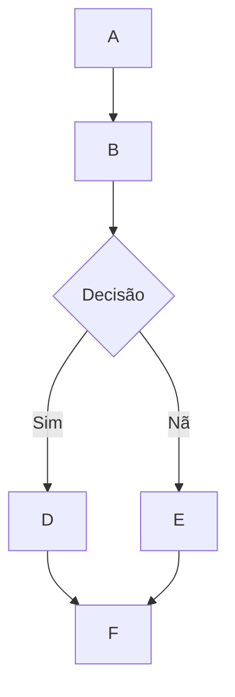

# 🌊 Suporte à Renderização do MermaidJS no Open WebUI

## Visão Geral

O Open WebUI suporta a renderização de diagramas MermaidJS visualmente atraentes, fluxogramas, gráficos de pizza e mais, diretamente na interface de bate-papo. O MermaidJS é uma ferramenta poderosa para visualizar informações e ideias complexas e, quando combinado com as capacidades de um modelo de linguagem grande (LLM), pode ser uma ferramenta robusta para gerar e explorar novas ideias.

## Usando o MermaidJS no Open WebUI

Para gerar um diagrama MermaidJS, basta pedir a um LLM dentro de qualquer bate-papo para criar um diagrama ou gráfico usando o MermaidJS. Por exemplo, você pode pedir ao LLM:

* "Crie um fluxograma para um processo de tomada de decisão simples para mim usando Mermaid. Explique como o fluxograma funciona."
* "Use Mermaid para visualizar uma árvore de decisão para determinar se é apropriado fazer uma caminhada ao ar livre."

Observe que, para que a resposta do LLM seja renderizada corretamente, ela deve começar com a palavra `mermaid` seguida pelo código MermaidJS. Você pode consultar a [documentação do MermaidJS](https://mermaid.js.org/intro/) para garantir que a sintaxe esteja correta e fornecer prompts estruturados ao LLM para orientá-lo na geração de melhor sintaxe MermaidJS.

## Visualizando o Código MermaidJS Diretamente no Bate-Papo

Quando você solicita uma visualização MermaidJS, o Modelo de Linguagem Grande (LLM) gerará o código necessário. O Open WebUI renderizará automaticamente a visualização diretamente na interface de bate-papo, desde que o código utilize a sintaxe válida do MermaidJS.

Se o modelo gerar sintaxe MermaidJS, mas a visualização não for renderizada, geralmente indica um erro de sintaxe no código. Não se preocupe — você será notificado sobre quaisquer erros após a resposta ter sido completamente gerada. Se isso ocorrer, tente consultar a [documentação do MermaidJS](https://mermaid.js.org/intro/) para identificar o problema e revisar o prompt conforme necessário.

## Interagindo com Sua Visualização

Depois que sua visualização for exibida, você pode:

* Dar zoom para analisar mais detalhadamente.
* Copiar o código original MermaidJS usado para gerar a visualização clicando no botão de copiar no canto superior direito da área de exibição.

### Exemplo



Isso gerará um fluxograma como o seguinte:

```markdown
 startAncestor [ início ]
A[A] --> B[B]
B --> C[Decisão]
C -->| Sim | D[D]
C -->| Não | E[E]
D --> F[F]
E --> F[F]
```

Experimentar diferentes tipos de diagramas e gráficos pode ajudá-lo a desenvolver uma compreensão mais detalhada de como aproveitar eficazmente o MermaidJS dentro do Open WebUI. Para modelos menores, considere consultar a [documentação do MermaidJS](https://mermaid.js.org/intro/) para fornecer orientações ao LLM, ou peça para que ele resuma a documentação em notas abrangentes ou um prompt de sistema. Seguindo essas diretrizes e explorando as capacidades do MermaidJS, você pode desbloquear todo o potencial dessa poderosa ferramenta no Open WebUI.
