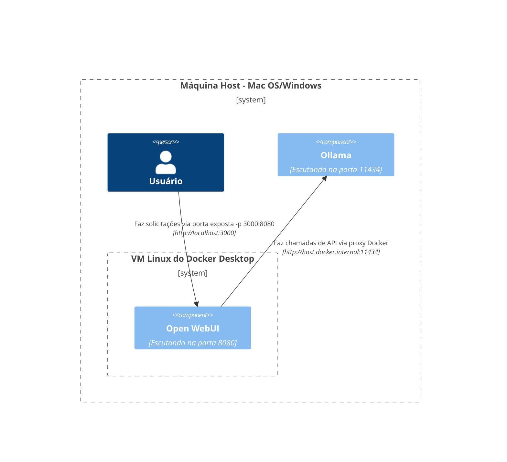
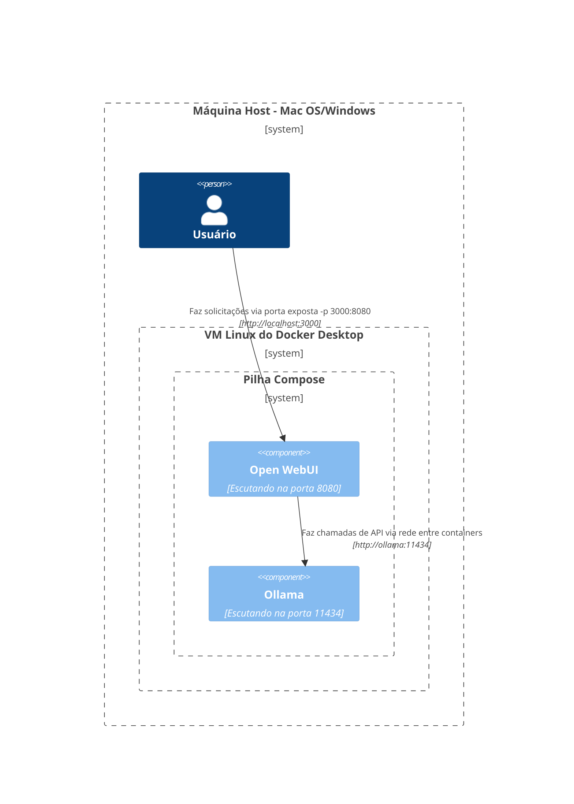
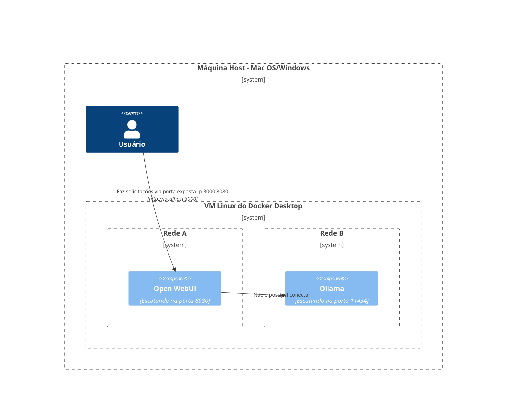
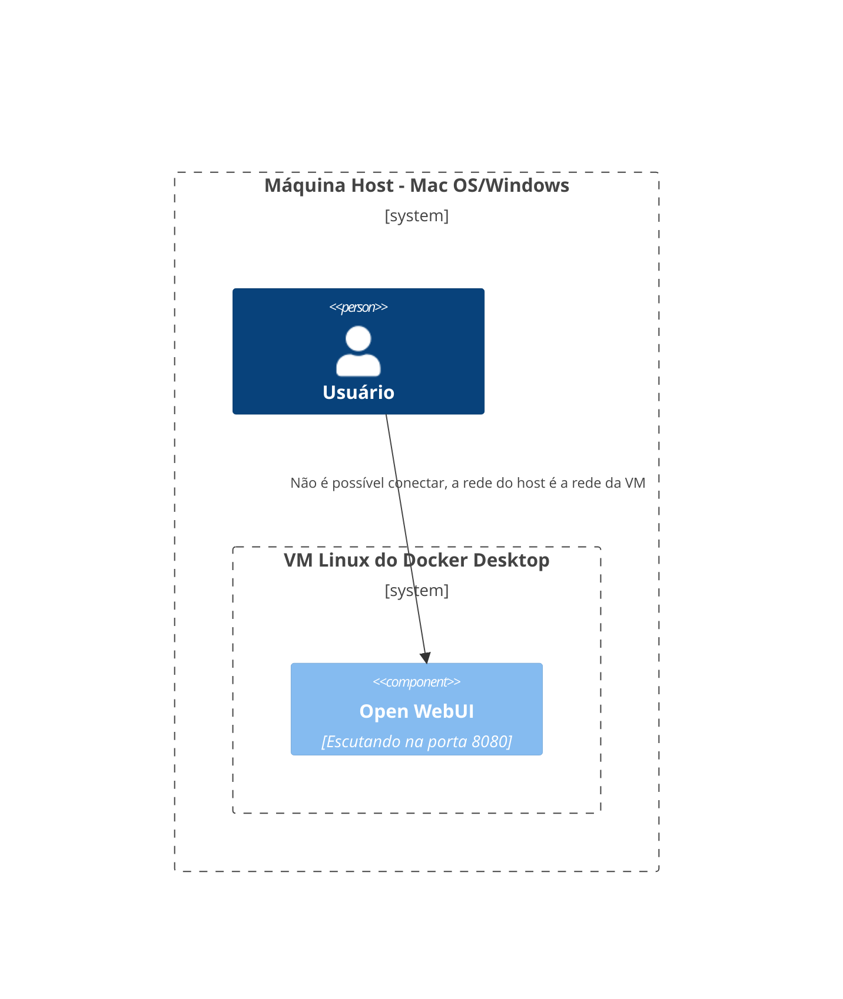
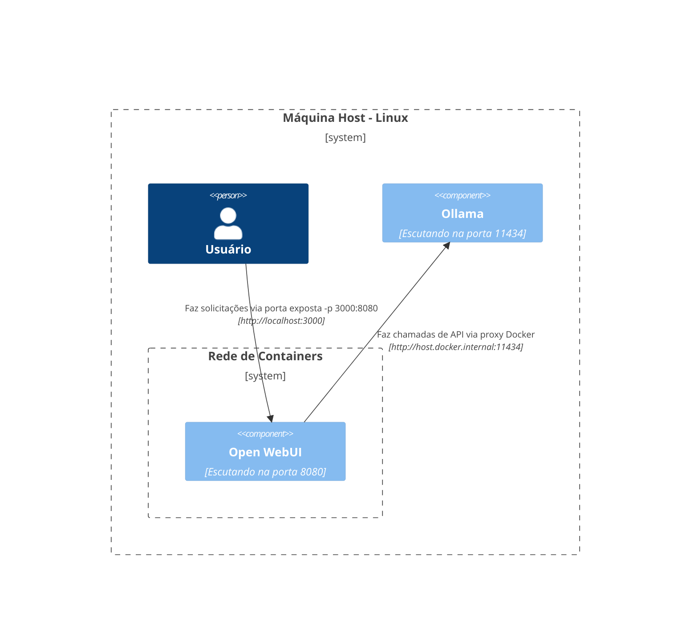
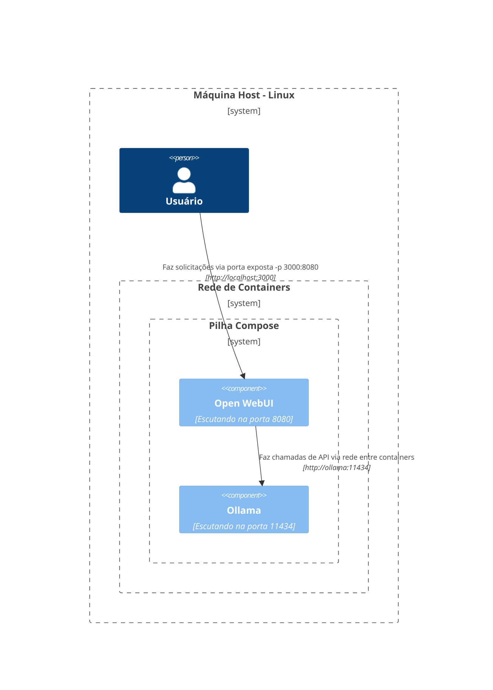
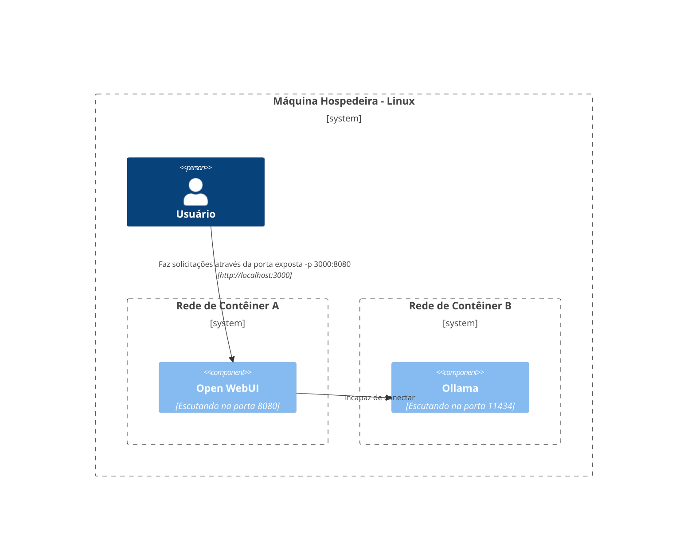
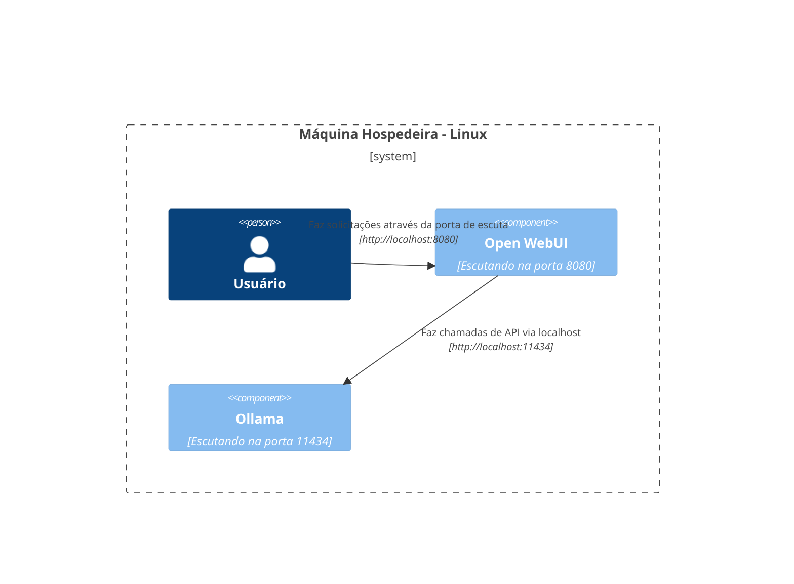

Aqui, fornecemos diagramas claros e estruturados para ajudá-lo a entender como diversos componentes da rede interagem em diferentes configurações. Esta documentação foi criada para usuários de macOS/Windows e Linux. Cada cenário é ilustrado usando diagramas Mermaid para mostrar como as interações são configuradas dependendo das diferentes configurações de sistema e estratégias de implantação.

## Opções de Configuração no Mac OS/Windows 🖥️

### Ollama no Host, Open WebUI no Container

Neste cenário, `Ollama` é executado diretamente na máquina host, enquanto `Open WebUI` opera dentro de um container Docker.

### Ollama e Open WebUI em Pilha Compose

Ambos `Ollama` e `Open WebUI` são configurados dentro da mesma pilha Docker Compose, simplificando as comunicações de rede.

### Ollama e Open WebUI, Redes Separadas

Aqui, `Ollama` e `Open WebUI` são implantados em redes Docker separadas, potencialmente levando a problemas de conectividade.

### Open WebUI na Rede do Host

Nesta configuração, `Open WebUI` utiliza a rede do host, o que impacta sua capacidade de conectar em determinados ambientes.

## Opções de Configuração no Linux 🐧

### Ollama no Host, Open WebUI no Container (Linux)

Este diagrama é específico para a plataforma Linux, com `Ollama` executando no host e `Open WebUI` implantado dentro de um container Docker.

### Ollama e Open WebUI em Pilha Compose (Linux)

Uma configuração onde `Ollama` e `Open WebUI` residem na mesma pilha Docker Compose, permitindo uma rede simplificada no Linux.

### Ollama e Open WebUI, Redes Separadas (Linux)

Um cenário no qual `Ollama` e `Open WebUI` estão em redes Docker diferentes em um ambiente Linux, o que pode dificultar a conectividade.

### Open WebUI na Rede Host, Ollama no Host (Linux)

Uma configuração ideal onde tanto o `Open WebUI` quanto o `Ollama` utilizam a rede do host, facilitando uma interação perfeita em sistemas Linux.

Cada configuração aborda diferentes estratégias de implantação e configurações de rede para ajudá-lo a escolher a melhor opção para suas necessidades.
