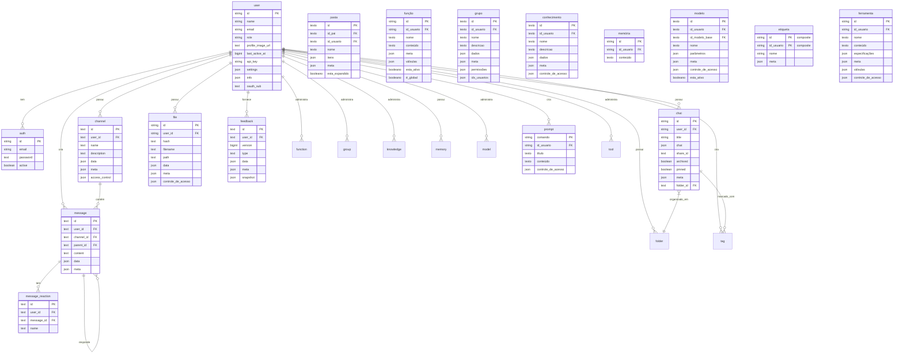

:::warning
Este tutorial é uma contribuição da comunidade e não é suportado pela equipe do Open WebUI. Serve apenas como uma demonstração de como personalizar o Open WebUI para seu caso de uso específico. Quer contribuir? Confira o tutorial de contribuição.
:::

> [!WARNING]  
> Esta documentação foi criada com base na versão atual (0.5.11) e está sendo constantemente atualizada.

# Banco de Dados SQLite Interno do Open-WebUI

Para o Open-WebUI, o banco de dados SQLite serve como a espinha dorsal para gerenciamento de usuários, histórico de conversas, armazenamento de arquivos e várias outras funcionalidades principais. Compreender essa estrutura é essencial para quem deseja contribuir ou manter o projeto de forma eficaz.

## Localização do SQLite Interno

Você pode encontrar o banco de dados SQLite em `root` -> `data` -> `webui.db`

```
📁 Root (/)
├── 📁 data
│   ├── 📁 cache
│   ├── 📁 uploads
│   ├── 📁 vector_db
│   └── 📄 webui.db
├── 📄 dev.sh
├── 📁 open_webui
├── 📄 requirements.txt
├── 📄 start.sh
└── 📄 start_windows.bat
```

## Copiar o Banco de Dados Localmente

Se você quiser copiar o banco de dados SQLite do Open-WebUI que está sendo executado no contêiner para sua máquina local, você pode usar:

```bash
docker cp open-webui:/app/backend/data/webui.db ./webui.db
```

Alternativamente, você pode acessar o banco de dados dentro do contêiner usando:

```bash
docker exec -it open-webui /bin/sh
```

## Visão Geral das Tabelas

Aqui está uma lista completa de tabelas no banco de dados SQLite do Open-WebUI. As tabelas estão listadas em ordem alfabética e numeradas para conveniência.

| **Nº** | **Nome da Tabela** | **Descrição**                                                      |
| ------- | ------------------- | ------------------------------------------------------------------ |
| 01      | auth               | Armazena as credenciais de autenticação e informações de login de usuários |
| 02      | channel            | Gerencia os canais de conversa e suas configurações               |
| 03      | channel_member     | Acompanha a associação de usuários e permissões nos canais        |
| 04      | chat               | Armazena sessões de conversa e seus metadados                     |
| 05      | chatidtag          | Mapeia relacionamentos entre conversas e as tags associadas       |
| 06      | config             | Mantém as configurações de sistema                                |
| 07      | document           | Armazena documentos e seus metadados para gerenciamento de conhecimento |
| 08      | feedback           | Captura feedback e avaliações dos usuários                       |
| 09      | file               | Gerencia arquivos enviados e seus metadados                      |
| 10      | folder             | Organiza arquivos e conteúdos em estruturas hierárquicas         |
| 11      | function           | Armazena funções personalizadas e suas configurações             |
| 12      | group              | Gerencia grupos de usuários e suas permissões                    |
| 13      | knowledge          | Armazena entradas da base de conhecimento e informações relacionadas |
| 14      | memory             | Mantém o histórico das conversas e memória contextual            |
| 15      | message            | Armazena mensagens de conversas individuais e seus conteúdos     |
| 16      | message_reaction   | Registra reações dos usuários (emojis/respostas) às mensagens    |
| 17      | migrate_history    | Acompanha a versão do esquema do banco de dados e registros de migração |
| 18      | model              | Gerencia as configurações e configurações dos modelos de IA      |
| 19      | prompt             | Armazena templates e configurações para prompts de IA            |
| 20      | tag                | Gerencia tags/etiquetas para categorização de conteúdo            |
| 21      | tool               | Armazena configurações para ferramentas e integrações do sistema |
| 22      | user               | Mantém perfis de usuários e informações de conta                 |

Nota: existem duas tabelas adicionais no banco de dados SQLite do Open-WebUI que não estão relacionadas à funcionalidade principal do Open-WebUI e foram excluídas:

- Tabela de Versão do Alembic
- Tabela de Histórico de Migração

Agora que temos todas as tabelas, vamos entender a estrutura de cada uma delas.

## Tabela Auth

| **Nome da Coluna** | **Tipo de Dado** | **Restrições** | **Descrição**                     |
| ------------------- | ---------------- | --------------- | ---------------------------------- |
| id                  | String           | PRIMARY KEY     | Identificador único               |
| email               | String           | -               | Email do usuário                  |
| password            | Text             | -               | Senha criptografada               |
| active              | Boolean          | -               | Status da conta                   |

Coisas para saber sobre a tabela auth:

- Usa UUID como chave primária
- Relacionamento Um-para-Um com a tabela `users` (id compartilhado)

## Tabela Channel

| **Nome da Coluna** | **Tipo de Dado** | **Restrições** | **Descrição**                     |
| ------------------- | ---------------- | --------------- | ---------------------------------- |
| id              | Texto         | CHAVE PRIMÁRIA  | Identificador único (UUID)                |
| user_id         | Texto         | -               | Proprietário/criador do canal             |
| type            | Texto         | pode ser nulo   | Tipo de canal                            |
| name            | Texto         | -               | Nome do canal                            |
| description     | Texto         | pode ser nulo   | Descrição do canal                       |
| data            | JSON          | pode ser nulo   | Armazenamento flexível de dados          |
| meta            | JSON          | pode ser nulo   | Metadados do canal                       |
| access_control  | JSON          | pode ser nulo   | Configurações de permissões              |
| created_at      | BigInteger    | -               | Timestamp de criação (nanosegundos)      |
| updated_at      | BigInteger    | -               | Timestamp da última atualização          |

Considerações sobre a tabela de autenticação:

- Utiliza UUID como chave primária
- Nomes de canais não diferencia maiúsculas de minúsculas (armazenados em minúsculas)

## Tabela de Membros do Canal

| **Nome da Coluna** | **Tipo de Dados** | **Restrições**    | **Descrição**                              |
| ------------------ | ----------------- | ----------------- | ------------------------------------------ |
| id                | TEXTO             | NÃO NULO          | Identificador único da associação ao canal |
| channel_id        | TEXTO             | NÃO NULO          | Referência ao canal                        |
| user_id           | TEXTO             | NÃO NULO          | Referência ao usuário                      |
| created_at        | BIGINT            | -                 | Timestamp de quando a associação foi criada|

## Tabela de Chat

| **Nome da Coluna** | **Tipo de Dados** | **Restrições**       | **Descrição**                |
| ------------------ | ----------------- | ------------------- | ---------------------------- |
| id                | String            | CHAVE PRIMÁRIA      | Identificador único (UUID)   |
| user_id           | String            | -                   | Proprietário do chat         |
| title             | Texto             | -                   | Título do chat               |
| chat              | JSON              | -                   | Conteúdo e histórico do chat |
| created_at        | BigInteger        | -                   | Timestamp de criação         |
| updated_at        | BigInteger        | -                   | Timestamp da última atualização|
| share_id          | Texto             | ÚNICO, pode ser nulo| Identificador de compartilhamento |
| archived          | Boolean           | padrão=False        | Status de arquivamento       |
| pinned            | Boolean           | padrão=False, pode ser nulo| Status de fixação      |
| meta              | JSON              | padrão_do_servidor="{}" | Metadados incluindo tags   |
| folder_id         | Texto             | pode ser nulo       | ID da pasta pai             |

## Tabela de Tags de ID do Chat

| **Nome da Coluna** | **Tipo de Dados** | **Restrições**  | **Descrição**           |
| ------------------ | ----------------- | -----------------| ----------------------- |
| id                | VARCHAR(255)      | NÃO NULO         | Identificador único      |
| tag_name          | VARCHAR(255)      | NÃO NULO         | Nome da tag              |
| chat_id           | VARCHAR(255)      | NÃO NULO         | Referência ao chat       |
| user_id           | VARCHAR(255)      | NÃO NULO         | Referência ao usuário    |
| timestamp         | INTEGER           | NÃO NULO         | Timestamp de criação     |

## Configuração

| **Nome da Coluna** | **Tipo de Dados** | **Restrições**  | **Padrão**             | **Descrição**                |
| ------------------ | ----------------- | -----------------| ----------------------- | --------------------------- |
| id                | INTEGER           | NÃO NULO         | -                       | Identificador chave primária|
| data              | JSON              | NÃO NULO         | -                       | Dados de configuração       |
| version           | INTEGER           | NÃO NULO         | -                       | Número da versão da configuração|
| created_at        | DATETIME          | NÃO NULO         | TIMESTAMP_ATUAL         | Timestamp de criação         |
| updated_at        | DATETIME          | -                | TIMESTAMP_ATUAL         | Timestamp da última atualização|

## Tabela de Feedback

| **Nome da Coluna** | **Tipo de Dados** | **Restrições**  | **Descrição**                  |
| ------------------ | ----------------- | -----------------| ----------------------------- |
| id                | Texto             | CHAVE PRIMÁRIA   | Identificador único (UUID)    |
| user_id           | Texto             | -                | Usuário que forneceu feedback |
| version           | BigInteger        | padrão=0         | Número da versão do feedback  |
| type              | Texto             | -                | Tipo de feedback              |
| data              | JSON              | pode ser nulo    | Dados de feedback incluindo avaliações |
| meta              | JSON              | pode ser nulo    | Metadados (arena, chat_id, etc)|
| snapshot          | JSON              | pode ser nulo    | Snapshot associado ao chat    |
| created_at      | BigInteger    | -               | Timestamp de criação             |
| updated_at      | BigInteger    | -               | Timestamp da última atualização  |

# Tabela de Arquivo

| **Nome da Coluna** | **Tipo de Dados** | **Restrições** | **Descrição**       |
| ------------------ | ----------------- | --------------- | ------------------- |
| id                 | String            | PRIMARY KEY     | Identificador único |
| user_id            | String            | -               | Proprietário do arquivo |
| hash               | Text              | nullable        | Hash/checksum do arquivo |
| filename           | Text              | -               | Nome do arquivo     |
| path               | Text              | nullable        | Caminho no sistema de arquivos |
| data               | JSON              | nullable        | Dados relacionados ao arquivo |
| meta               | JSON              | nullable        | Metadados do arquivo |
| access_control     | JSON              | nullable        | Configurações de permissão |
| created_at         | BigInteger        | -               | Timestamp de criação |
| updated_at         | BigInteger        | -               | Timestamp da última atualização |

Formato esperado para o campo `meta`:

```python
{
    "name": string,          # Nome opcional para exibição
    "content_type": string,  # Tipo MIME
    "size": integer,         # Tamanho do arquivo em bytes
    # Metadados adicionais suportados via ConfigDict(extra="allow")
}
```

## Tabela de Pastas

| **Nome da Coluna** | **Tipo de Dados** | **Restrições** | **Descrição**                   |
| ------------------ | ----------------- | --------------- | ------------------------------ |
| id                 | Text              | PRIMARY KEY     | Identificador único (UUID)     |
| parent_id          | Text              | nullable        | ID da pasta pai para hierarquia |
| user_id            | Text              | -               | Proprietário da pasta          |
| name               | Text              | -               | Nome da pasta                  |
| items              | JSON              | nullable        | Conteúdo da pasta              |
| meta               | JSON              | nullable        | Metadados da pasta             |
| is_expanded        | Boolean           | default=False   | Estado de expansão na interface |
| created_at         | BigInteger        | -               | Timestamp de criação           |
| updated_at         | BigInteger        | -               | Timestamp da última atualização |

Coisas a saber sobre a tabela de pastas:

- Pastas podem ser aninhadas (referência a parent_id)
- Pastas raíz têm parent_id nulo
- Os nomes das pastas devem ser únicos dentro de um mesmo pai

## Tabela de Funções

| **Nome da Coluna** | **Tipo de Dados** | **Restrições** | **Descrição**               |
| ------------------ | ----------------- | --------------- | --------------------------- |
| id                 | String            | PRIMARY KEY     | Identificador único         |
| user_id            | String            | -               | Proprietário da função      |
| name               | Text              | -               | Nome da função              |
| type               | Text              | -               | Tipo da função              |
| content            | Text              | -               | Conteúdo/código da função   |
| meta               | JSON              | -               | Metadados da função         |
| valves             | JSON              | -               | Configurações de controle da função |
| is_active          | Boolean           | -               | Status ativo da função      |
| is_global          | Boolean           | -               | Indicador de disponibilidade global |
| created_at         | BigInteger        | -               | Timestamp de criação        |
| updated_at         | BigInteger        | -               | Timestamp da última atualização |

Coisas a saber sobre a tabela de funções:

- `type` pode ser apenas: ["filter", "action"]

## Tabela de Grupos

| **Nome da Coluna** | **Tipo de Dados** | **Restrições**       | **Descrição**               |
| ------------------ | ----------------- | -------------------- | --------------------------- |
| id                 | Text              | PRIMARY KEY, UNIQUE  | Identificador único (UUID)  |
| user_id            | Text              | -                   | Proprietário/criador do grupo |
| name               | Text              | -                   | Nome do grupo               |
| description        | Text              | -                   | Descrição do grupo          |
| data               | JSON              | nullable            | Dados adicionais do grupo   |
| meta               | JSON              | nullable            | Metadados do grupo          |
| permissions        | JSON              | nullable            | Configuração de permissão   |
| user_ids           | JSON              | nullable            | Lista de IDs dos usuários membros |
| created_at         | BigInteger        | -                   | Timestamp de criação        |
| updated_at         | BigInteger        | -                   | Timestamp da última atualização |

## Tabela de Conhecimento

| **Nome da Coluna** | **Tipo de Dados** | **Restrições**       | **Descrição**               |
| ------------------ | ----------------- | -------------------- | --------------------------- |
| id              | Texto         | PRIMARY KEY, UNIQUE | Identificador único (UUID)         |
| user_id         | Texto         | -                   | Proprietário da base de conhecimento |
| name            | Texto         | -                   | Nome da base de conhecimento       |
| description     | Texto         | -                   | Descrição da base de conhecimento  |
| data            | JSON          | nullable            | Conteúdo da base de conhecimento   |
| meta            | JSON          | nullable            | Metadados adicionais               |
| access_control  | JSON          | nullable            | Regras de controle de acesso       |
| created_at      | BigInteger    | -                   | Timestamp de criação               |
| updated_at      | BigInteger    | -                   | Timestamp da última atualização    |

Estrutura esperada para os campos `access_control`:

```python
{
  "read": {
    "group_ids": ["group_id1", "group_id2"],
    "user_ids": ["user_id1", "user_id2"]
  },
  "write": {
    "group_ids": ["group_id1", "group_id2"],
    "user_ids": ["user_id1", "user_id2"]
  }
}
```

## Tabela de Memória

| **Nome da Coluna** | **Tipo de Dado** | **Restrições** | **Descrição**                      |
| ------------------- | ---------------- | --------------- | ------------------------------------ |
| id                 | String           | PRIMARY KEY     | Identificador único (UUID)          |
| user_id            | String           | -               | Proprietário da memória             |
| content            | Texto            | -               | Conteúdo da memória                 |
| created_at         | BigInteger       | -               | Timestamp de criação                |
| updated_at         | BigInteger       | -               | Timestamp da última atualização     |

## Tabela de Mensagem

| **Nome da Coluna** | **Tipo de Dado** | **Restrições** | **Descrição**                                        |
| ------------------- | ---------------- | --------------- | ---------------------------------------------------- |
| id                 | Texto            | PRIMARY KEY     | Identificador único (UUID)                          |
| user_id            | Texto            | -               | Autor da mensagem                                   |
| channel_id         | Texto            | nullable        | Canal associado                                     |
| parent_id          | Texto            | nullable        | Mensagem pai para threads                          |
| content            | Texto            | -               | Conteúdo da mensagem                               |
| data               | JSON             | nullable        | Dados adicionais da mensagem                       |
| meta               | JSON             | nullable        | Metadados da mensagem                              |
| created_at         | BigInteger       | -               | Timestamp de criação (nanosegundos)               |
| updated_at         | BigInteger       | -               | Timestamp da última atualização (nanosegundos)    |

## Tabela de Reações a Mensagens

| **Nome da Coluna** | **Tipo de Dado** | **Restrições** | **Descrição**                      |
| ------------------- | ---------------- | --------------- | ------------------------------------ |
| id                 | Texto            | PRIMARY KEY     | Identificador único (UUID)          |
| user_id            | Texto            | -               | Usuário que reagiu                  |
| message_id         | Texto            | -               | Mensagem associada                  |
| name               | Texto            | -               | Nome/reação emoji                   |
| created_at         | BigInteger       | -               | Timestamp da reação                 |

## Tabela de Modelos

| **Nome da Coluna** | **Tipo de Dado** | **Restrições** | **Descrição**                      |
| ------------------- | ---------------- | --------------- | ------------------------------------ |
| id                 | Texto            | PRIMARY KEY     | Identificador do modelo             |
| user_id            | Texto            | -               | Proprietário do modelo              |
| base_model_id      | Texto            | nullable        | Referência ao modelo pai            |
| name               | Texto            | -               | Nome de exibição                    |
| params             | JSON             | -               | Parâmetros do modelo                |
| meta               | JSON             | -               | Metadados do modelo                 |
| access_control     | JSON             | nullable        | Permissões de acesso                |
| is_active          | Boolean          | default=True    | Status ativo                        |
| created_at         | BigInteger       | -               | Timestamp de criação                |
| updated_at         | BigInteger       | -               | Timestamp da última atualização     |

## Tabela de Prompt

| **Nome da Coluna** | **Tipo de Dado** | **Restrições** | **Descrição**                        |
| ------------------- | ---------------- | --------------- | ------------------------------------ |
| command            | String           | PRIMARY KEY     | Identificador único do comando       |
| user_id            | String           | -               | Proprietário do prompt               |
| title              | Texto            | -               | Título do prompt                     |
| content            | Texto            | -               | Conteúdo/modelo do prompt            |
| timestamp          | BigInteger       | -               | Timestamp da última atualização      |
| access_control     | JSON             | nullable        | Permissões de acesso                 |

## Tabela de Tags

| **Nome da Coluna** | **Tipo de Dados** | **Restrições** | **Descrição**           |
| ------------------ | ----------------- | -------------- | ----------------------- |
| id                | String            | PK (composto)  | Identificador normalizado de tag |
| name              | String            | -              | Nome de exibição        |
| user_id           | String            | PK (composto)  | Proprietário da tag      |
| meta              | JSON              | nullable       | Metadados da tag         |

Pontos para saber sobre a tabela de tag:

- Chave primária é composta (id, user_id)

## Tabela de Ferramenta

| **Nome da Coluna** | **Tipo de Dados** | **Restrições** | **Descrição**       |
| ------------------ | ----------------- | -------------- | ------------------- |
| id                | String            | CHAVE PRIMÁRIA | Identificador único |
| user_id           | String            | -              | Proprietário da ferramenta |
| name              | Text              | -              | Nome da ferramenta  |
| content           | Text              | -              | Conteúdo/código da ferramenta |
| specs             | JSON              | -              | Especificações da ferramenta |
| meta              | JSON              | -              | Metadados da ferramenta |
| valves            | JSON              | -              | Configurações de controle da ferramenta |
| access_control    | JSON              | nullable       | Permissões de acesso |
| created_at        | BigInteger        | -              | Timestamp de criação |
| updated_at        | BigInteger        | -              | Timestamp da última atualização |

## Tabela de Usuário

| **Nome da Coluna**   | **Tipo de Dados** | **Restrições**  | **Descrição**              |
| -------------------- | ----------------- | -------------- | -------------------------- |
| id                  | String            | CHAVE PRIMÁRIA | Identificador único       |
| name                | String            | -              | Nome do usuário           |
| email               | String            | -              | Email do usuário          |
| role                | String            | -              | Função do usuário         |
| profile_image_url   | Text              | -              | Caminho da imagem de perfil |
| last_active_at      | BigInteger        | -              | Timestamp da última atividade |
| updated_at          | BigInteger        | -              | Timestamp da última atualização |
| created_at          | BigInteger        | -              | Timestamp de criação      |
| api_key             | String            | ÚNICO, nullable | Chave de autenticação API |
| settings            | JSON              | nullable       | Preferências do usuário   |
| info                | JSON              | nullable       | Informações adicionais do usuário |
| oauth_sub           | Text              | ÚNICO          | Identificador de assunto OAuth |

# Diagrama de Relacionamento de Entidades

Para ajudar a visualizar o relacionamento entre as tabelas, consulte o Diagrama de Relacionamento de Entidades (ERD) abaixo, gerado com Mermaid.


