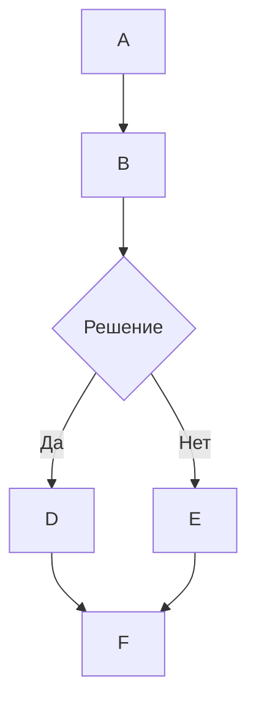

# 🌊 Поддержка визуализации MermaidJS в Open WebUI

## Обзор

Open WebUI поддерживает рендеринг привлекательных диаграмм, блок-схем, круговых диаграмм и других визуализаций MermaidJS непосредственно в интерфейсе чата. MermaidJS является мощным инструментом для визуализации сложной информации и идей, и в сочетании с возможностями больших языковых моделей (LLM) он становится мощным средством для генерации и изучения новых идей.

## Использование MermaidJS в Open WebUI

Чтобы создать диаграмму MermaidJS, просто запросите у LLM в любом чате создание диаграммы или графика, используя MermaidJS. Например, вы можете попросить LLM:

* "Создать блок-схему простого процесса принятия решений с использованием Mermaid. Объясните, как работает блок-схема."
* "Используйте Mermaid для визуализации дерева решений, чтобы определить, подходящее ли время для прогулки на улице."

Обратите внимание, что для корректного рендеринга ответа от LLM он должен начинаться со слова `mermaid`, за которым следует код MermaidJS. Вы можете обратиться к [документации MermaidJS](https://mermaid.js.org/intro/), чтобы убедиться, что используемый синтаксис верен, и обеспечить структурированные подсказки для LLM, чтобы улучшить генерируемый синтаксис MermaidJS.

## Визуализация MermaidJS кода прямо в чате

Когда вы запрашиваете визуализацию MermaidJS, большая языковая модель (LLM) сгенерирует необходимый код. Open WebUI автоматически отобразит визуализацию непосредственно в интерфейсе чата, если код использует допустимый синтаксис MermaidJS.

Если модель генерирует синтаксис MermaidJS, но визуализация не отображается, это обычно указывает на ошибку синтаксиса в коде. Не беспокойтесь – вы будете уведомлены об ошибках после полного завершения генерации ответа. Если это произойдет, попробуйте обратиться к [документации MermaidJS](https://mermaid.js.org/intro/) для выявления проблемы и внесите изменения в запрос, если необходимо.

## Взаимодействие с вашей визуализацией

Когда ваша визуализация будет отображена, вы сможете:

* Увеличивать и уменьшать масштаб, чтобы рассмотреть её более внимательно.
* Скопировать оригинальный код MermaidJS, использованный для создания визуализации, нажав кнопку копирования в правом верхнем углу области отображения.

### Пример



Это создаст блок-схему, подобную следующей:

```markdown
 startAncestor [ старт ]
A[A] --> B[B]
B --> C[Решение]
C -->| Да | D[D]
C -->| Нет | E[E]
D --> F[F]
E --> F[F]
```

Эксперименты с различными видами диаграмм и графиков помогут вам лучше понять, как эффективно использовать MermaidJS в Open WebUI. Для меньших моделей рассмотрите возможность обращения к [документации MermaidJS](https://mermaid.js.org/intro/) для предоставления рекомендаций для LLM или попросите её создать краткие заметки или системные подсказки из документации. Следуя этим руководствам и исследуя возможности MermaidJS, вы сможете раскрыть весь потенциал этого мощного инструмента в Open WebUI.
