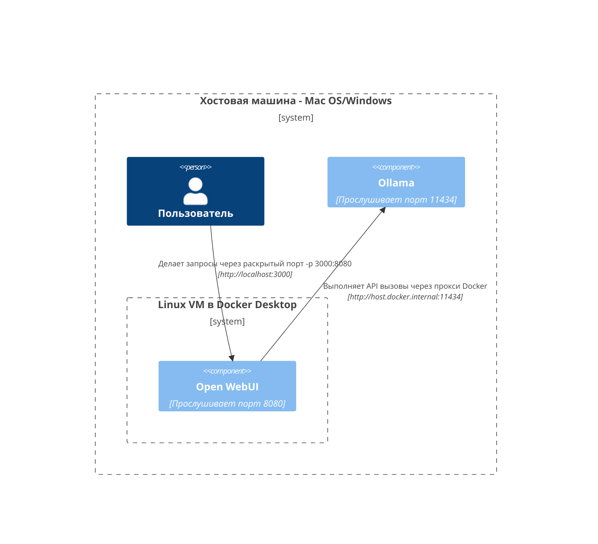
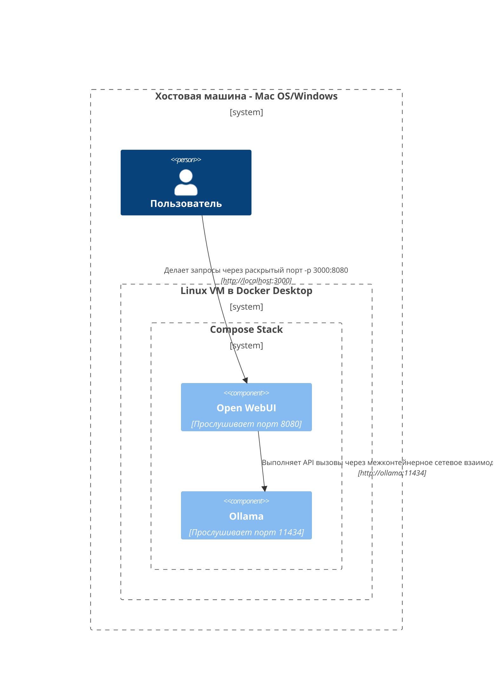
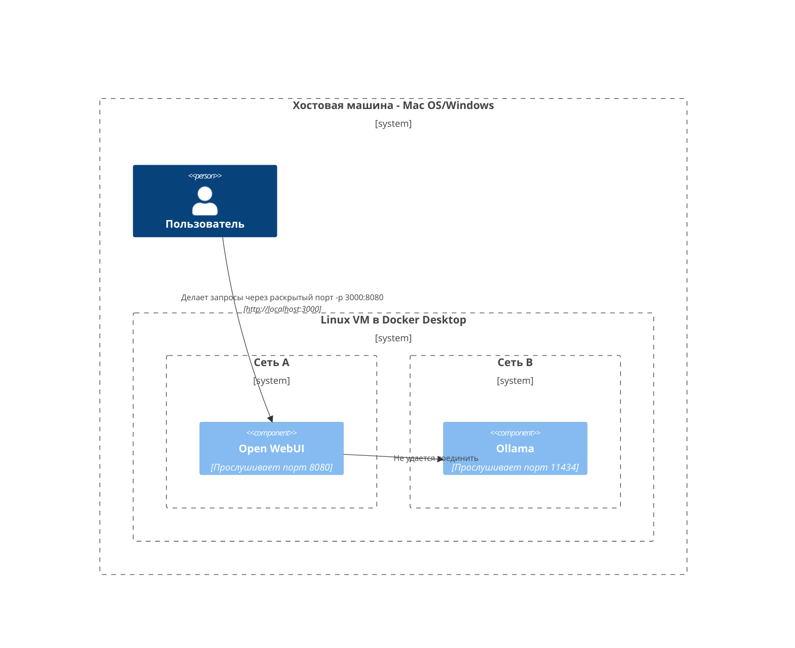
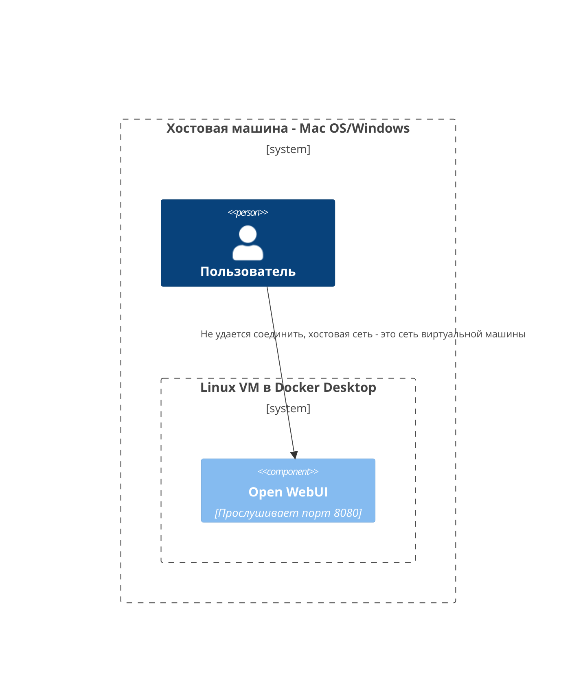
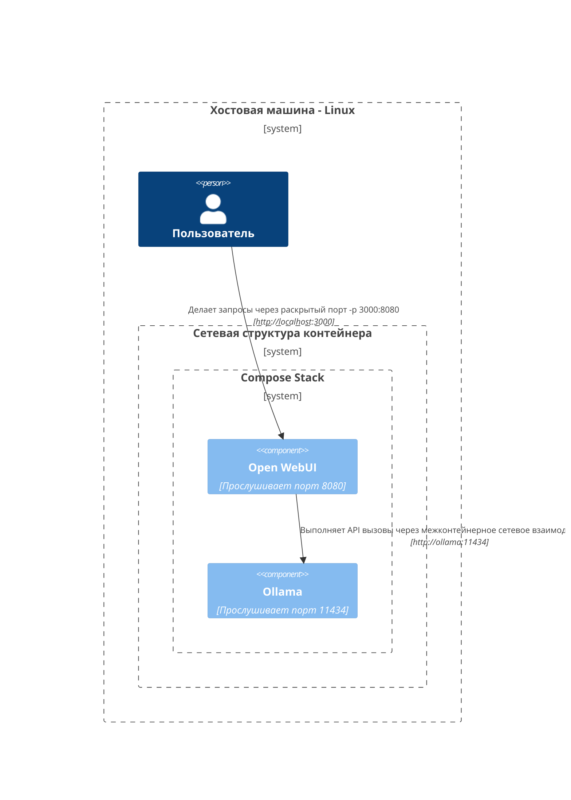

Здесь мы предоставляем четкие и структурированные диаграммы, чтобы помочь вам понять, как различные компоненты сети взаимодействуют в разных настройках. Эта документация предназначена для пользователей macOS/Windows и Linux. Каждая ситуация иллюстрируется с использованием диаграмм Mermaid, чтобы показать, как настраиваются взаимодействия в зависимости от различных конфигураций системы и стратегий развертывания.

## Настройки для Mac OS/Windows 🖥️

### Ollama на хосте, Open WebUI в контейнере

В этом сценарии `Ollama` работает напрямую на хостовой машине, а `Open WebUI` работает внутри контейнера Docker.



### Ollama и Open WebUI в составе Compose стека

И `Ollama`, и `Open WebUI` настроены в одном стеке Docker Compose, что упрощает сетевые коммуникации.



### Ollama и Open WebUI, отдельные сети

В этом случае `Ollama` и `Open WebUI` размещены в отдельных сетях Docker, что потенциально может вызывать проблемы с подключением.



### Open WebUI в сети хоста

В данной конфигурации `Open WebUI` использует сеть хоста, что влияет на его способность подключаться в определенных средах.




## Настройки для Linux 🐧

### Ollama на хосте, Open WebUI в контейнере (Linux)

Эта диаграмма специфична для платформы Linux, где `Ollama` работает на хосте, а `Open WebUI` помещен в Docker контейнер.


### Ollama и Open WebUI в составе Compose стека (Linux)

Настройка, в которой как `Ollama`, так и `Open WebUI` находятся в одном стеке Docker Compose, что обеспечивает бесперебойное сетевое взаимодействие на Linux.



### Ollama и Open WebUI, отдельные сети (Linux)

Сценарий, в котором `Ollama` и `Open WebUI` находятся в разных сетях Docker в среде Linux, что может затруднять их подключение.

```mermaid
C4Context
Граница(b0, "Хостинг-машина - Linux") {
   Персона(user, "Пользователь")
   Граница(b2, "Сетевая подсеть А") {
      Компонент(openwebui, "Open WebUI", "Прослушивание на порту 8080")
   }
   Граница(b3, "Сетевая подсеть B") {
      Компонент(ollama, "Ollama", "Прослушивание на порту 11434")
   }
}
Отношение(openwebui, ollama, "Невозможно подключиться")
Отношение(user, openwebui, "Делает запросы через открытый порт -p 3000:8080", "http://localhost:3000")
ОбновитьСтильОтношения(user, openwebui, $offsetX="-100", $offsetY="-50")
```

### Open WebUI в хост-сети, Ollama на хосте (Linux)

Оптимальная схема, где и `Open WebUI`, и `Ollama` используют сеть хоста, что обеспечивает бесшовное взаимодействие на системах Linux.

```mermaid
C4Context
Граница(b0, "Хостинг-машина - Linux") {
   Персона(user, "Пользователь")
   Компонент(openwebui, "Open WebUI", "Прослушивание на порту 8080")
   Компонент(ollama, "Ollama", "Прослушивание на порту 11434")
}
Отношение(openwebui, ollama, "Делает API-запросы через localhost", "http://localhost:11434")
Отношение(user, openwebui, "Делает запросы через прослушиваемый порт", "http://localhost:8080")
ОбновитьСтильОтношения(user, openwebui, $offsetX="-100", $offsetY="-50")
```

Каждая схема учитывает разные стратегии развертывания и настройки сети, чтобы помочь вам выбрать лучший вариант для ваших требований.
