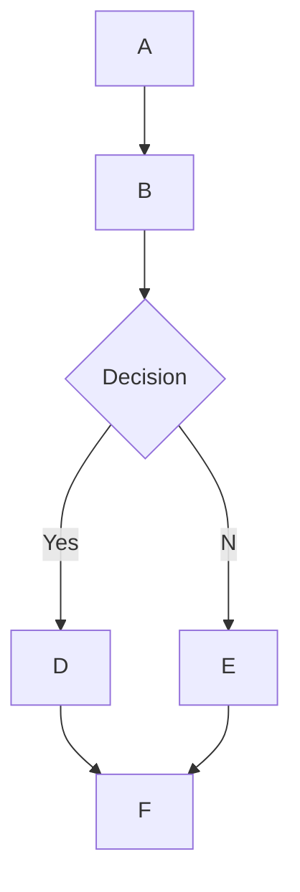

# 🌊 Open WebUI 的 MermaidJS 繪製支援

## 概述

Open WebUI 支援直接在聊天介面中呈現美觀的 MermaidJS 圖表、流程圖、圓餅圖等等。MermaidJS 是一個強大的工具，用於視覺化複雜的資訊和想法，當它與大型語言模型（LLM）結合使用時，可以成為一個生成和探索新想法的強大工具。

## 在 Open WebUI 中使用 MermaidJS

要生成 MermaidJS 圖表，只需在任何聊天中請求 LLM 使用 MermaidJS 創建圖表。例如，您可以請求 LLM:

* 「幫我使用 Mermaid 創建一個簡單的決策流程圖，並解釋該流程圖的運作方式。」
* 「使用 Mermaid 可視化一個決策樹，以判斷外出散步是否合適。」

請注意，為了使 LLM 的回應正確呈現，其內容必須以 `mermaid` 一詞開頭，後接 MermaidJS 的代碼。您可以參考 [MermaidJS 文檔](https://mermaid.js.org/intro/) 以確保語法正確並提供結構化的提示引導 LLM 生成更好的 MermaidJS 語法。

## 在聊天中直接可視化 MermaidJS 代碼

當您請求 MermaidJS 可視化時，大型語言模型（LLM）將生成所需的代碼。只要代碼使用有效的 MermaidJS 語法，Open WebUI 將自動在聊天介面中呈現可視化結果。

如果模型生成了 MermaidJS 語法但未渲染可視化結果，通常表明代碼存在語法錯誤。不用擔心——當回應完全生成後，您將收到任何錯誤的通知。如果出現這種情況，請參考 [MermaidJS 文檔](https://mermaid.js.org/intro/) 以確定問題並相應地修訂提示。

## 與您的可視化互動

當您的可視化顯示後，您可以:

* 放大和縮小以更詳細地檢視。
* 按一下顯示區域右上角的複製按鈕，複製用於生成可視化的原始 MermaidJS 代碼。

### 示例



這將生成如以下的流程圖:

```markdown
 startAncestor [ start ]
A[A] --> B[B]
B --> C[Decision]
C -->| Yes | D[D]
C -->| No  | E[E]
D --> F[F]
E --> F[F]
```

嘗試不同類型的圖表和圖示可以幫助您更深入地瞭解如何在 Open WebUI 中有效使用 MermaidJS。對於較小的模型，請考慮參考 [MermaidJS 文檔](https://mermaid.js.org/intro/) 來指導 LLM，或者讓它將文檔摘要成為全面的筆記或系統提示。通過遵循這些指南並探索 MermaidJS 的功能，您可以在 Open WebUI 中充分利用這一強大工具。
