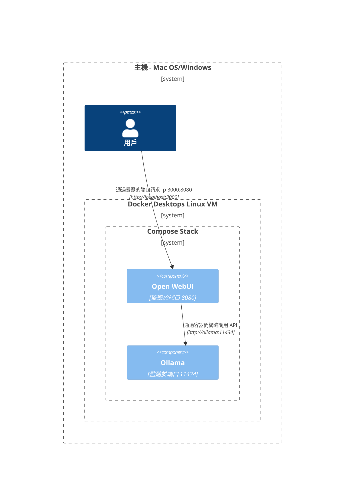
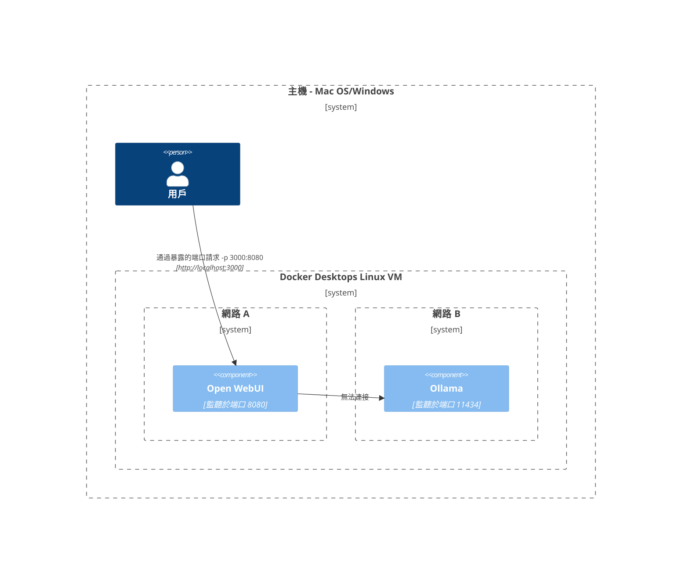
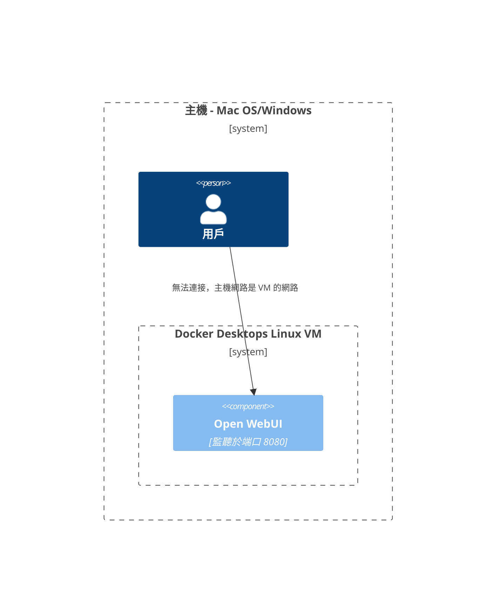
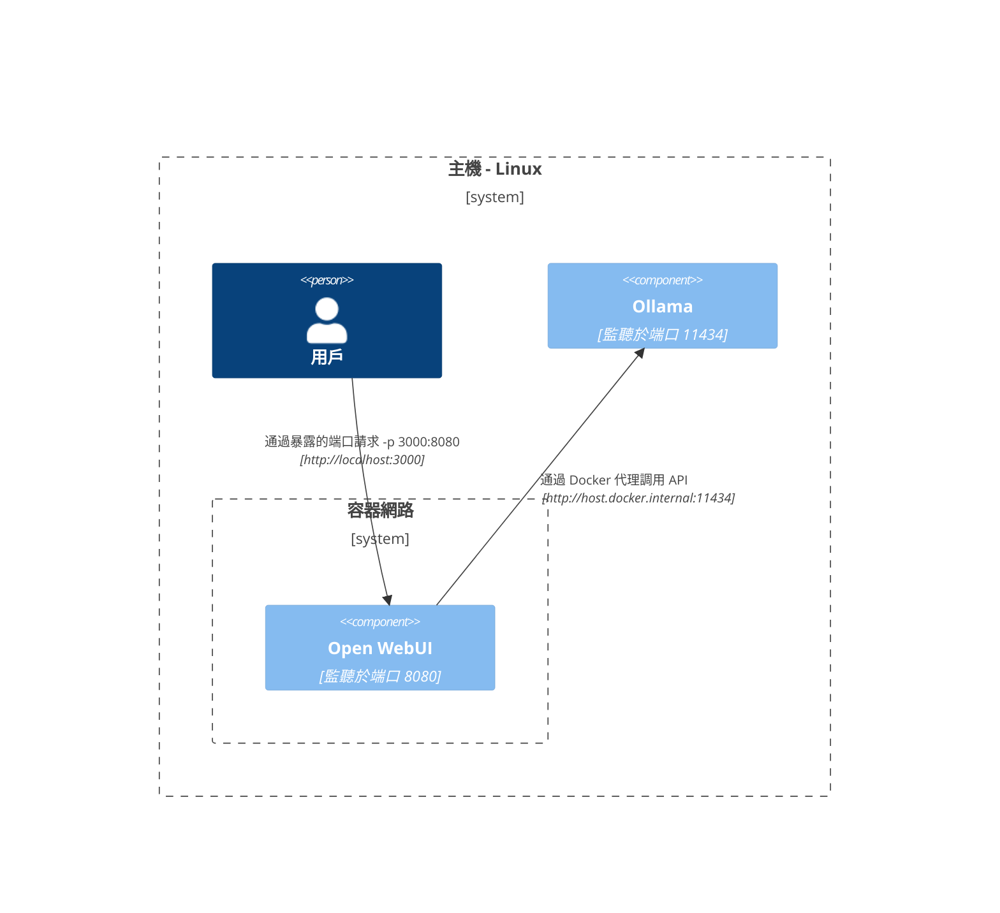
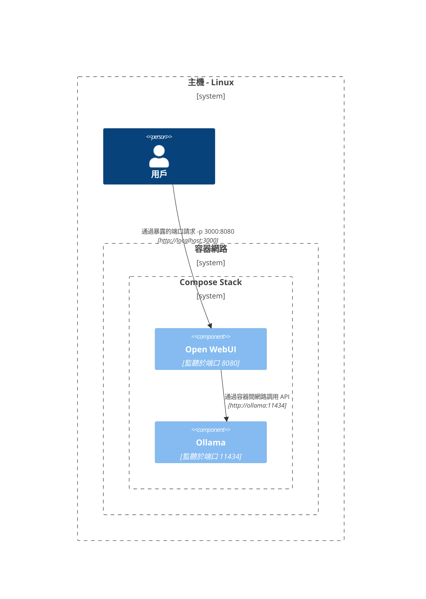
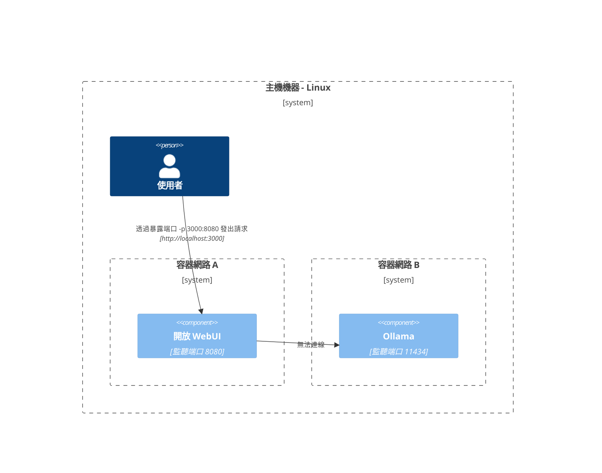
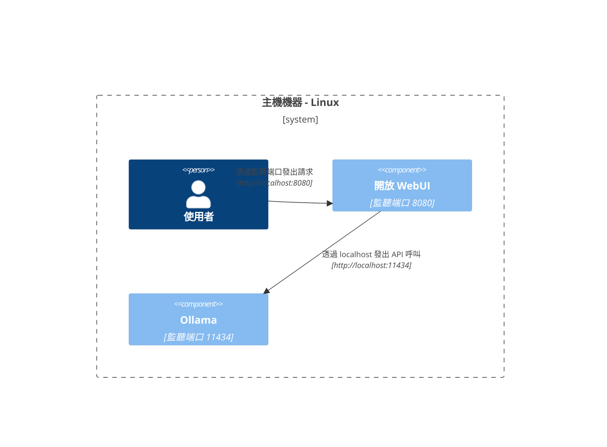

在這裡，我們提供清晰且結構化的圖表，以幫助您理解網路中各組件在不同環境中的互動方式。此文件設計為幫助 macOS/Windows 與 Linux 用戶。每個場景都使用 Mermaid 圖表進行說明，展示在不同系統配置和部署策略中的互動設置。

## Mac OS/Windows 設置選項 🖥️

### Ollama 在主機上，Open WebUI 在容器中

在此情境下，`Ollama` 直接運行在主機上，而 `Open WebUI` 則在 Docker 容器中運行。

### Ollama 和 Open WebUI 在 Compose Stack 中

`Ollama` 和 `Open WebUI` 都配置在相同的 Docker Compose 堆棧中，簡化了網路通信。

### Ollama 和 Open WebUI 分屬不同網路

在此場景中，`Ollama` 和 `Open WebUI` 部署在不同的 Docker 網路中，可能會導致連接問題。

### Open WebUI 使用主機網路

此配置中，`Open WebUI` 使用主機網路，這可能會影響其在某些環境中的連接能力。

## Linux 設置選項 🐧

### Ollama 在主機上，Open WebUI 在容器中（Linux）

此圖表針對 Linux 平台，`Ollama` 運行在主機上，`Open WebUI` 部署於 Docker 容器中。

### Ollama 和 Open WebUI 在 Compose Stack 中（Linux）

一種配置，其中 `Ollama` 和 `Open WebUI` 屬於相同的 Docker Compose 堆棧，便於在 Linux 上的網路通信。

### Ollama 和 Open WebUI 分屬不同網路（Linux）

在 Linux 環境下，`Ollama` 和 `Open WebUI` 分屬不同的 Docker 網路，可能會影響連接。

### 主機網路中的開放 WebUI，Ollama 在主機（Linux）

最優化的佈局，其中 `開放 WebUI` 和 `Ollama` 使用主機的網路，方便在 Linux 系統上進行無縫互動。

每種設置適應不同的部署策略和網路配置，以幫助您選擇最佳佈局以符合您的需求。
