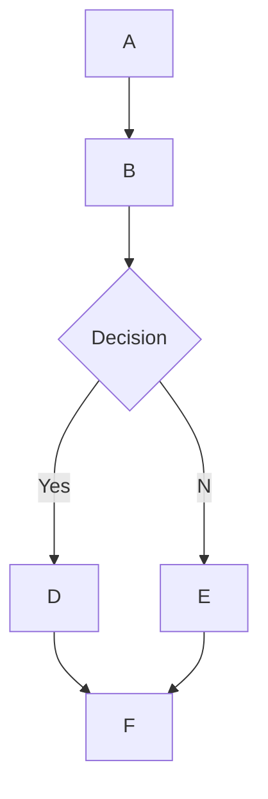

# 🌊 Open WebUI 中的 MermaidJS 渲染支持

## 概述

Open WebUI 支持在聊天界面内直接渲染美观的 MermaidJS 图表、流程图、饼图等。MermaidJS 是一个强大的工具，用于可视化复杂的信息和想法，当与大型语言模型（LLM）的能力相结合时，它可以成为生成和探索新想法的强大工具。

## 在 Open WebUI 中使用 MermaidJS

要生成 MermaidJS 图表，只需在任意聊天中请求 LLM 使用 MermaidJS 创建图表或图示。例如，可以请求 LLM：

* “使用 Mermaid 为我创建一个简单决策流程的流程图，并解释流程图如何工作。”
* “使用 Mermaid 可视化一个决策树，判断是否适合出去散步。”

需要注意的是，为了正确渲染 LLM 的响应，其代码必须以 `mermaid` 开头，并跟随 MermaidJS 代码。可以参考 [MermaidJS 文档](https://mermaid.js.org/intro/) 以确保语法正确，并为 LLM 提供结构化提示，从而帮助其生成更好的 MermaidJS 语法。

## 在聊天中直接可视化 MermaidJS 代码

当您请求 MermaidJS 可视化时，大型语言模型（LLM）将生成必要的代码。只要代码使用有效的 MermaidJS 语法，Open WebUI 将自动在聊天界面中呈现可视化的内容。

如果模型生成了 MermaidJS 语法，但可视化未渲染，通常表明代码存在语法错误。不必担心——一旦响应完全生成，您将收到错误通知。如果出现这种情况，可以参考 [MermaidJS 文档](https://mermaid.js.org/intro/) 识别问题并相应地修改提示。

## 与您的可视化互动

一旦显示了您的可视化，您可以：

* 缩放以更仔细地检查它。
* 点击显示区域右上角的复制按钮，复制生成可视化所使用的原始 MermaidJS 代码。

### 示例



这将生成如下流程图：

```markdown
 startAncestor [ start ]
A[A] --> B[B]
B --> C[Decision]
C -->| Yes | D[D]
C -->| No  | E[E]
D --> F[F]
E --> F[F]
```

尝试不同类型的图表和图示可以帮助您更深刻地了解如何有效地在 Open WebUI 中利用 MermaidJS。对于较小的模型，可以参考 [MermaidJS 文档](https://mermaid.js.org/intro/) 为 LLM 提供指导，或者让其将文档总结为综合笔记或系统提示。通过遵循这些指南并探索 MermaidJS 的功能，您可以在 Open WebUI 中充分发挥这一强大工具的潜力。
