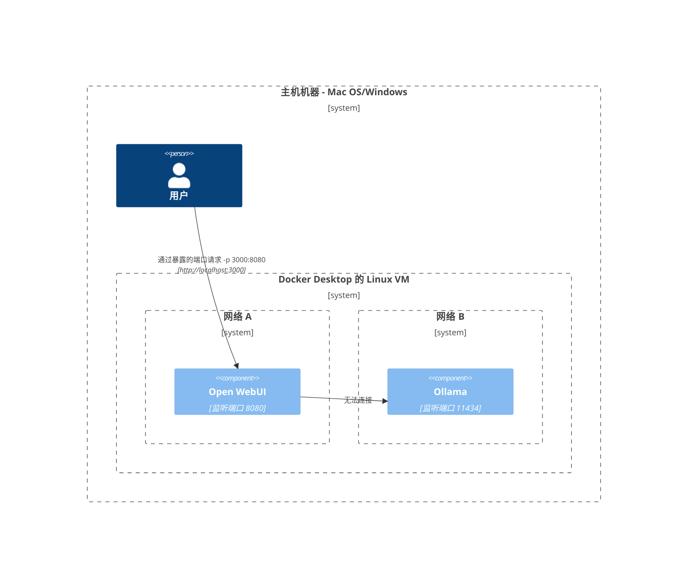
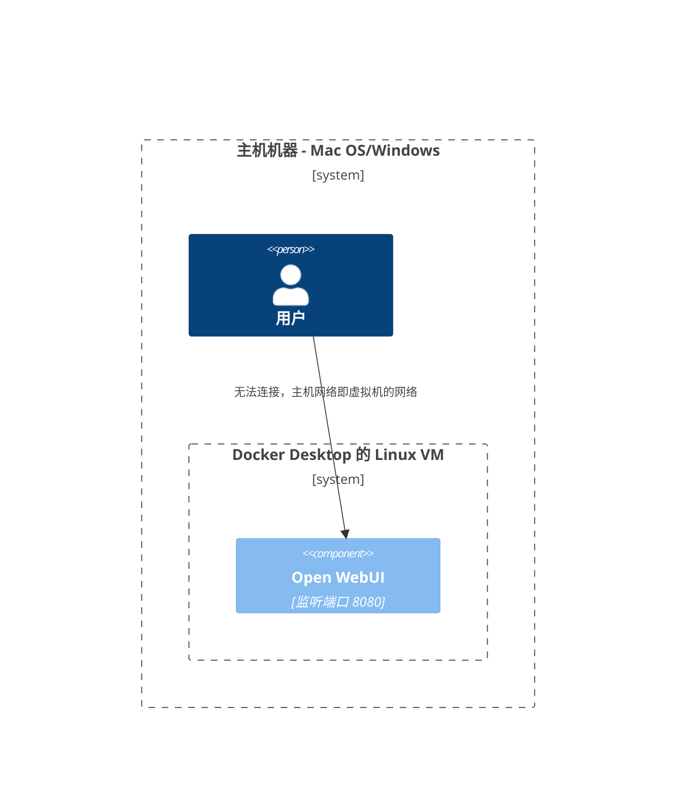
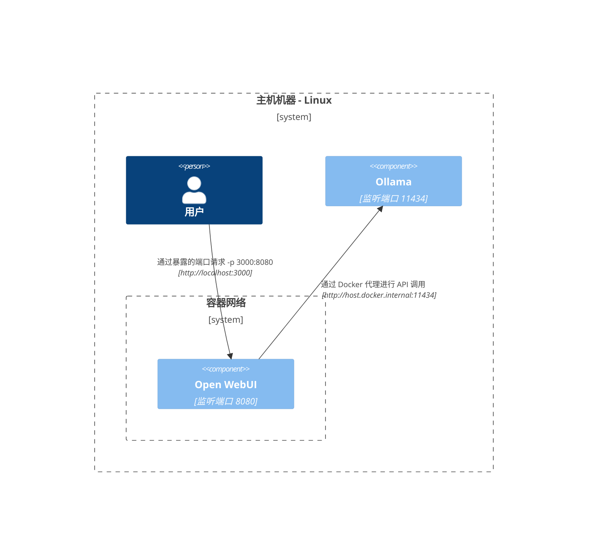
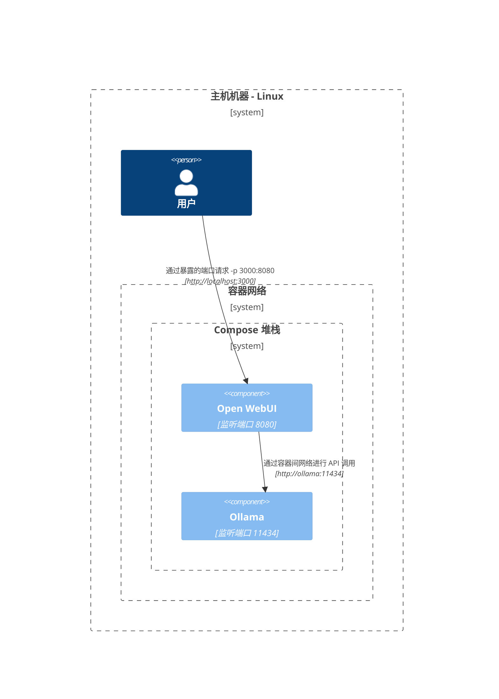
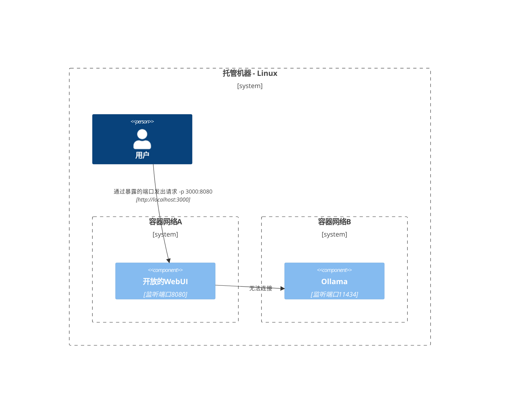
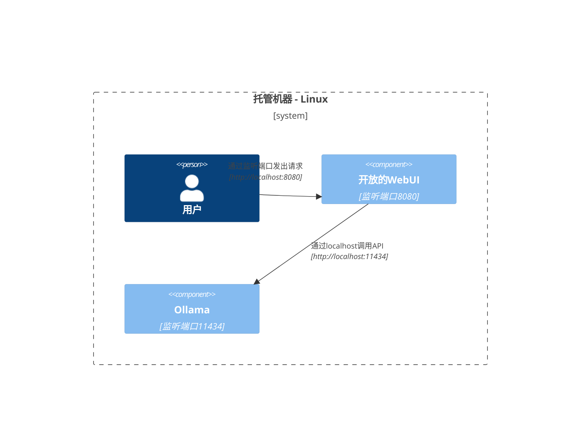

这里我们提供清晰且结构化的图示，帮助您理解在不同配置中网络的各组件如何交互。此文档旨在协助 macOS/Windows 和 Linux 用户。每个场景均使用 Mermaid 图示，展示根据不同系统配置和部署策略如何设置交互。

## Mac OS/Windows 设置选项 🖥️

### 主机运行 Ollama，容器内运行 Open WebUI

在此场景中，`Ollama` 直接运行在主机上，而 `Open WebUI` 在 Docker 容器内运行。

### Compose 堆栈中运行 Ollama 和 Open WebUI

`Ollama` 和 `Open WebUI` 均配置在同一个 Docker Compose 堆栈中，简化网络通信。

### 分别属于独立网络的 Ollama 和 Open WebUI

在此场景中，`Ollama` 和 `Open WebUI` 部署在不同的 Docker 网络中，可能会导致连接问题。

### 主机网络上的 Open WebUI

在此配置中，`Open WebUI` 使用主机网络，在某些环境中可能会影响连接能力。

## Linux 设置选项 🐧

### 主机运行 Ollama，容器内运行 Open WebUI（Linux）

此网络图专门针对 Linux 平台，`Ollama` 运行在主机上，`Open WebUI` 部署在 Docker 容器内。

### Compose 堆栈中运行 Ollama 和 Open WebUI（Linux）

在 Linux 环境中 `Ollama` 和 `Open WebUI` 均运行于同一 Docker Compose 堆栈，网络设置简单明了。

### 分别属于独立网络的 Ollama 和 Open WebUI（Linux）

在 Linux 环境中 `Ollama` 和 `Open WebUI` 位于不同的 Docker 网络中，这可能会影响连接能力。

### Host网络上的开放的WebUI，Host上的Ollama (Linux)

一个优化的布局，其中 `开放的WebUI` 和 `Ollama` 都使用主机的网络，促进在Linux系统上的无缝交互。

每种设置针对不同的部署策略和网络配置，帮助您选择最适合需求的布局。
